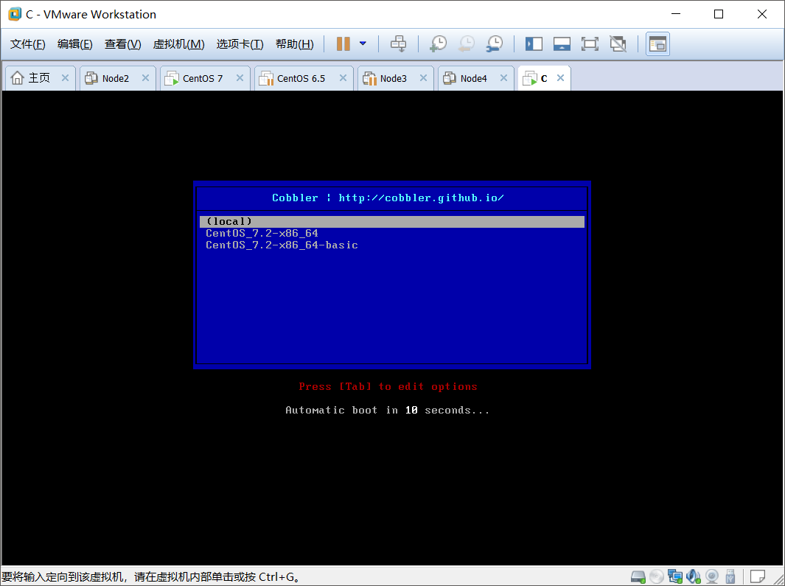
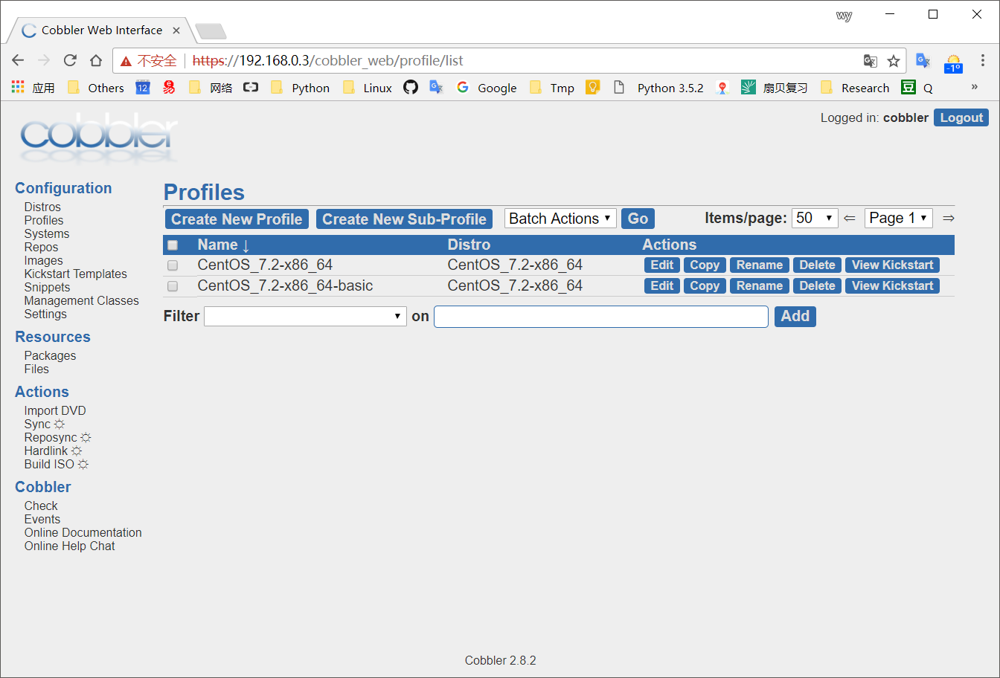

#### cobbler server 部署
```bash
[root@node ~]# systemctl stop firewalld
[root@node ~]# setenforce 0
[root@node ~]# sed -Ei 's/(SELINUX=).*/\1disabled/' /etc/sysconfig/selinux 
#删除tftp的/var/lib/tftpboot/下的文件（cobbler会自动设置）只需启动tftp服务即可，若之前已经存在的话...
[root@node ~]# rm -rf /var/lib/tftpboot/*

[root@node ~]# yum -y install epel-release
[root@node ~]# yum -y install xinetd
[root@node ~]# yum -y install cobbler
[root@node ~]# yum -y install cobbler-web           #WEB-GUI也可不安装
[root@node ~]# yum -y install debmirror             #cobbler的依赖
[root@node ~]# yum -y install pykickstart           #KS文件的语法验证程序
[root@node ~]# yum -y install httpd                 #提供安装源
[root@node ~]# yum -y install syslinux              #提供引导文件"pxelinux.0"
[root@node ~]# yum -y install dhcp tftp-server

#若基于cobbler进行部署，则DHCP中除分配网段外其next-server无需再设置(但filename需要) cobbler将自动指定next-server
[root@node ~]# ip address add 192.168.5.1/24 dev ens38 #负责分配网段的网卡（生产环境不需要，仅使用其默认）
[root@node ~]# cat /etc/dhcp/dhcpd.conf
subnet 192.168.5.0 netmask 255.255.255.0 {
  range 192.168.5.2 192.168.5.250;
  default-lease-time 600;
  max-lease-time 7200;
  filename "pxelinux.0";                            #引导文件（pxelinux.0由syslinux提供：yum install syslinux）
  next-server 192.168.5.1;                          #引导文件所在tftp地址（此配置可略过，由cobbler处理，建议添加）
}
[root@node ~]# systemctl start dhcpd
[root@node ~]# systemctl start tftp
[root@node ~]# systemctl start cobblerd
[root@node ~]# systemctl start httpd                #httpd要在cobbler之后启动（有插件安装在httpd之上）
[root@node ~]# systemctl restart httpd cobblerd
[root@node ~]# cobbler check                        #对部署环境进行检查，根据其列出的各类提示逐步进行修改
The following are potential configuration items that you may want to fix:

1 : The 'server' field in /etc/cobbler/settings must be set to something other than  (略)
2 : For PXE to be functional, the 'next_server' field in /etc/cobbler/settings must  (略)
3 : SELinux is enabled. Please review the following wiki page for details on ensuri  (略)
    https://github.com/cobbler/cobbler/wiki/Selinux
4 : Some network boot-loaders are missing from /var/lib/cobbler/loaders, you may ru  (略)
5 : enable and start rsyncd.service with systemctl #错误是不一定要联网下载某些程序，而安装syslinux就可以
6 : debmirror package is not installed, it will be required to manage debian deploym (略)
7 : The default password used by the sample templates for newly installed machines ( (略)
8 : fencing tools were not found, and are required to use the (optional) power manag (略)

Restart cobblerd and then run 'cobbler sync' to apply changes.

[root@node ~]# vim /etc/cobbler/settings
server: 192.168.5.1                                 #本机地址（cobbler的主机地址）
next_server: 192.168.5.1                            #通过cobbler设置dhcp中的tftp地址
manage_dhcp: 0                                      #是否自动管理DHCP服务，此处不需要（之前需要先启动DHCP）
manage_tftp: 0                                      #是否自动管理TFTP服务，此处不需要
......  
    
[root@node ~]# systemctl start rsyncd               #
[root@node ~]# systemctl enable rsyncd              #相当于将xinetd中rsyncd服务的disable改为No
[root@node ~]# systemctl restart xinetd
[root@node ~]# openssl passwd -1 -salt `openssl rand -hex 4`  #修改cobbler默认加密密码，使用此命令生成
Password: 
$1$07f29696$GSHjtVsrUp6HE2OjCFbwO/
[root@node ~]# sed -Ei 's|(default_password_crypted: ).*|\1\"$1$07f29696$GSHjtVsrUp6HE2OjCFbwO/\"|g' \
/etc/cobbler/settings   
[root@node ~]# cat /etc/cobbler/settings | grep default_password_crypted
default_password_crypted: "$1$07f29696$GSHjtVsrUp6HE2OjCFbwO/"

[root@node ~]# systemctl restart cobblerd httpd     #重新启动后再进行检查
[root@node ~]# cobbler check
[root@node ~]# sed -i "s/@dists/#&/"  /etc/debmirror.conf
[root@node ~]# sed -i "s/@arches/#&/" /etc/debmirror.conf
[root@node ~]# cp /usr/share/syslinux/{pxelinux.0,meminfo.c32} /var/lib/cobbler/loaders/
[root@node ~]# # cp /usr/share/syslinux/* /var/lib/cobbler/loaders/   #建议用此步骤替代上面的cp命令，全拷过去..
[root@node ~]# cobbler sync                         #执行同步
task started: 2018-01-14_101743_sync
task started (id=Sync, time=Sun Jan 14 10:17:43 2018)
running pre-sync triggers
cleaning trees
removing: /var/lib/tftpboot/grub/images
copying bootloaders
copying: /usr/share/syslinux/pxelinux.0 -> /var/lib/tftpboot/pxelinux.0
copying: /usr/share/syslinux/menu.c32 -> /var/lib/tftpboot/menu.c32
copying: /usr/share/syslinux/memdisk -> /var/lib/tftpboot/memdisk
copying distros to tftpboot
copying images
generating PXE configuration files
generating PXE menu structure
rendering TFTPD files
generating /etc/xinetd.d/tftp
cleaning link caches
running post-sync triggers
running python triggers from /var/lib/cobbler/triggers/sync/post/*
running python trigger cobbler.modules.sync_post_restart_services
running shell triggers from /var/lib/cobbler/triggers/sync/post/*
running python triggers from /var/lib/cobbler/triggers/change/*
running python trigger cobbler.modules.scm_track
running shell triggers from /var/lib/cobbler/triggers/change/*
*** TASK COMPLETE ***

[root@node ~]# ll /var/lib/tftpboot/                #此时会发现cobbler自动同步的一堆文件
总用量 112
drwxr-xr-x. 3 root root    17 1月  14 10:17 boot
drwxr-xr-x. 2 root root     6 9月  18 23:16 etc
drwxr-xr-x. 2 root root    36 1月  14 10:17 grub
drwxr-xr-x. 2 root root     6 9月  18 23:16 images
drwxr-xr-x. 2 root root     6 9月  18 23:16 images2
-rw-r--r--. 1 root root 26140 1月  14 10:17 memdisk
-rw-r--r--. 1 root root 55012 1月  14 10:17 menu.c32
drwxr-xr-x. 2 root root     6 9月  18 23:16 ppc
-rw-r--r--. 1 root root 26764 1月  14 10:17 pxelinux.0
drwxr-xr-x. 2 root root    20 1月  14 10:17 pxelinux.cfg
drwxr-xr-x. 2 root root    25 1月  14 10:17 s390x

#子命令介绍
# cobbler check                 #检查cobbler配置
# cobbler sync                  #同步配置到dhcp pxe和数据目录
# cobbler list                  #列出所有的cobbler元素
# cobbler import                #导入安装的系统光盘镜像
# cobbler report                #列出各元素的详细信息
# cobbler distro                #查看导入的发行版系统信息
# cobbler profile               #查看配置信息
# cobbler system                #查看添加的系统信息
# cobbler reposync              #同步yum仓库到本地

[root@node ~]# cobbler repo help   #仓库相关命令
usage
=====
cobbler repo add                #添加
cobbler repo copy               #复制
cobbler repo edit               #编辑
cobbler repo find               #....
cobbler repo list               #列出所有的repo
cobbler repo remove             #
cobbler repo rename             #
cobbler repo report             #

[root@node ~]# cobbler list        #列出当前配置的一些内容
distros:

profiles:

systems:

repos:

images:

mgmtclasses:

packages:

files:
```
#### 导入Linux发行版IOS及设置各发行版相关的的Profile与ks.cfg
```bash
[root@node ~]# mkdir /mnt/cdrom
[root@node ~]# mount -t auto /dev/cdrom /mnt/cdrom/                     #挂载系统IOS光盘

#导入光盘映像文件,其会将光盘安装树导入到自己管理的repo中去
#会自动生成distro与profile，生成的profile默认使用/var/lib/cobbler/kickstarts/default.ks
[root@node ~]# cobbler import --name=CentOS_7.2_x86_64 --path=/mnt/cdrom/
task started: 2018-01-14_102448_import
task started (id=Media import, time=Sun Jan 14 10:24:48 2018)
Found a candidate signature: breed=redhat, version=rhel6
Found a candidate signature: breed=redhat, version=rhel7
Found a matching signature: breed=redhat, version=rhel7
Adding distros from path /var/www/cobbler/ks_mirror/CentOS_7.2_x86_64:
creating new distro: CentOS_7.2-x86_64
trying symlink: /var/www/cobbler/ks_mirror/CentOS_7.2_x86_64 -> /var/www/cobbler/links/CentOS_7.2-x86_64
creating new profile: CentOS_7.2-x86_64
associating repos
checking for rsync repo(s)
checking for rhn repo(s)
checking for yum repo(s)
starting descent into /var/www/cobbler/ks_mirror/CentOS_7.2_x86_64 for CentOS_7.2-x86_64
processing repo at : /var/www/cobbler/ks_mirror/CentOS_7.2_x86_64
need to process repo/comps: /var/www/cobbler/ks_mirror/CentOS_7.2_x86_64
looking for /var/www/cobbler/ks_mirror/CentOS_7.2_x86_64/repodata/*comps*.xml
Keeping repodata as-is :/var/www/cobbler/ks_mirror/CentOS_7.2_x86_64/repodata
*** TASK COMPLETE ***
[root@node ~]# ll /var/www/cobbler/ks_mirror/CentOS_7.2_x86_64/        #导入到了这里并自动生成了一个YUM源
总用量 296
-r--r--r--. 1 root root     14 12月 10 2015 CentOS_BuildTag
dr-xr-xr-x. 3 root root     33 12月 10 2015 EFI
-r--r--r--. 1 root root    215 12月 10 2015 EULA
-r--r--r--. 1 root root  18009 12月 10 2015 GPL
dr-xr-xr-x. 3 root root     54 12月 10 2015 images
dr-xr-xr-x. 2 root root   4096 12月 10 2015 isolinux
dr-xr-xr-x. 2 root root     41 12月 10 2015 LiveOS
dr-xr-xr-x. 2 root root 204800 12月 10 2015 Packages
dr-xr-xr-x. 2 root root   4096 12月 10 2015 repodata
-r--r--r--. 1 root root   1690 12月 10 2015 RPM-GPG-KEY-CentOS-7
-r--r--r--. 1 root root   1690 12月 10 2015 RPM-GPG-KEY-CentOS-Testing-7
-r--r--r--. 1 root root   2883 12月 10 2015 TRANS.TBL
[root@node ~]# cobbler sync                        #导入数据后需要执行一次同步
[root@node ~]# cobbler distro list                 #查看dirstro（导入的发行版）
   CentOS_7.2-x86_64

#添加Cobbler Profile (若多个就添加多个)
[root@node ~]# cp ~/anaconda-ks.cfg /var/lib/cobbler/kickstarts/CentOS_7.2-x86_64.cfg
[root@node ~]# cobbler profile add --name=CentOS_7.2-x86_64-basic --distro=CentOS_7.2-x86_64 \
--kickstart=/var/lib/cobbler/kickstarts/CentOS_7.2-x86_64.cfg
[root@node ~]# cobbler profile list
   CentOS_7.2-x86_64
   CentOS_7.2-x86_64-basic
[root@node ~]# cobbler sync
root@node ~]# cat /var/lib/tftpboot/pxelinux.cfg/default      #执行同步之后其将自动创建如下的grub文件
DEFAULT menu
PROMPT 0
MENU TITLE Cobbler | http://cobbler.github.io/
TIMEOUT 200
TOTALTIMEOUT 6000
ONTIMEOUT local

LABEL local
        MENU LABEL (local)
        MENU DEFAULT        #建议把此行移到默认安装的'LABEL CentOS_7.2-x86_64-basic'里，指定默认执行的菜单
        LOCALBOOT -1

LABEL CentOS_7.2-x86_64
        kernel /images/CentOS_7.2-x86_64/vmlinuz
        MENU LABEL CentOS_7.2-x86_64
        append initrd=/images/CentOS_7.2-x86_64/initrd.img ksdevice=bootif lang=  kssendmac \   #不能使用\换行
        text  ks=http://192.168.0.5/cblr/svc/op/ks/profile/CentOS_7.2-x86_64
        ipappend 2

LABEL CentOS_7.2-x86_64-basic
        kernel /images/CentOS_7.2-x86_64/vmlinuz
        MENU LABEL CentOS_7.2-x86_64-basic
        append initrd=/images/CentOS_7.2-x86_64/initrd.img ksdevice=bootif lang=  kssendmac \   #不能使用\换行
        text  ks=http://192.168.0.5/cblr/svc/op/ks/profile/CentOS_7.2-x86_64-basic
        ipappend 2

MENU end
```
#### 此时客户端可以通过PXE启动了（目前在启动时使用 CentOS_7.2-x86_64-basic 会报与 --hostname 相关的问题）

#### conbbler web-ui
```bash
[root@node ~]# vim /etc/cobbler/modules.conf
[authentication]
module = authn_configfile   #使用 /etc/cobbler/users.digest 进行基本认证的方式

[authorization]
module = authz_allowall     #对认证允许所有访问

[root@node ~]# htdigest /etc/cobbler/users.digest "Cobbler" cobbler     #添加账号备注及生成账号/密码
Changing password for user cobbler in realm Cobbler
New password: 
Re-type new password: 

[root@node ~]# systemctl restart cobblerd httpd
[root@node ~]# setsebool -P httpd_can_network_connect true

#此时即可以通过 https://192.168.0.3/cobbler_web 访问了                    #必须要用https协议访问....
```

