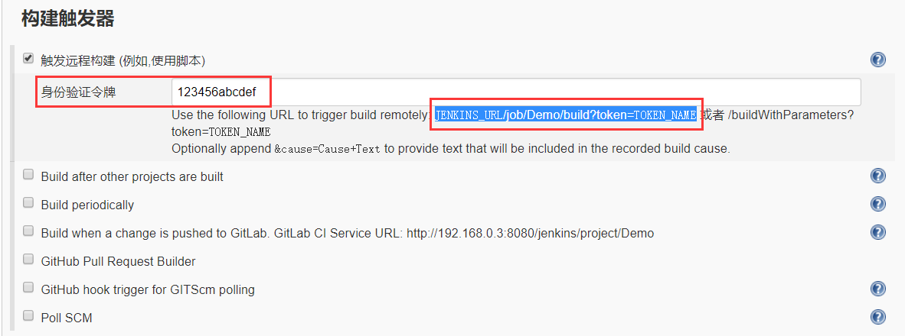
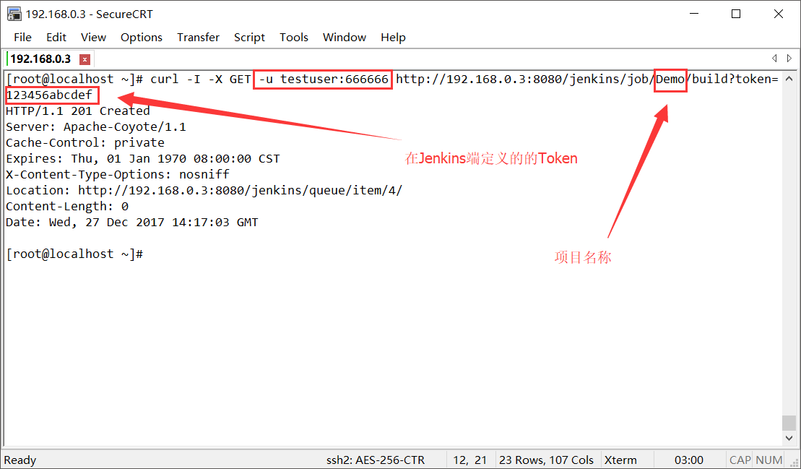

#### Jenkins 主要的环境变量
```bash
#!/bin/sh

# Jenkins启动时读取此环境变量作为其工作空间路径
export JENKINS_HOME="/home/xxxx/jenkins/tomcat_jenkins2/jenkins"

# JVM优化部分
export JAVA_OPTS="${JAVA_OPTS}"" -Xms512m -Xmx2048m -XX:PermSize=64m -XX:MaxPermSize=512m -Dfile.encoding=UTF-8 
-Dhudson.util.ProcessTree.disable=true -Doracle.jdbc
.V8Compatible=true -Dappframe.server.name=release_tomcat_jenkins -XX:+HeapDumpOnOutOfMemoryError 
-XX:HeapDumpPath=/home/zyzx/jenkins/tomcat_jenkins/logs/oom.hprof"

echo "JAVA_OPTS=${JAVA_OPTS}"

JAVA_HOME=/home/xxxx/jdk1.8.0_60
```
## 触发构建 Example
#### Jenkins端设置 Token

#### 使用 curl 触发构建

#### 使用 curl 脚本触发构建并判断是否成功
```bash
#!/bin/bash

# Jenkins主机/账号/工程+模块地址
JENKINS_HOST_PORT=192.168.26.8:8080
USERNAME_PASSWORD=zyzx:'3e4r#E$R'
PROJECT_NAME=10085ds_yf
JOB_NAME=ecp

# 构建参数
# JOB_ARGS1='args1=value1'
# JOB_ARGS2='args1=value1'
TAG_NAME=BUILD_BRANCH
TAG_VALUE=ds-1.1.75-20181206

JOB_ADDRESS="http://${JENKINS_HOST_PORT}/jenkins/job/${PROJECT_NAME}/job/${JOB_NAME}"

# 执行构建，携带了构建时参数（当构建参数为列表类型时，若参数的值不存在列表中将触发错误异常返回）
curl -s -X POST -u "${USERNAME_PASSWORD}" "${JOB_ADDRESS}/build"  --data-urlencode \
json="{'parameter': [{'name':\"${TAG_NAME}\",'value':\"${TAG_VALUE##*/}\"}]}"

# 获取上次成功构建的编号
LASTSUCCESSFULBUILD=$(curl -s -u "${USERNAME_PASSWORD}" "${JOB_ADDRESS}/lastSuccessfulBuild/buildNumber")

# 循环判断JOB是否执行完毕 ( 等待8分钟，若最后一次成功构建的编号未发生改变则判断发布失败 )
for i in {1..60}
do
    sleep 10
    if [[ "${LASTSUCCESSFULBUILD}" != "`curl -s -u "${USERNAME_PASSWORD}" "${JOB_ADDRESS}/lastSuccessfulBuild/buildNumber"`" ]]; then
        echo -e "\033[32m Build OK: ${PROJECT_NAME}/${JOB_NAME} \033[0m" 
        exit 0
    fi
done

echo -e "\033[31m Build Fail!: ${PROJECT_NAME}/${JOB_NAME} \033[0m" 

exit 1

# 上次失败的构建
# curl -XGET -u "${USERNAME}:${PASSWORD}" "${JOB_ADDRESS}/lastUnsuccessfulBuild/buildNumber"

# --------------------------------------------------------------------------------------------

# JENKINS_URL/job/JOB_NAME/lastSucessfulBuild/api/  
# http://192.168.37.100:8080/jenkins/job/email-test/lastSuccessfulBuild/api/
```
#### curl for jenkins api
```bash
# 若某个job名为： delete_jenkins_job
# 其访问路径为:   http://jenkins./job/delete_jenkins_job/   则api为:   http://jenkins./job/delete_jenkins_job/api


# 创建JOB配置文件 (刚刚下载的xml文件刚好用上)
curl -X POST  http://jenkins/createItem?name=JavaStd  -u username:password \
--data-binary "@javastd.config.xml" -H "Content-Type: text/xml"

# 下载JOB配置文件
curl -X GET http://jenkins/job/delete_jenkins_job/config.xml -u username:password > JOB.config.xml

# 禁用JOB 
curl -X POST http://jenkins/job/delete_jenkins_job/disable  -u username:password

# 启用JOB 
curl -X POST http://jenkins/job/delete_jenkins_job/enable  -u username:password

# 删除JOB 
curl -X POST http://jenkins/job/delete_jenkins_job/doDelete -u username:password

# 获取JOB项目描述
curl -X GET http://jenkins/job/delete_jenkins_job/description -u username:password

# 获取配置文件 
curl -X GET http://jenkins/job/delete_jenkins_job/config.xml -u username:password

# 需要传参时API端点为：buildWithParameters
curl -X POST -u 'username:password' http://jenkins/job/delete_jenkins_job/rest-test/buildWithParameters 
```