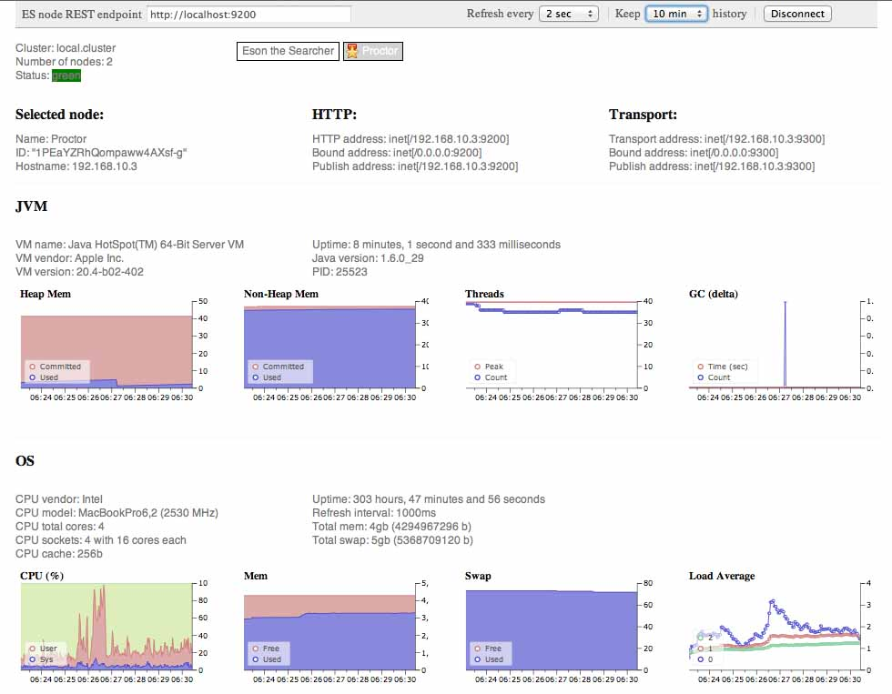
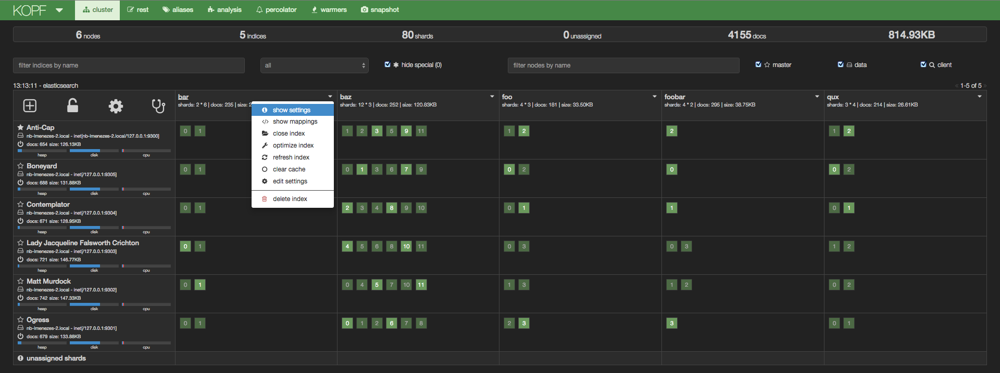
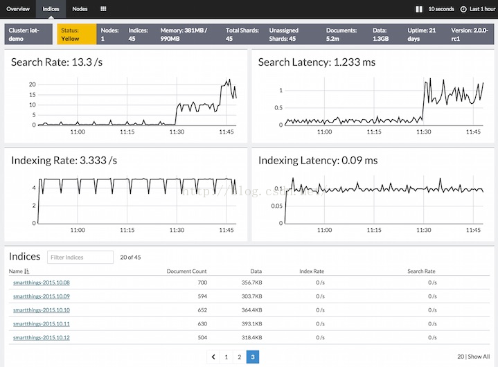

```bash
#RPM包安装ES后的的插件存放目录：/usr/share/elasticsearch/plugins   

# 常用插件：   对于web站点型的插件，在浏览器端直接以 "http://x.x.x.x:9200/_plugin/<插件名>/" 的方式访问即可...
#  - head           
#  - kopf           
#  - bigdesk        
#  - marvel-agent   
  
#ElasticSearch-Head是与Elastic集群交互的Web前台
#它展现ES集群的拓扑结构，并且可以通过它来进行索引（Index）和节点（Node）级别的操作
#提供一组针对集群的查询API，并将结果以json和表格形式返回，提供一些快捷菜单以展现集群的各种状态...
[root@node1 ~]# /usr/share/elasticsearch/bin/plugin install mobz/elasticsearch-head
#命令"plugin install"后面的这一串"mobz/elasticsearch-head"是github上的一个地址...
#若安装失败则手动下载该插件的源码包并解压后直接整个目录mv到ES的插件安装路径下: /usr/share/elasticsearch/plugins/

#Kopf是一个ElasticSearch的管理工具，它也提供了对ES集群操作的API
[root@node1 ~]# /usr/share/elasticsearch/bin/plugin install lmenezes/elasticsearch-kopf/2.0

#Marvel是Elasticsearch的管理和监控工具，在开发环境下免费使用
#它包含了一个叫做Sense的交互式控制台，使用户方便的通过浏览器直接与Elasticsearch进行交互
[root@node1 ~]# /usr/share/elasticsearch/bin/plugin install license 
[root@node1 ~]# /usr/share/elasticsearch/bin/plugin install marvel-agent 
 
#Bigdesk为Elastic集群提供动态的图表与统计数据（部署过程有问题...）
[root@node1 ~]# 2.4.0版本下安装请参考：https://www.cnblogs.com/wangxiaoqiangs/p/6430354.html

#列出已经安装的插件：
[root@node1 ~]# /usr/share/elasticsearch/bin/plugin list
Installed plugins in /usr/share/elasticsearch/plugins:
    - head
    - kopf
    - license
    - marvel-agent
```
#### WEB站点类型的ES插件:
#### http://x.x.x.x:9200/_plugin/Bigdesk

#### http://x.x.x.x:9200/_plugin/Head

#### http://x.x.x.x:9200/_plugin/Kopf

#### http://x.x.x.x:9200/_plugin/Marvel

