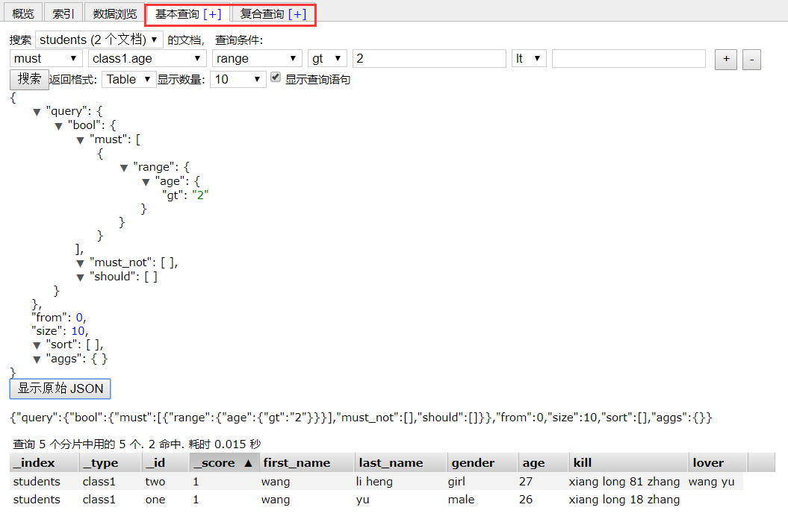

#### 运维相关
```bash
#查看集群统计数据
[root@node2 ~]# curl -X GET http://localhost:9200/_cluster/state?pretty 
{
  "cluster_name" : "elasticsearch",
  "version" : 4,
  "state_uuid" : "5Mcqk1GEQMq8UOO3AoiDsA",
  "master_node" : "-eE6xk1kReaiHJkXdMnrzQ",
  "blocks" : { },
  "nodes" : {
    "-eE6xk1kReaiHJkXdMnrzQ" : {
      "name" : "node2",
      "transport_address" : "192.168.0.6:9300",
      "attributes" : { }
    },
    "FphwOd7zQ2GGsMQRfvY1sA" : {
      "name" : "node1",
      "transport_address" : "192.168.0.5:9300",
      "attributes" : { }
    },
    "VhkF497sQKSAoWY7_ow-og" : {
      "name" : "node3",
      "transport_address" : "192.168.0.7:9300",
      "attributes" : { }
    }
  },
  "metadata" : {
    "cluster_uuid" : "dkZecPmFQN6PVFh9hu_InA",
    "templates" : { },
    "indices" : { }
  },
  "routing_table" : {
    "indices" : { }
  },
  "routing_nodes" : {
    "unassigned" : [ ],
    "nodes" : {
      "VhkF497sQKSAoWY7_ow-og" : [ ],
      "FphwOd7zQ2GGsMQRfvY1sA" : [ ],
      "-eE6xk1kReaiHJkXdMnrzQ" : [ ]
    }
  }
} 

#查询master_node
[root@node2 ~]# curl -X GET http://localhost:9200/_cluster/state/master_node?pretty 
{
  "cluster_name" : "elasticsearch",
  "master_node" : "-eE6xk1kReaiHJkXdMnrzQ"
}

#查看集群状态的版本
[root@node2 ~]# curl -X GET http://localhost:9200/_cluster/state/version?pretty 
{
  "cluster_name" : "elasticsearch",
  "version" : 4,
  "state_uuid" : "5Mcqk1GEQMq8UOO3AoiDsA"
}

#更新集群设定(常用)
[root@node2 ~]# curl -X PUT http://192.168.0.6:9200/_cluster/settings -d \' {
>     "persistent": {
>           "discovery.zen.minimun_master_nodes": 1
>     }
> }\'
{"acknowledged":true,"persistent":{},"transient":{}}

#节点相关信息
[root@node2 ~]# curl -X GET http://localhost:9200/_nodes/node1,node2?pretty

#查看ES中的索引信息
[root@h102 ~]# curl localhost:9200/_cat/indices?v
health status index               pri rep docs.count docs.deleted store.size pri.store.size 
yellow open   filebeat-2015.12.24   5   1       3182            0        1mb            1mb 
yellow open   logstash-2015.12.23   5   1        100            0    235.8kb        235.8kb 
yellow open   logstash-2015.12.22   5   1         41            0    126.5kb        126.5kb 
yellow open   .kibana               1   1         94            0    102.3kb        102.3kb 

#删除索引
[root@node1 ~]# curl -s -X DELETE "http://192.168.0.5:9200/students?pretty"
```

#### CURD 相关的 Elasticsearch Restful API （CURD在运维方面使用较少，有其他便捷方式构建相关查询）
```bash
#创建索引，名为"students" 类型为class1 学生为one 若存在则会被替换，相当于覆盖更新的操作
[root@node1 ~]# curl -X PUT "http://192.168.0.5:9200/students/class1/one?pretty" -d '
> {
>     "first_name": "wang",
>     "last_name": "yu",
>     "gender": "male",
>     "age": 25,
>     "kill": "xiang long 18 zhang"
> }'

{                               #JSON格式的返回信息
  "_index" : "students",        #索引名
  "_type" : "class1",           #类型
  "_id" : "one",                #每个文档都有着一个唯一的ID号
  "_version" : 1,
  "_shards" : {
    "total" : 2,
    "successful" : 2,
    "failed" : 0
  },
  "created" : true              #创建成功...
}

[root@node1 ~]# curl -X PUT "http://192.168.0.5:9200/students/class1/two?pretty" -d '
{
    "first_name": "wang",
    "last_name": "li heng",
    "gender": "girl",
    "age": 27,
    "kill": "xiang long 81 zhang",
    "lover": "wang yu"
}'
{
  "_index" : "students",
  "_type" : "class1",
  "_id" : "two",
  "_version" : 1,
  "_shards" : {
    "total" : 2,
    "successful" : 2,
    "failed" : 0
  },
  "created" : true
}

#查询（无非是PUT变GET，格式仍是：索引/类型/文档ID）
[root@node1 ~]# curl -X GET "http://192.168.0.5:9200/students/class1/one?pretty"
{
  "_index" : "students",
  "_type" : "class1",
  "_id" : "one",
  "_version" : 1,
  "found" : true,
  "_source" : {
    "first_name" : "wang",
    "last_name" : "yu",
    "gender" : "male",
    "age" : 25,
    "kill" : "xiang long 18 zhang"
  }
}

#更新文档（部分内容，使用UPDATE，或者全部替换则使用PUT）
[root@node1 ~]# curl -X POST "http://192.168.0.5:9200/students/class1/one/_update?pretty" -d '
> {
>     "doc": {"age":26}     #其中的doc是固定格式，表示更新文档...
> }'
{
  "_index" : "students",
  "_type" : "class1",
  "_id" : "one",
  "_version" : 2,
  "_shards" : {
    "total" : 2,
    "successful" : 2,       #更新成功
    "failed" : 0
  }
}
#验证更新是否成功
[root@node1 ~]# curl -s -X GET "http://192.168.0.5:9200/students/class1/one?pretty" | grep age
    "age" : 26,

#删除文档
[root@node1 ~]# curl -s -X DELETE "http://192.168.0.5:9200/students/class1/three?pretty"
{
  "found" : true,
  "_index" : "students",
  "_type" : "class1",
  "_id" : "three",
  "_version" : 2,
  "_shards" : {
    "total" : 2,
    "successful" : 2,
    "failed" : 0
  }
}

#查询数据（使用_search API的方式）
[root@node1 ~]# curl -s -X GET "http://192.168.0.5:9200/students/_search?pretty"    #全量查询，搜索此索引下的所有
{
  "took" : 2,                               #执行时长
  "timed_out" : false,                      #是否超时
  "_shards" : {                             #涉及到的分片
    "total" : 5,            
    "successful" : 5,           
    "failed" : 0            
  },            
  "hits" : {                                #搜索结果
    "total" : 2,                            #命中的数量
    "max_score" : 1.0,        
    "hits" : [ {        
        "_index" : "students",        
        "_type" : "class1",                 #在那个type中查询
        "_id" : "two",          
        "_score" : 1.0,                     #文档的评分
        "_source" : {                       #元数据
            "first_name" : "wang",          #
            "last_name" : "li heng",        #
            "gender" : "girl",              #
            "age" : 27,                     #
            "kill" : "xiang long 81 zhang", #
            "lover" : "wang yu"             #
        }
        }, {
        "_index" : "students",
        "_type" : "class1",
        "_id" : "one",
        "_score" : 1.0,
        "_source" : {                       #元数据
            "first_name" : "wang",          #
            "last_name" : "yu",             #
            "gender" : "male",              #
            "age" : 26,                     #
            "kill" : "xiang long 18 zhang"  #
        }
    } ]
  }
}

#查询数据（使用BODY的方式）
[root@node1 ~]# curl -s -X GET "http://192.168.0.5:9200/students/_search?pretty" -d '
> {
>     "query":{"match_all":{}}
> }'
{
  "took" : 7,
  "timed_out" : false,
  "_shards" : {
    "total" : 5,
    "successful" : 5,
    "failed" : 0
  },
  "hits" : {
    "total" : 2,
    "max_score" : 1.0,
    "hits" : [ {
      "_index" : "students",
      "_type" : "class1",
      "_id" : "two",
      "_score" : 1.0,
      "_source" : {
        "first_name" : "wang",
        "last_name" : "li heng",
        "gender" : "girl",
        "age" : 27,
        "kill" : "xiang long 81 zhang",
        "lover" : "wang yu"
      }
    }, {
      "_index" : "students",
      "_type" : "class1",
      "_id" : "one",
      "_score" : 1.0,
      "_source" : {
        "first_name" : "wang",
        "last_name" : "yu",
        "gender" : "male",
        "age" : 26,
        "kill" : "xiang long 18 zhang"
      }
    } ]
  }
}

#多索引，多类型查询（为防止负载过大，ELK默认仅返回前10个）
[root@node1 ~]# curl -X GET "http://node1:9200/students/_search?age=27&pretty" #查询单个索引
[root@node1 ~]# curl -X GET "http://node1:9200/students/class1/_search?age=27&pretty" #查询单个索引下的单个类型
[root@node1 ~]# curl -X GET "http://node1:9200/students/class1，class2/_search?age=27&pretty" #查询单索引下的多个类型
[root@node1 ~]# curl -X GET "http://node1:9200/_search?age=27&pretty" #查询所有索引
[root@node1 ~]# curl -X GET "http://node1:9200/index1,index2/_search?age=27&pretty" #查询多个索引
[root@node1 ~]# curl -X GET "http://node1:9200/a*,b*/_search?age=27&pretty" #查询多个通配索引
```
#### Mapping 和 Analysis  (映射和分析)
```bash
# 特殊域：_all
#    ES对每个文档都会取得其所有域的所有值来构建为一个大字符串并为此字串生成名为"_all"的域
#    当用户通过其Restful API执行查询时若在query_string当中未执行查询的域则就在_all域上执行查询操作
    
    GET /_search?q="xiang long"                  #任何域中出现此关键字均返回，因为它是在_all域内查询的
    GET /_search?q="xiang long 18 zhang"         #在_all域内查询
    GET /_search?q=kill:"xiang long 18 zhang"    #仅在特定域进行查询
    GET /_search?q=kill:"xiang long"             #仅在特定域进行查询

# 数据类型：(每一种数据类型在解析时并不完全一样)
#    string
#    number
#    boolean
#    dates

#Mapping的主要作用是定义一个文档域中的数据类型是如何被理解和解析的
#映射(mapping)机制用于进行字段类型确认，将每个字段匹配为一种确定的数据类型(string, number, booleans, date等)
#分析(analysis)机制用于进行全文文本(Full Text)的分词，以建立供搜索用的反向索引。
#查询整个文档中的mapping，即数据被当作何种类型对待...
[root@node1 ~]# curl -X GET 'http://192.168.0.5:9200/students/_mapping/class1?pretty'
{
"students" : {
    "mappings" : {              #对students而言其内部自动创建了一个mapping
    "class1" : {
        "properties" : {
        "age" : {
            "type" : "long"     #长整型
        },
        "first_name" : {
            "type" : "string"   #字串
        },
        "gender" : {
            "type" : "string"   #字串
        },
        "kill" : {
            "type" : "string"   #字串
        },
        "last_name" : {
            "type" : "string"   #字串
        },
        "lover" : {
            "type" : "string"   #字串
        }
        }
    }
    }
}
}

#ES中搜索的数据广义上可以被理解为2种数据类型
    types:exact：
        在指定类型上做精确搜索，其指的是未经加工的搜索，如区分大小写
        
    full-text：
        全文搜素，能进行模糊匹配，用于引用文本中的数据，判断文档在多大程度上匹配查询请求，即文档与用户请求查询的相关度
        
# 为了完成full-text搜索，ES必须首先分析文本，并创建出倒排索引，即实现分词和正规化来实现倒排索引的创建...
# 倒排索引中的数据还需进行"正规化"为标准格式，比如所有权改为小写，复数改为单数等等...
# 分词和正规化的过程被称为分析，分析又需要分析器进行"analayzer"

# 分析器由三个组件构成：
#     1.字符过滤器     过滤不需要分词的文本
#     2.分词器           
#     3.分词过滤器     例如对助词进行过滤

# ES内置的分析器：
#     standard analayzer      默认分析器，适用于多种语言，适用于Unicode
#     simple analayzer        根据所有的非字母进行分词，即将非字母视为单词边界
#     whitespace analayzer    只把空白字符作为单词分割
#     language analayzer      支持多语言

# 分析器不仅在创建索引时用到，在构建查询时也会用到，因为分析时和构建时要使用同一个分析器，否则相差甚远....

#ES中查询语句的结构：
    {
        QUERY_NAME: {
            argument:value,argument....
        }
    }
    
#或：
     {
        QUERY_NAME: {
            FIELD_NAME: {
                argument:value,....
            }
        }
    }

# ES中存在2种DSL方式：
# 
#     Query DSL:（查询DSL）
#         查询过程复杂且不会有缓存，但其在少量查询时速度相当快，接近实时...
#         2种方式：
#             查询数据（使用_search API的方式）
#             查询数据（使用BODY的方式）
# 
#     filter DEL:（过滤DSL）
#         可简单理解为精确比对，其与Query DSL又有些类似...
#         基于布尔结果，因此速度快且适用于缓存
#              分为几类：
#                 term filter:    项过滤，精确匹配包含指定term的文档，
#                                 如查询name中有没有wangyu：实现：{curl ....  -d { "term"：{"name":"wangyu"}}
#                 range
#                 terms...
#                 ......(略)      更多CRUD相关的操作，参考官方文档...


#相关度查询时使用 query DSL  （有匹配程度的概念） eg：执行full-text查询时根据相关度来评判匹配结果（大多数搜索引擎的方式）
#精确值查询时使用 filter DSL （布尔方式的匹配）   eg：基于结果为yes/no进行评判

#对查询语句进行语法检查：
GET /[INDEX]/_validate/query?explain&pretty -d '{
"query":{
        .......
    }
}'


#自己的例子
[root@node1 ~]#  curl -s -X GET 'http://192.168.0.5:9200/students/_search?pretty' -d '     
> {
>     "query":{
>         "terms":{
>           "age":[26,27]
>         }
>     }
> }'
{
  "took" : 7,
  "timed_out" : false,
  "_shards" : {
    "total" : 5,
    "successful" : 5,
    "failed" : 0
  },
  "hits" : {
    "total" : 2,
    "max_score" : 0.04500804,
    "hits" : [ {
      "_index" : "students",
      "_type" : "class1",
      "_id" : "two",
      "_score" : 0.04500804,           #对搜索的评分（相关度）
      "_source" : {
        "first_name" : "wang",
        "last_name" : "li heng",
        "gender" : "girl",
        "age" : 27,
        "kill" : "xiang long 81 zhang",
        "lover" : "wang yu"
      }
    }, {
      "_index" : "students",
      "_type" : "class1",
      "_id" : "one",
      "_score" : 0.04500804,            #对搜索的评分
      "_source" : {
        "first_name" : "wang",
        "last_name" : "yu",
        "gender" : "male",
        "age" : 26,
        "kill" : "xiang long 18 zhang"
      }
    } ]
  }
}
```
#### 使用 Elastic 的 HEAD 插件生成查询

