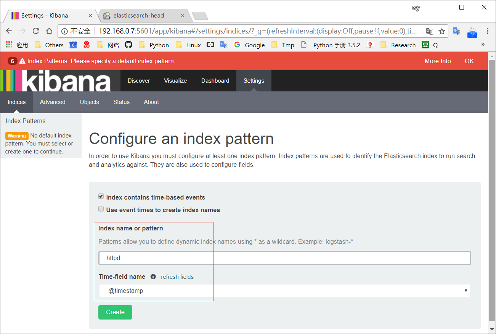
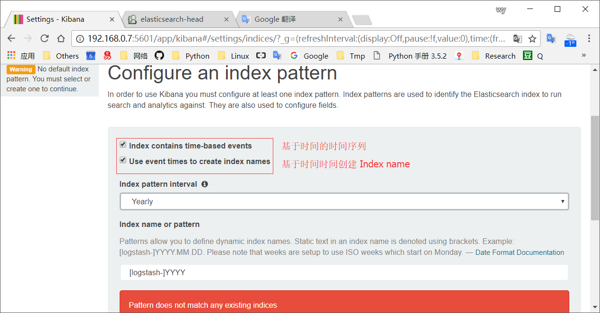
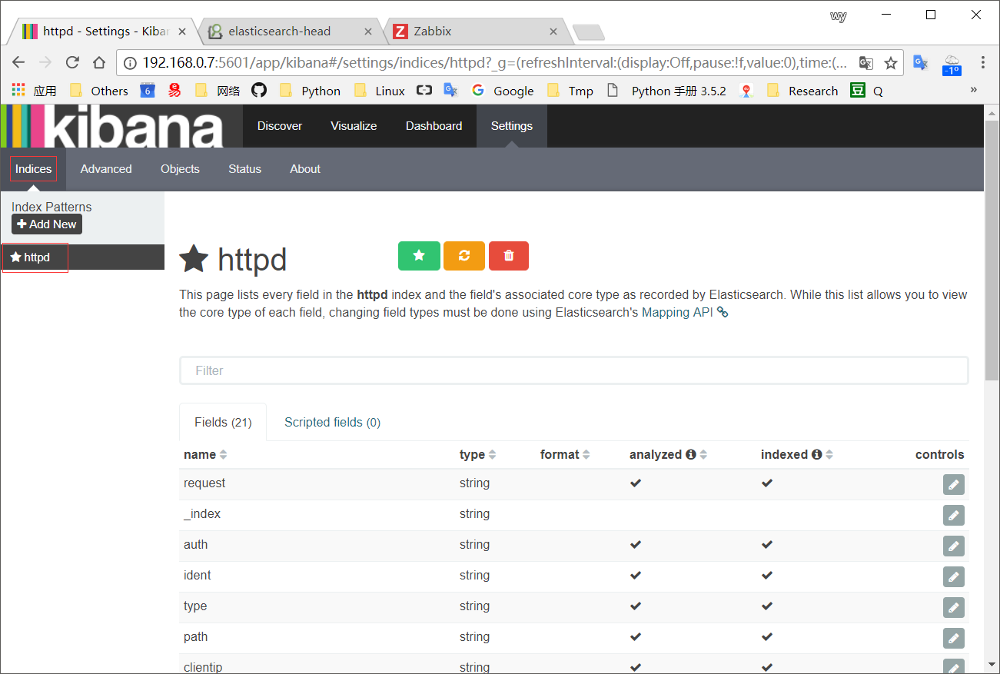
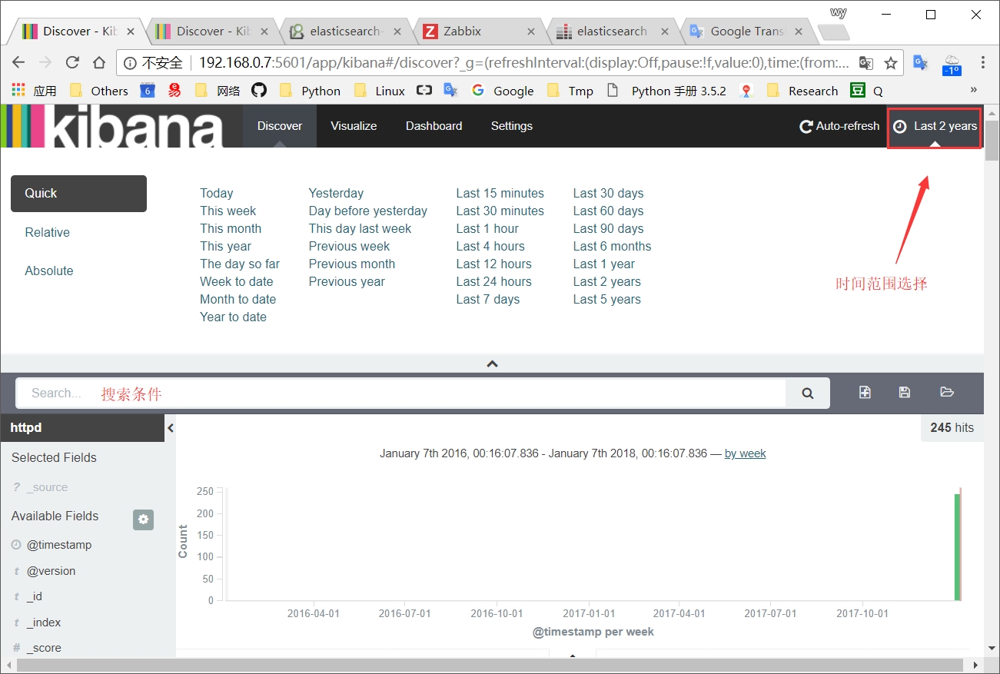
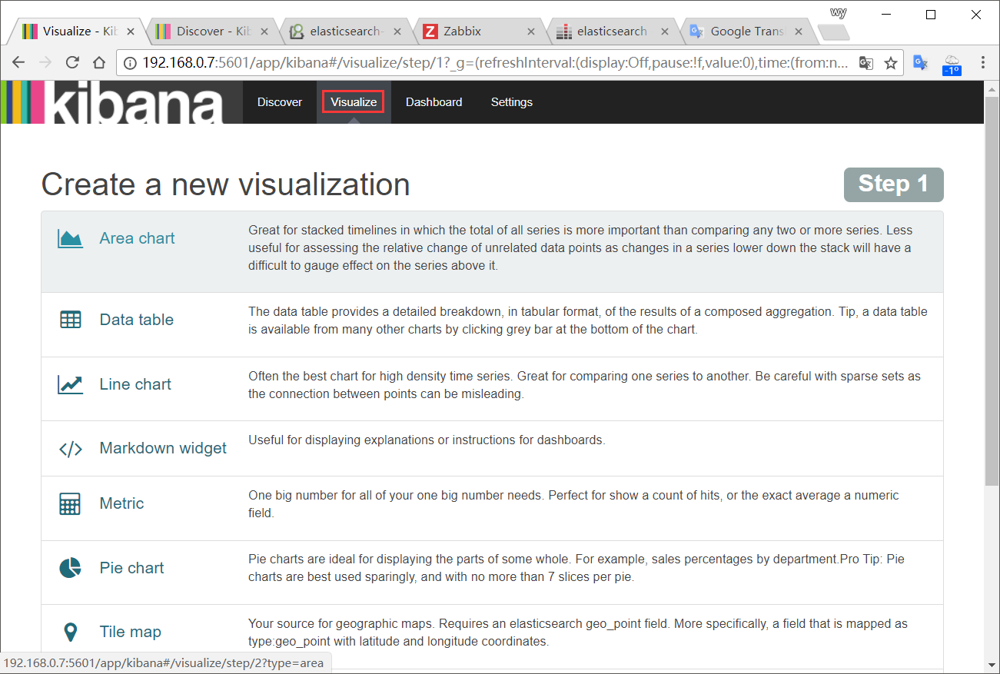

#### 安装
```bash
#仅需要安装在ES集群的某个节点或独立节点安装即可

[root@node3 ~]# tar -zxf kibana-4.2.2-linux-x64.tar.gz -C /usr/local/
[root@node3 ~]# ln -sv /usr/local/kibana-4.2.2-linux-x64 /usr/local/kibana
"/usr/local/kibana" -> "/usr/local/kibana-4.2.2-linux-x64"
[root@node3 ~]# cd /usr/local/kibana
[root@node3 kibana]# vim config/kibana.yml 
port:5601                                                       #其提供的WEB服务的端口
host:"0.0.0.0"                                                  #监听的地址
elasticsearch_url:"http://<ES集群内某节点的名字或IP>:9200"        #ES集群的访问接口
[root@node3 kibana]# ./bin/kibana       #若报"message": "unknown error"错误，需要更换成适合ES的kibana版本
  log   [05:57:14.015] [info][status][plugin:kibana] Status changed from uninitialized to green - Ready
  log   [05:57:14.038] [info][status][plugin:elasticsearch] Status changed from uninitialized to yellow - Waiting for Elasticsearch
  log   [05:57:14.051] [info][status][plugin:kbn_vislib_vis_types] Status changed from uninitialized to green - Ready
  log   [05:57:14.059] [info][status][plugin:markdown_vis] Status changed from uninitialized to green - Ready
  log   [05:57:14.064] [info][status][plugin:metric_vis] Status changed from uninitialized to green - Ready
  log   [05:57:14.070] [info][status][plugin:spyModes] Status changed from uninitialized to green - Ready
  log   [05:57:14.073] [info][status][plugin:statusPage] Status changed from uninitialized to green - Ready
  log   [05:57:14.077] [info][status][plugin:table_vis] Status changed from uninitialized to green - Ready
  log   [05:57:14.115] [info][listening] Server running at http://0.0.0.0:5601
  log   [05:57:19.122] [info][status][plugin:elasticsearch] Status changed from yellow to yellow - No existing Kibana index found
  log   [05:57:21.826] [info][status][plugin:elasticsearch] Status changed from yellow to green - Kibana index ready

# kibana 参数：
#     -c 指明配置文件
#     --plugins <path> 指明Kibana插件的存放目录
#     -e 启动时指定ES集群的URL（即配置文件中的 elasticsearch_url 值）
#     -l 日志文件路径，不指定则默认输出到stdout
#     ..(略)

# 访问：http://<kibana_server_address>:5601
```
#### Example
###### 首次访问时需添加一个index pattern来告诉kibana需要从es里面搜索哪些类型的索引...

###### 基于时间时间创建 Index name

###### 增加及查看索引

###### Kibana-搜索

###### 自定义图形展示

