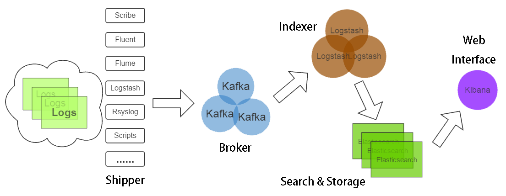
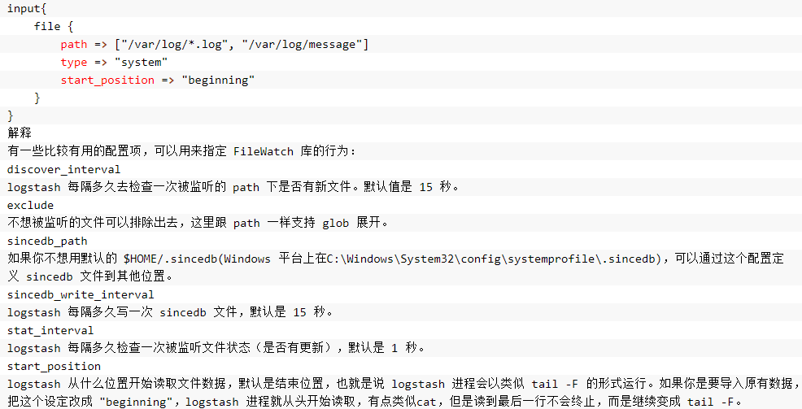
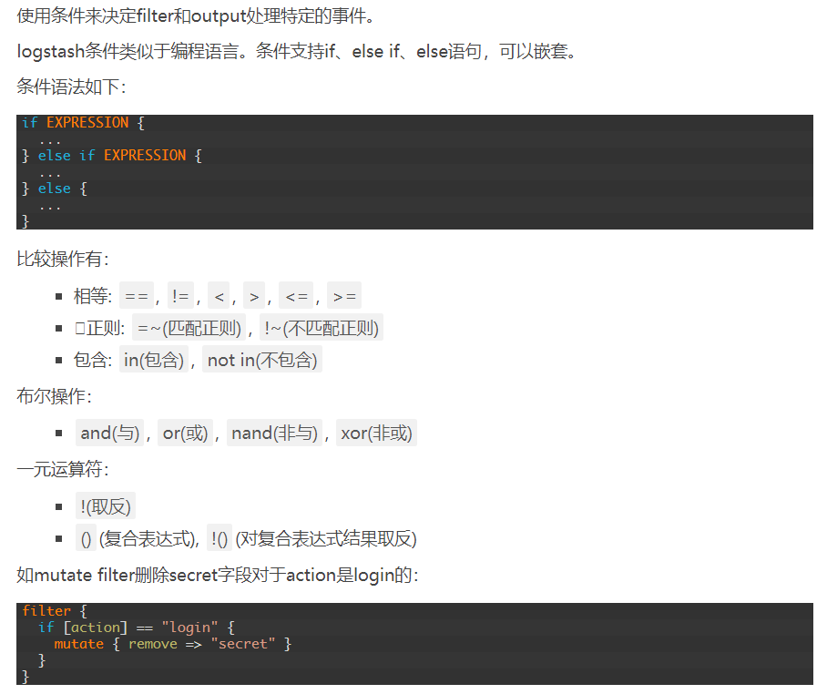
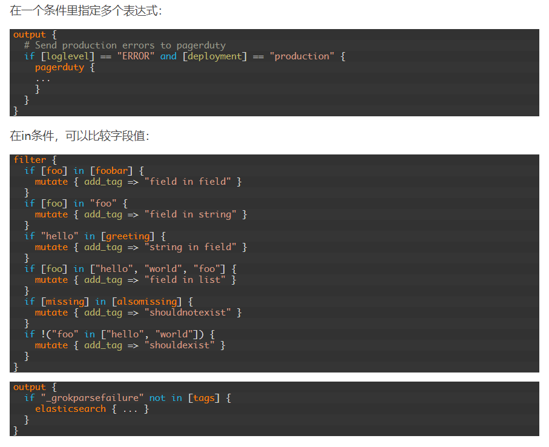
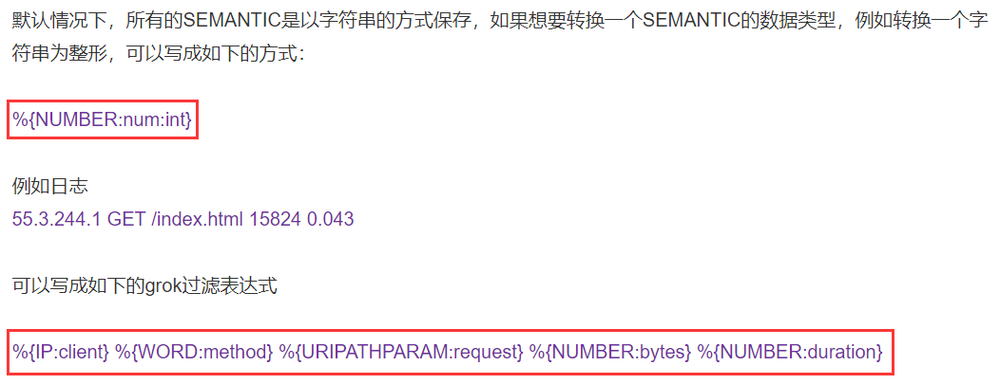

#### 安装
```bash
#分别在Logstash的各Node节点执行如下。Logstash requires Java 7 or later ...
any_node ~]# yum -y install java-1.8.0-openjdk java-1.8.0-openjdk-devel.x86_64
any_node ~]# echo "export JAVA_HOME=/usr" > /etc/profile.d/java.sh && . /etc/profile
any_node ~]# yum -y install logstash-1.5.4-1.noarch.rpm                 #本地安装

any_node ~]# echo "export PATH=/opt/logstash/bin:$PATH" > /etc/profile.d/logstash.sh 
any_node ~]# . /etc/profile                                             #其二进制文件放在了opt/logstash目录下

any_node ~]# rpm -ql logstash | grep -v opt         
/etc/init.d/logstash
/etc/logrotate.d/logstash
/etc/logstash/conf.d
/etc/sysconfig/logstash
/var/lib/logstash
/var/log/logstash
```
#### 配置举例 （ stdin 与 stdout 插件 ）
```bash
any_node ~]# cd /etc/logstash/conf.d     #此目录下所有的conf后缀都是配置文件                 
any_node conf.d]# vim simple.conf        #一般用于定义使用的插件及参数，如：从哪里得到数据，从哪里输出数据...
input {                                  #定义输入
        stdin {}                         #使用stdin插件实现从标准输入获取数据
}                                       
    
output {                                 #定义输出
        stdout {                         #使用stdout插件实现输出到标准输出
                codec => rubydebug       #定义编码插件，使用的编码是rubydebug（其中的 XXX "=>" XXX 即键与值）
        }                                
}                                        

any_node conf.d]# logstash -f /etc/logstash/conf.d/simple.conf -t  #测试配置是否正确
Configuration OK
any_node conf.d]# logstash -f /etc/logstash/conf.d/simple.conf
Logstash startup completed

 kjfsdjfsdjfhskdhfskjd                                   #从标准输入输入数据
{
       "message" => " kjfsdjfsdjfhskdhfskjd",            #输入的数据（可使用过滤器对其进行过滤）
      "@version" => "1",                                 #版本号，若未修改则通常为1
    "@timestamp" => "2018-01-05T12:23:18.403Z",          #自动附加的数据生成时间戳，如：用于Logstash对其排序
          "host" => "node1"                              #在哪个节点生成
}

# --------------------------------- Logstash的配置文件内的配置框架 ------------------------------------------
input {
    ...
}

filter {
    ...		#filter段可选，其进行数据的处理
}

output {
    ...
}

# 	支持的数据类型：
# 	   Array: [item1,item2,item3,...]
# 	   Boolean: True/false
# 	   Bytes:简单字符
# 	   Codec:编码器，指明数据类型
# 	   HASH:key: value
# 	   Number: 数值，一般是正数或浮点数
# 	   Password: 密码串，不会被记录到日志中，或显示为星号的字串
# 	   Path：路径，表示FS路径
# 	   String：字符串

# 	对Logstash获取的字段引用时应使用中括号"[]"括住!
# 	条件判断：
# 	   逻辑：==，!=，<，<=，>，>=，...
# 	   匹配：=~, !~
# 	   in，not in
# 	   and，or
# 	   复合语句：()
```
####  一个监听 /var/log/messages 的例子
```bash
any_node conf.d]# cat from_message.conf 
input {
    file {
        path => ["/var/log/messages"]       #键的值支持使用数组的方式
        type => "system"		    #指明其获取的数据类型，默认是string，（也可以随便取）
        start_position => "beginning"       #键值对，指明读取的起使位置
    }
}       #type可供logstash的server端收集时根据类型做额外的处理（这些都是file的相关参数，需要参考官方的文档）...

output {
    stdout {
        codec => rubydebug
    }
}

any_node conf.d]# logstash -f /etc/logstash/conf.d/from_message.conf -t    	#验证配置
Configuration OK
any_node conf.d]# logstash -f /etc/logstash/conf.d/from_message.conf            #启动
{
       "message" => "Jan  5 02:21:18 node1 elasticsearch: at org.elasticsearch.http.netty.HttpRequestHandler.exceptionCaught(HttpRequestHandler.java:67)",
      "@version" => "1",
    "@timestamp" => "2018-01-05T14:35:05.831Z",
          "host" => "node1",
          "path" => "/var/log/messages",
          "type" => "system"
}
{
       "message" => "Jan  5 02:21:18 node1 elasticsearch: at org.jboss.netty.channel.SimpleChannelUpstreamHandler.handleUpstream(SimpleChannelUpstreamHandler.java:112)",
      "@version" => "1",
    "@timestamp" => "2018-01-05T14:35:05.841Z",
          "host" => "node1",
          "path" => "/var/log/messages",
          "type" => "system"
}
```
#### filter 插件：grok
```txt
filter插件主要实现的功能是将event通过output段发出前对其实现事先的某些处理，其比较著名的处理插件是 grok
grok也是logstash最重要的插件之一，并且也是从web服务器读取日志后在处理时必然用到的插件
grok用于分析并结构化文本的数据，如给web日志的IP或method方法从文本中通过正则拆出并为其赋予KAY：METHOD，ADDRESS之类供分析
它也是将一大段非结构化的日志文本数据转化为结构化可查询数据的不二之选

默认情况下logstash已经提供了120种grok模式，这些模式定义在patterns目录下的grok-patterns文件中，每个模式都有唯一的名称
    any_node  ~]# rpm -ql logstash | grep patterns$
    /opt/logstash/vendor/bundle/jruby/1.9/gems/logstash-patterns-core-0.3.0/patterns/grok-patterns       
    #其中的grok-patterns是grok的模式文件，里面是事先定义的正则表达式和对其的嵌套引用，其使用的元字符与sed/awk/grep类似

grok语法格式：
    %{SYNTAX:SEMANTIC}
        SYNTAX -> 预定义的模式的名称（即grok已经有的模式的名称，通常是grok-patterns文件中各行开头的模式名）
                  形如：SYSLOGBASE  %{SYSLOGTIMESTAMP:timestamp}  (?:%{SYSLOGFACILITY} )?  .....
        SEMANTIC -> 指定预定义模式所匹配的文本的自定义的标识符...

Example：
     --> 192.168.0.1 GET /index.html 2048 12.30
     --> ${IP:clientIP}  ${WORD:method} ${URIPATHPARAM:request} ${NUMBER:bytes}  ${NUMBER:time}
     解释：对通过IP模式匹配到的数据取一个名叫clientIP，相当于将匹配的数据赋值给变量KEY键: clientIP .....
     

插件 Demo：
filter {  
    grok{
        patterns_dir => "./patterns"
        match => { "message" => "%{IP:client}/%{USER:auth}/%{WORD:method}/%{NOTSPACE:request}"}  
    }   #定义消息如何匹配并拆解....
} 

自定义模式：（较少用）
    1.(?<field_name> 这里写入正则表达式 )  <--- 其中的"<field_name>"可省略
    2.模式又引用模式： NEW_PATTERN_NAME ${PATTERN_NAME}

注：当原始messages信息经grok被拆分后，可以不存储在ES Cluster中，因此可在filter中对"messages"字段(KEY)进行隐藏...
```
```bash
input {
    file {
	codec => multiline {
		 pattern => "^\s"
		 what => "previous"
	}
        path => "/usr/local/tomcat8/logs/catalina.out"
        start_position => "beginning"
    }
}

filter {
    grok {
        patterns_dir => "/usr/local/elk/logstash-patterns"
        match => {
            "message" => "%{MYLOG}"
        }
        add_field => [ "log_ip", "192.168.1.81" ]
	add_field => {"log_hostname" => "${HOSTNAME}"}	#使用了${HOSTNAME}，即本机环境变量
    }							#若使用本机环境变量，需在启动命令上加 --alow-env
    ruby {
    	code => "event['daytag'] = event.timestamp.time.localtime.strftime('%Y-%m-%d')"
    }	#执行ruby程序，上面是将日期转化为字符串赋予"daytag"
}

output {
    elasticsearch {                                                   #ES插件
      hosts => ["192.168.1.81","192.168.1.82","192.168.1.83"]         #ES主机集群的列表
        index => "tomcat"                                             #存储到ES的哪个索引当中（若不存在会创建）
        #index => "tomcat-{+yyy.mm.dd}"                               #按天创建索引   
    }
}

output {
    redis{
        batch => false              #若启用则一次可PUSH多个事件，即通过发一条push命令存储一批的数据，默认为false
        batch_events => 50          #一次rpush多少条
        batch_timeout => 5          #一次rpush最多消耗多少s（默认5s）
        codec => plain
        congestion_interval => 1    #每多长时间进行一次拥塞检查，默认1s，若为0则对每个PUSH都进行检测
        congestion_threshold => 0   #Redis的list中最多可存在多少item数据，默认0，表示禁用拥塞检测，
                                    #当list中的数据量达到congestion_threshold，会阻塞直到有其他消费者消费list中的数据
        data_type => list           #存储到redis时的数据类型（主要有：list列表或：channel频道（实现发布订阅））
                                    #使用列表时生产者不断对特定数据库（0~15中）进行LPUSH追加到，消费者不断的RPOP取出..
        db => 0                     #使用redis的数据库，默认使用0号（0~15）
        host => ["127.0.0.1:6379"] 
        key => xxx                  #指定存储在redis中时的list或channel的名字
        password => xxx             #密码
        port => 6379                #端口
        reconnect_interval => 1
        shuffle_hosts => true
        timeout => 5                #超时时间
        workers => 1                #线程数
    }
}
```
#### 例子
```txt
input {
    file {
        path => "/root/logstash/logstash-tutorial.log"
        start_position => beginning 
    }
}

filter {
    grok {
        match => { "message" => "%{COMBINEDAPACHELOG}"}
    }
    geoip {
    	source => "clientip"
    }
}
output {
    elasticsearch {
	hosts => "localhost:9200"
    }
    stdout {}
}
```
#### 关于 Logstash 的架构
```
Logstash Agent 发送数据时的两种方式：

    直接发往elasticsearch:
    [Logstash-Agent] ---> [Elasticsearch-Cluster]

    先交给logstatsh-server:
    [Logstash-Agent] ---> [Logstash-server] ---> [Elasticsearch-Cluster]
    其主要目的是实现数据流的整合，如：Serevr将收到的各个event数据依时间戳"排列好"之后再发往ES
    并且其可减轻agent对es的负载，还可以只让agent进行收集任务，而grok与filter交给server进行...
    Logstash-server与Logstash-Agent并没有什么区别，只不过是其input与outpt的次序不同而已...
    注：Logstash-server与Logstash-Agent的版本最好保持一致~！

其他形式的Logstash架构:
    [Logstash-Agent] ---> [redis/kafka] ---> [Logstash-server] ---> [Elasticsearch-Cluster]
    当有多个Agent时由Redis做队列缓冲，并由server统一收集并进行filter之后再送给ES集群
```
```txt
单个进程logstash可实现对数据的读取、解析和输出处理。
但是生产环境中从每台应用服务器运行logstash并将数据直接送到Elasticsearch里，显然不是第一选择：
	第1，过多的客户端连接对 Elasticsearch 是一种额外的压力
	第2，网络抖动会影响到 logstash 进程，进而影响生产应用
	第3，运维人员未必愿意在生产服务器上部署Java，或让logstash跟业务代码争夺Java资源

所以在实际运用中，logstash进程会被分为两个不同的角色
运行在应用服务器上的，尽量减轻运行压力，只做读取和转发，这个角色叫做shipper
运行在独立服务器上，完成数据解析处理，负责写入Elasticsearch的角色，叫indexer
```

#### output 插件：redis 与 elasticsearch
```bash
#Logstash-server端配置的Demo：

input {
    redis {                         #从redis获取数据（Agnt端output到redis）
        batch_count => 1            #返回的事件数量，此属性仅在list模式下起作用。
        data_type => "list"         #logstash redis插件工作方式
        key => "logstash-test-list" #监听的键值（即Logstash-Agent存储在redis中时的list或channel的名字）
        host => "127.0.0.1"         #redis地址
        port => 6379                #redis端口号
        password => "123qwe"        #如果有安全认证，此项为密码
        db => 0                     #redis数据库的编号
        threads => 1                #启用线程数量
    }
}

filter {
    ....（若其接收输入数据在Agent端已经被grok过滤则Server端可省略此步骤）
}

output {
    elasticsearch {                                           #ES插件
        hosts => ["192.168.0.5","192.168.0.6","192.168.0.7"]  #ES主机集群的列表（不同Logstash版本配置方式不同）
        index => "tomcat"                                     #存储到ES的哪个索引当中（若不存在会创建）
        #index => "tomcat-{+yyy.mm.dd}"                       #按天创建索引   
    }
}
```
###### Logstash 的 FileWatch 说明...

###### 条件判断 demo 1

###### 条件判断 demo 2

###### Grok中的数据类型转换

