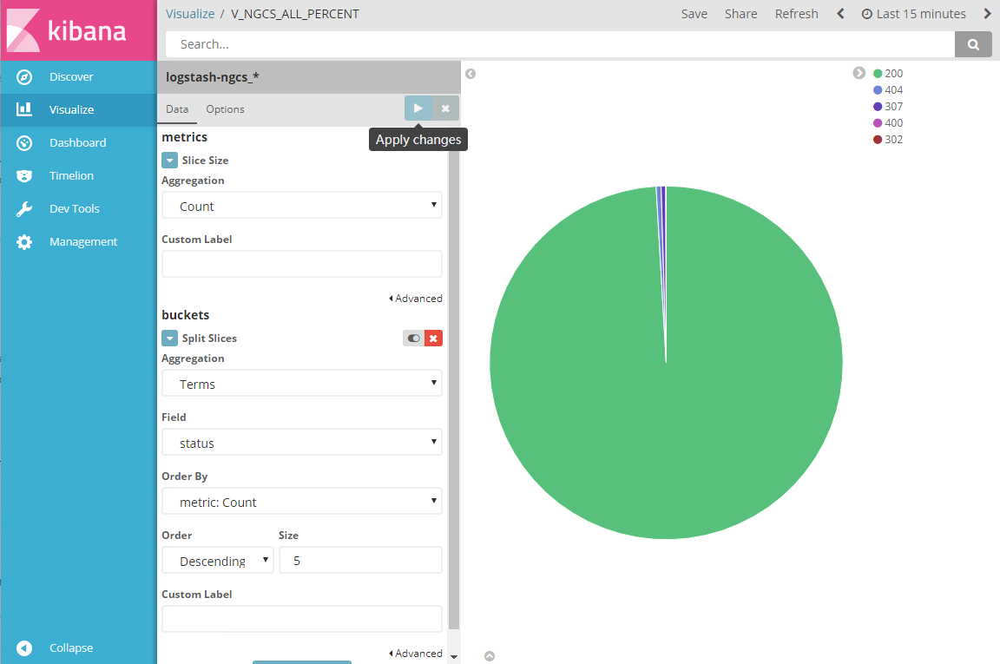
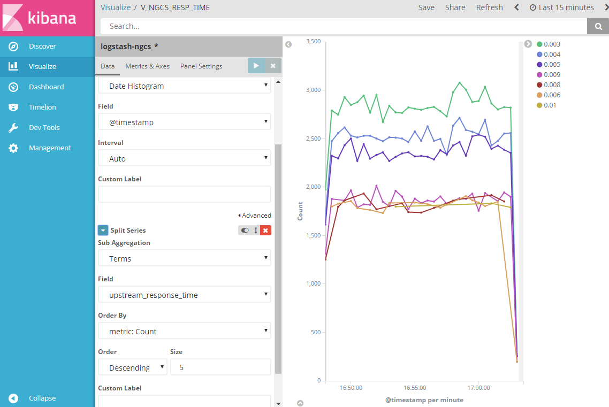
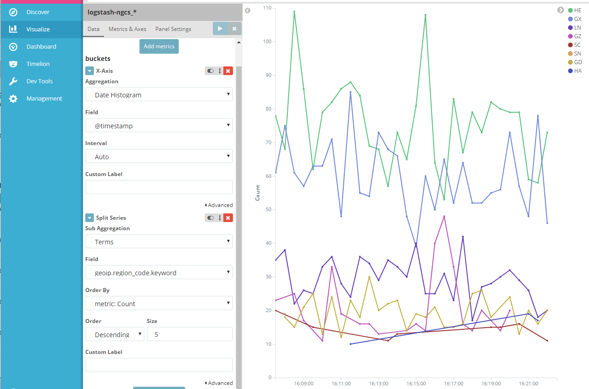
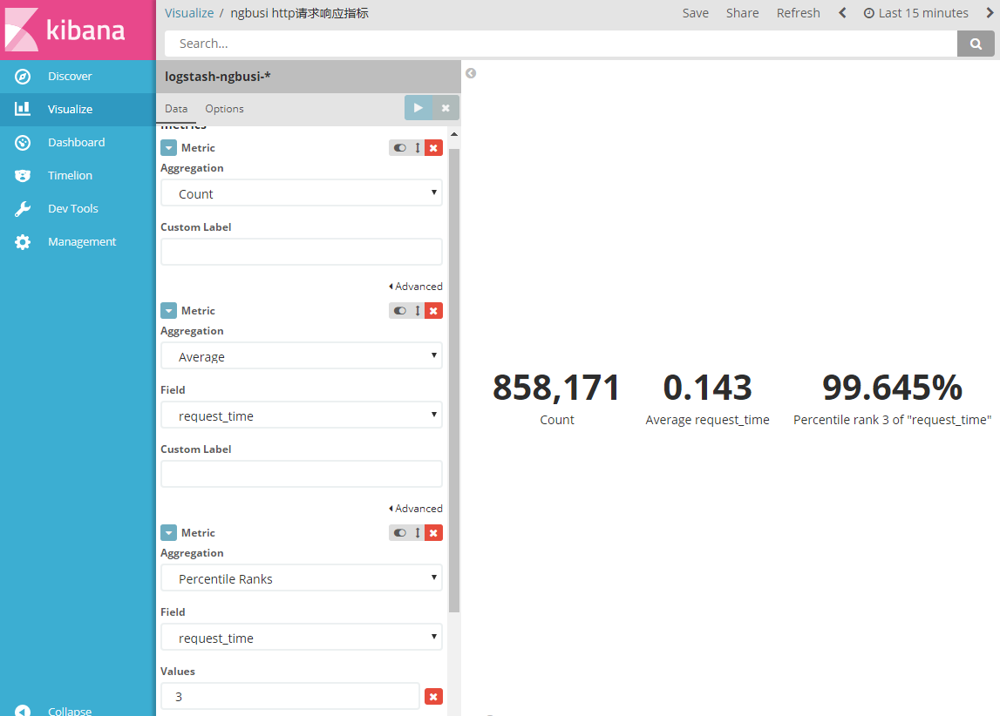
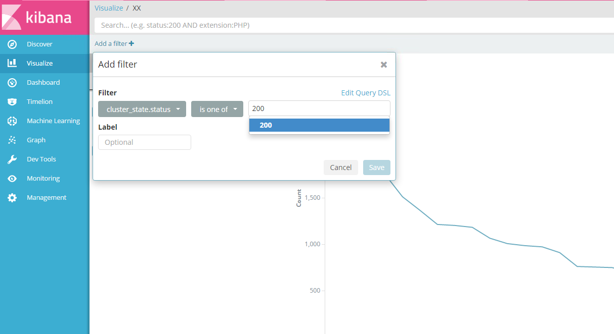
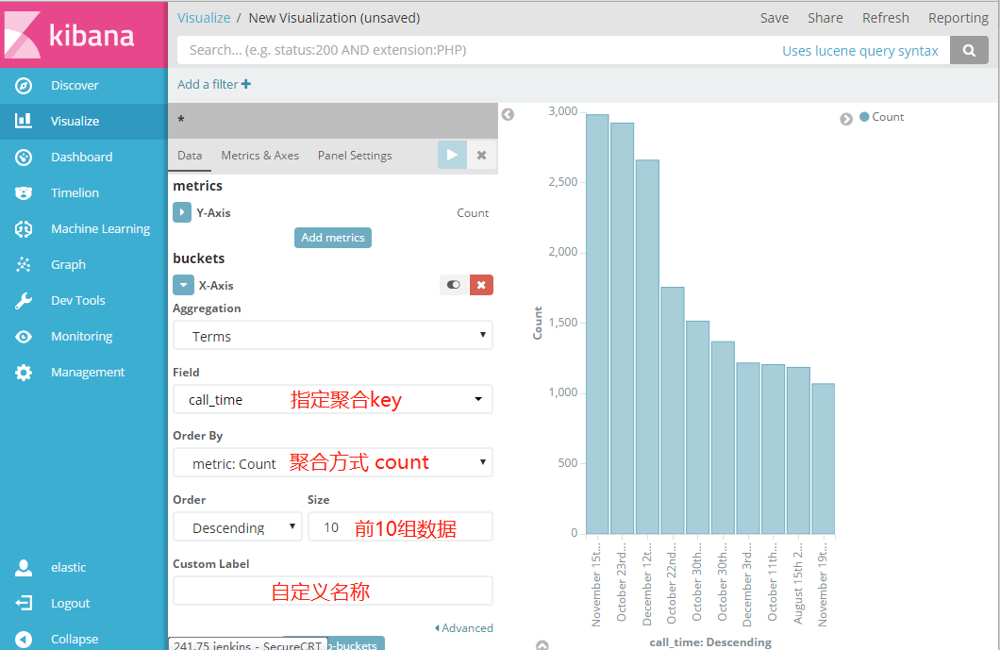

#### KQL
```bash
# 排除特定主机的三种日志类型后的日志，且消息中含有weblogic关键字
ip: xx.xx.xx.xx and messages: weblogic and not loglevel: info || warning || notice 

# 字段匹配200或404的文档
response:(200 or 404)

# 包含术语列表的多值字段的文档
tags:(success and info and security)

# 匹配响应不是200的所有文档
not response:200

# 范围查询
account_number: < 100 AND balance: > 47500
```
#### 状态码饼图展示

#### Nginx返回时间统计

#### 地区分布折线图

#### 具体key数据计算

#### 排除某部分数据

#### 条形图分组

