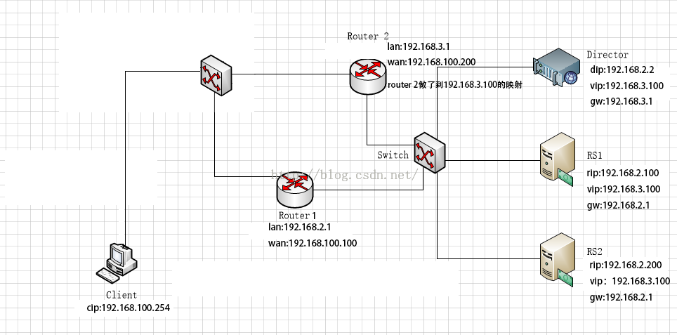

#### 说明
```txt
DR：
      DR、RS均使用相同VIP对外服务但仅DR对此VIP的ARP请求响应，所有RS对此VIP的ARP请求保持静默，即网关把对VIP的请求全部交给DR
      当DR收到后根据调度算法找出对应RS并切把此VIP的数据包中的MAC改为RS的MAC（因IP一致）并将请求分发给这台RS
      RS处理后由于IP一致因此可将数据直接返回给C端，"相当于直接从客户端收到这个数据包无异"。DR模型从始至终修改的仅有MAC地址
      因DR要对二层包头改换所以DR、RS之间必须在同一个广播域（可简单理解为在同一台交换机中）

      特点：
      与TUN相比这种实现不需隧道结构因此可使用大多数操作系统做为后端节点，但其要求负载均衡器的网卡必须与物理网卡在一个物理段
      RS的网关不能与DR的网关相同，接收VIP的网关应该仅知道DR的MAC地址... （响应报文必须不能进过Director Server设备）

NAT：
      将C端的数据包目的IP换为某RS的IP并发其处理，RS处理后把数据交给LVS(网关)后LVS再把RS发送时数据包中的源IP改为VIP后发送
      不论进出流量都要经过DR，"性能不优"（NAT模式下的RS需将网关指向DR，数据包内的客户端IP一直存在数据包中，未被DR改变）
      
      特点：
      集群中的服务器可使用任何支持TCP/IP的系统而LVS仅需有1个合法IP即可
      但当服务器节点过多时大量数据交汇在LVS导致速度变慢成为性能瓶颈

FULLNAT：（需要编译）
      相对与NAT模式来说，此模式同时将源与目的地址修改，RS认为C端就是DR设备....
      相当于中间人，其可实现端口映射功能
      
IP-IP：	
      将C端来的数据"封装"增加新的目的IP后发往RS，RS把数据的头解开并还原数据包、处理后直接返回C端（不再经LVS）
      因RS需对LVS发来的包还原所以必须支持IPTUNNEL协议，所以RS的内核必须编译支持IPTUNNEL
      
      特点：
      LVS仅负责将请求包分发给后端节点从而减少LVS的大量数据交互，这种方式在公网即可进行不同地域分发..
      但各后端节点需合法IP并且需要所有节点支持"IP Tunneling"协议
```

#### DR

```bash
yum install -y ipvsadm

# 前端 director 设置
echo 1 > /proc/sys/net/ipv4/ip_forward

ifconfig eth0:0 down
ifconfig eth0:0 192.168.0.38 broadcast 192.168.0.38 netmask 255.255.255.255 up
route add -host 192.168.0.38 dev eth0:0

ipvsadm -C
ipvsadm -A -t 192.168.0.38:80 -s wrr 
ipvsadm -a -t 192.168.0.38:80 -r 192.168.0.18:80 -g -w 3
ipvsadm -a -t 192.168.0.38:80 -r 192.168.0.28:80 -g -w 1

# 查看规则
ipvsadm -ln

# 后端 RS 设置
vip=192.168.0.38
ifconfig lo:0 $vip broadcast $vip netmask 255.255.255.255 up    #注意是在本地的loopbak
route add -host $vip lo:0
echo "1" >/proc/sys/net/ipv4/conf/lo/arp_ignore
echo "2" >/proc/sys/net/ipv4/conf/lo/arp_announce
echo "1" >/proc/sys/net/ipv4/conf/all/arp_ignore
echo "2" >/proc/sys/net/ipv4/conf/all/arp_announce

# 或用 RS 脚本：
SNS_VIP=192.168.0.38

case "$1" in 
start) 
      ifconfig lo:0 $SNS_VIP netmask 255.255.255.255 broadcast $SNS_VIP 
      /sbin/route add -host $SNS_VIP dev lo:0 
      echo "1" >/proc/sys/net/ipv4/conf/lo/arp_ignore 
      echo "2" >/proc/sys/net/ipv4/conf/lo/arp_announce 
      echo "1" >/proc/sys/net/ipv4/conf/all/arp_ignore 
      echo "2" >/proc/sys/net/ipv4/conf/all/arp_announce 
      sysctl -p >/dev/null 2>&1 
      echo "RealServer Start OK" 
      ;; 
stop) 
     ifconfig lo:0 down 
      route del $SNS_VIP >/dev/null 2>&1 
      echo "0" >/proc/sys/net/ipv4/conf/lo/arp_ignore 
      echo "0" >/proc/sys/net/ipv4/conf/lo/arp_announce 
      echo "0" >/proc/sys/net/ipv4/conf/all/arp_ignore 
      echo "0" >/proc/sys/net/ipv4/conf/all/arp_announce 
      echo "RealServer Stoped" 
      ;; 
*) 
      echo "Usage: $0 {start|stop}" 
      exit 1 
esac 

```
#### NAT
```bash
yum install -y ipvsadm

# 前端 director 设置
echo 1 > /proc/sys/net/ipv4/ip_forward

# 设置 nat （实验环境的设置，当实际环境为NAT时此步骤跳过）
# iptables -t nat -F
# iptables -t nat -X
# iptables -t nat -A POSTROUTING -s 192.168.0.0/24 -j MASQUERADE

ipvsadm -C
ipvsadm -A -t 172.16.254.200:80 -s wrr
ipvsadm -a -t 172.16.254.200:80 -r 192.168.0.18:80 -m -w 1
ipvsadm -a -t 172.16.254.200:80 -r 192.168.0.28:80 -m -w 1

# 查看规则
ipvsadm -ln

# 后端 RS 设置
在后端若干 RS 上设置其网关的 IP 为 director 的内网 IP 地址即可！
```
#### TUN
```bash

# 前端 DR 设置
echo 1 > /proc/sys/net/ipv4/ip_forward

/sbin/service network stop
ifconfig eno16777736:0 192.168.80.120 netmask 255.255.255.255 broadcast 192.168.80.120 up
/sbin/route add -host 192.168.80.120 dev eno16777736:0
/sbin/service network start

echo "0" > /proc/sys/net/ipv4/ip_forward
echo "1" > /proc/sys/net/ipv4/conf/all/send_redirects
echo "1" > /proc/sys/net/ipv4/conf/default/send_redirects
echo "1" > /proc/sys/net/ipv4/conf/eth0/send_redirects

ipvsadm -A -t 192.168.80.120:8080 -s rr
ipvsadm -a -t 192.168.80.120:8080 -r 192.168.80.135 -i
ipvsadm -a -t 192.168.80.120:8080 -r 192.168.80.136 -i


# 后端 RS 脚本

#!/bin/bash    
#description : start realserver  
VIP=192.168.80.120  
/etc/rc.d/init.d/functions  
case "$1" in  
start)  
echo " start LVS of REALServer"  
modprobe ipip  #加载好ipip模块后会有默认的tunl0隧道
echo "0" > /proc/sys/net/ipv4/ip_forward
/sbin/ifconfig tunl0 $VIP netmask 255.255.255.255 broadcast $VIP  
echo "1" > /proc/sys/net/ipv4/conf/tunl0/arp_ignore  
echo "2" > /proc/sys/net/ipv4/conf/tunl0/arp_announce  
echo "1" > /proc/sys/net/ipv4/conf/all/arp_ignore  
echo "2" > /proc/sys/net/ipv4/conf/all/arp_announce  
echo "0" > /proc/sys/net/ipv4/conf/tunl0/rp_filter
echo "0" > /proc/sys/net/ipv4/conf/all/rp_filter
# tunl0/rp_filter 默认为1 ，需要改为0，关闭此功能。
#Linux的rp_filter用于实现反向过滤技术，也即uRPF，它验证反向数据包的流向，以避免伪装IP攻击 。 
#然而，在LVS TUN 中，数据包是有问题的，因为从realserver eth0 出去的包源IP应为192.168.1.62，而不是VIP。
#所以必须关闭返一项功能。 
#DR和TUN在网络层实际上使用了一个伪装IP数据包的功能。让client收到数据包后，迒回的请求再次转给分发器。
#
;;  
stop)  
/sbin/ifconfig tunl0 down  
echo "close LVS Directorserver"  
echo "0" > /proc/sys/net/ipv4/conf/tunl0/arp_ignore  
echo "0" > /proc/sys/net/ipv4/conf/tunl0/arp_announce  
echo "0" > /proc/sys/net/ipv4/conf/all/arp_ignore  
echo "0" > /proc/sys/net/ipv4/conf/all/arp_announce  
echo "1" > /proc/sys/net/ipv4/conf/tunl0/rp_filter  
echo "1" > /proc/sys/net/ipv4/conf/all/rp_filter  
;;  
*)  
echo "Usage: $0 {start|stop}"  
exit 1  
esac 
```
