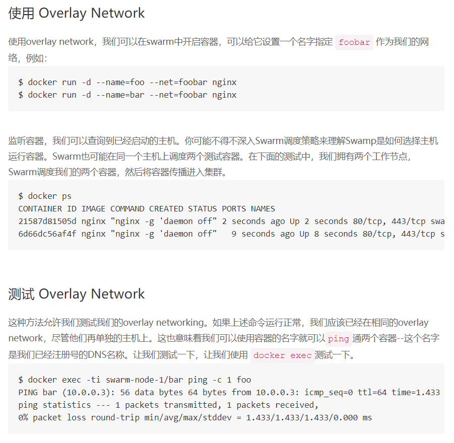

#### 创建2个服务，服务名分别为demo1，demo2
```bash
[root@host-a ~]# docker service create --replicas 2 --network my-network  --name demo1  docker.io/bashell/alpine-bash  ping www.163.com
alrj33okhrqaes9n0l5a65s22
[root@host-a ~]# docker service create --replicas 2 --network my-network  --name demo2  docker.io/bashell/alpine-bash  ping www.qq.com  
55bzqljqmerg17bq4xn9qmgm3
[root@host-a ~]# docker service ls
ID            NAME   REPLICAS  IMAGE                          COMMAND
55bzqljqmerg  demo2  2/2       docker.io/bashell/alpine-bash  ping www.qq.com
alrj33okhrqa  demo1  2/2       docker.io/bashell/alpine-bash  ping www.163.com
```

#### 测试
```bash
#通常Docker官方推荐使用dig，nslookup或其它查询工具来查询通过DNS对服务名的访问。因为VIP是逻辑IP，ping并不是确认VIP连通性的正确的工具
#连接到默认的bridge网络连接的容器需要明确的在启动时使用『–link』参数相互指定，才能在容器里使用容器名称连接到对方。
#而连接到自定义网络的容器，不需要任何配置就可以直接使用容器名连接到任何一个属于同一网络中的容器。
#在相同网络中的容器可直接使用名称相互找到对方，而在不同网络中的不能够直接通信!...

[root@host-b ~]# docker ps
CONTAINER ID        IMAGE                                  COMMAND             CREATED             STATUS              PORTS               NAMES
454c481f4349        docker.io/bashell/alpine-bash:latest   "ping www.qq.com"   25 seconds ago      Up 23 seconds                           demo2.1.2yip71mh1aschw596wp6wrkxm
014067903d08        docker.io/bashell/alpine-bash:latest   "ping www.qq.com"   26 seconds ago      Up 24 seconds                           demo2.2.2uks2aqkl2ev2fj3gpzffbfq4
[root@host-b ~]# docker exec -it 014067903d08 bash  #进入demo2
bash-4.4# ping demo1.1.8gb683zx67i0o1wo2gpsjvz0g    #pingdemo1的DNS名称，发现可ping通，使用的是swarm内置的DNS
PING demo1.1.8gb683zx67i0o1wo2gpsjvz0g (10.0.9.3): 56 data bytes
64 bytes from 10.0.9.3: seq=0 ttl=64 time=0.531 ms
64 bytes from 10.0.9.3: seq=1 ttl=64 time=0.609 ms
bash-4.4# nslookup tasks.demo1                      #容器内部，使用特殊查询DNS来找到demo1服务的所有容器的IP地址                                                                                                                                                         
nslookup: can't resolve '(null)': Name does not resolve

Name:      tasks.demo1
Address 1: 10.0.9.3 demo1.1.8gb683zx67i0o1wo2gpsjvz0g.my-network
Address 2: 10.0.9.4 demo1.2.8n1plpbgx7iqp4i5g04079mty.my-network

[root@host-b ~]#  docker network inspect my-network
[
    {
        "Name": "my-network",
        "Id": "a88ql269d3t1ev1yq4n828yut",
        "Scope": "swarm",
        "Driver": "overlay",
        "EnableIPv6": false,
        "IPAM": {
            "Driver": "default",
            "Options": null,
            "Config": [
                {
                    "Subnet": "10.0.9.0/24",
                    "Gateway": "10.0.9.1"
                }
            ]
        },
        "Internal": false,
        "Containers": {
            "014067903d08282c890a5ce57ae3245fb0962b522719306f9e6020d6fcd7a75b": {
                "Name": "demo2.2.2uks2aqkl2ev2fj3gpzffbfq4",
                "EndpointID": "4f5d7b1615aae29409e0b5e5ef275fcec7eaf1305117467fb1aa4fabcc55f11c",
                "MacAddress": "02:42:0a:00:09:07",
                "IPv4Address": "10.0.9.7/24",
                "IPv6Address": ""
            },
            "454c481f4349ab3b7a883c436c5a756fca42a93fb5f206545a50d36b109d512c": {
                "Name": "demo2.1.2yip71mh1aschw596wp6wrkxm",
                "EndpointID": "e4e69eae64c6c6d0899644ececaa31e20b7f755e7ebd41b186eb0c3e89d0d164",
                "MacAddress": "02:42:0a:00:09:06",
                "IPv4Address": "10.0.9.6/24",
                "IPv6Address": ""
            }
        },
        "Options": {
            "com.docker.network.driver.overlay.vxlanid_list": "257"
        },
        "Labels": {}
    }
]
```
#### 其他相关博文的转载

