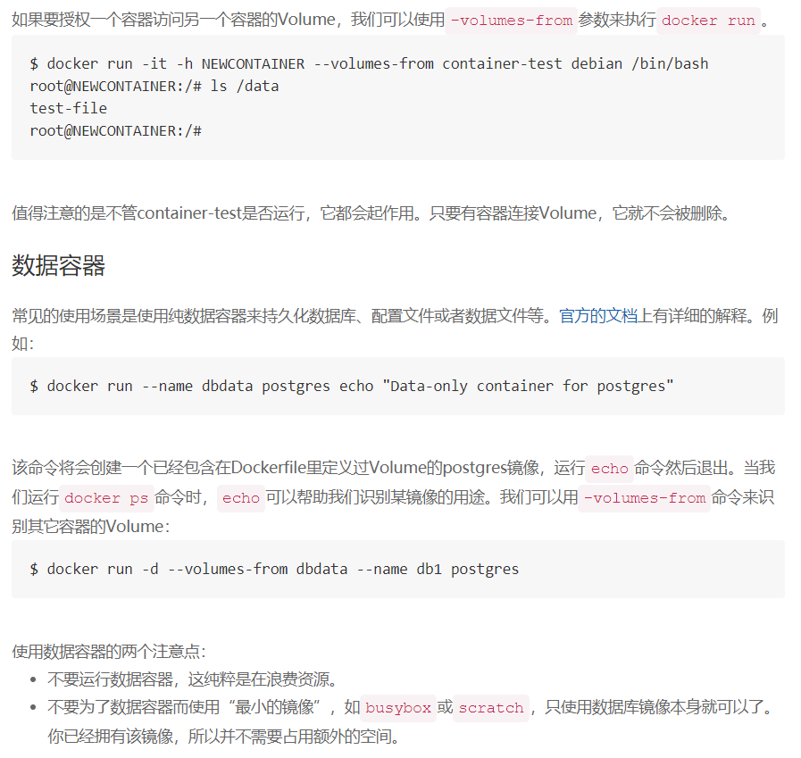
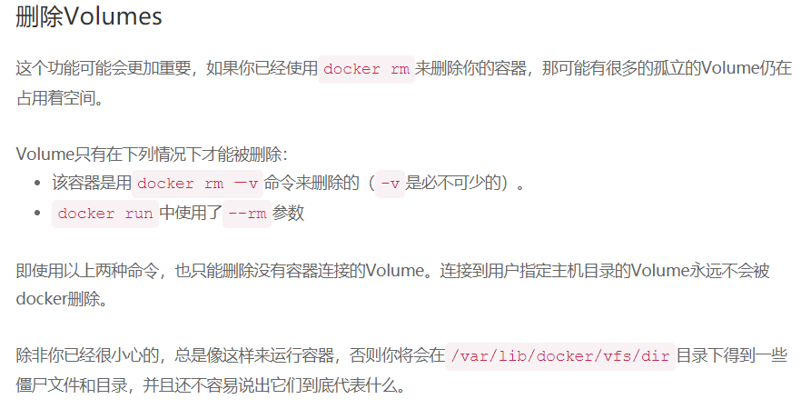

```bash
#创建提供共享卷的容器，注意其不需要被运行!
[root@localhost ~]# docker run -v /leader docker.io/bash
[root@localhost ~]# docker ps -aq
36c428158164

#使用--volumes-from=指定要挂载的Docker卷（即卷容器的ID）...
[root@localhost ~]# docker run -it --name client1111 --volumes-from=36c428158164 docker.io/bash 
bash-4.4# 
bash-4.4# ls /leader/   #不存在
[root@localhost ~]# docker run -it --name client2222 --volumes-from=36c428158164 docker.io/bash   
bash-4.4# ls /leader/
bash-4.4# cd /leader/   
bash-4.4# touch 1       #创建
[root@localhost ~]# docker exec -it  client1111 ls /leader
1                       #证明是被共享的数据...

[root@localhost ~]# docker inspect -f "{{.Mounts}}" client2
[{24a42a02d190b94d5ef5e64036bee67a53ebb5d7b91ad40114370cd84f05622c \
/var/lib/docker/volumes/24a42a02d190b94d5ef5e64036bee67a53ebb5d7b91ad40114370cd84f05622c/_data /leader local true }]
[root@localhost ~]# docker inspect -f "{{.Mounts}}" client1
[{24a42a02d190b94d5ef5e64036bee67a53ebb5d7b91ad40114370cd84f05622c \
/var/lib/docker/volumes/24a42a02d190b94d5ef5e64036bee67a53ebb5d7b91ad40114370cd84f05622c/_data /leader local true }]

[root@localhost ~]# docker volume ls
DRIVER              VOLUME NAME
local               24a42a02d190b94d5ef5e64036bee67a53ebb5d7b91ad40114370cd84f05622c    #client1与2均使用了此VOLUME
```
#### 以下摘录转载自: http://dockone.io/article/128


