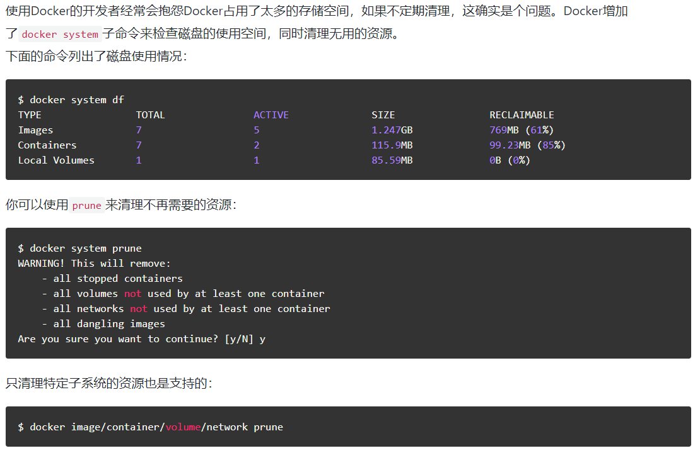

##### 数据存放位置 /var/lib/docker
```bash
1、/var/lib/docker/devicemapper/devicemapper/data       #用来存储相关的存储池数据      
2、/var/lib/docker/devicemapper/devicemapper/metadata   #用来存储相关的元数据。
3、/var/lib/docker/devicemapper/metadata/               #用来存储 device_id、大小、以及传输_id、初始化信息
4、/var/lib/docker/devicemapper/mnt                     #用来存储挂载信息 
5、/var/lib/docker/container/                           #用来存储容器信息
6、/var/lib/docker/graph/                               #用来存储镜像中间件及本身详细信息和大小 、以及依赖信息
7、/var/lib/docker/repositores-devicemapper             #用来存储镜像基本信息
8、/var/lib/docker/tmp                                  #docker临时目录   
9、/var/lib/docker/trust                                #docker信任目录
10、/var/lib/docker/volumes                             #docker卷目录
```
> 由于系统中有需要持久化的数据，数据卷几乎成了一个必选项。但是在N多次创建镜像、删除实例、新建实例的过程中硬盘居然不够用了！查看/var/lib/docker的空间，居然有几十个G之多。于是想到了数据卷


##### 重建实例时数据卷是否会被保留
> 基于同一个镜像时，多次创建实例会共享他们创建出的数据卷，这也是数据卷的最常用用法。  
> 但当镜像被修改时，即使名字和tags都相同，只要镜像ID不同，那么基于“相同名字”的这个镜像创建出的实例就不会共享之前的数据卷。

##### 删除未被挂载的数据卷
> Docker并未提供直接删除所有无用卷的功能（实际出于安全考虑也不应提供）。但通过命令组合可以达到这个目的

以下命令可显示所有的未挂载数据卷
```Bash
docker volume ls -f dangling=true
```
组合使用以下命令可以删除所有未挂载卷
```Bash
docker volume rm $(docker volume ls -qf dangling=true)
```
#### 新版DOCKER增加了清理占用资源的命令

#### docker 1.13 版本之后支持使用的数据清除命令
```bash
docker image prune      删除无用的镜像
docker container prune  删除无用的容器
docker volume prune     删除无用的卷
docker network prune    删除无用的网络
docker system prune     删除无用的镜像、容器、卷、网络
```
