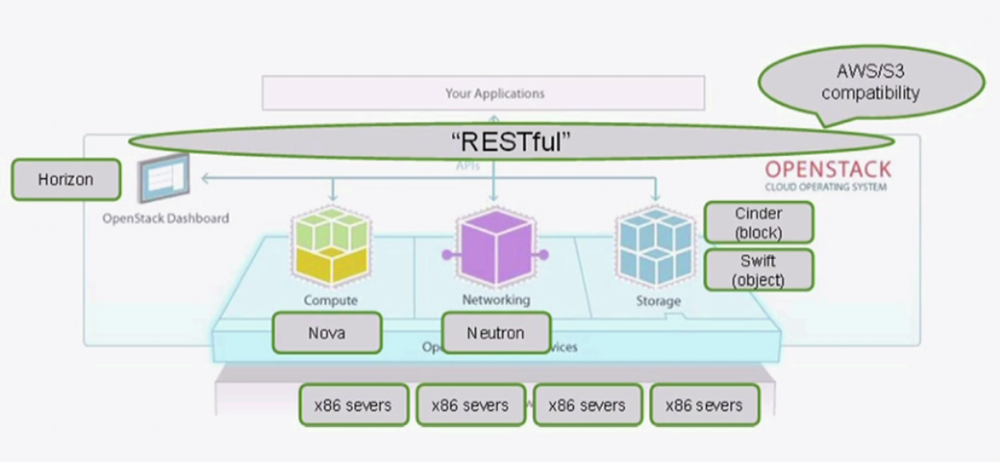

```txt
NAME	        SERVICE
Keystone	Identity	        认证*
Glance	        Image	                镜像*
Nova	        Compute	                计算*
Neutron	        Networking	        网络*
Cinder	        Block Storage	        块存储
Swift	        Object Storage	        对象存储
Horizon	        Dashboard	        面板*
Heat	        Orchestration	        编排
Ceilometer	Telemetry	        监控
Sahara	        Elastic Map Reduce	大数据部署
----------------------------------------------------------------
Service	Code Name	        Description
Identity Service	        Keystone	User Management
Compute Service	                Nova	        Virtual Machine Management
Image Service	                Glance	        Manages Virtual image like kernel image or disk image
Dashboard	                Horizon	        Provides GUI console via Web browser
Object Storage	                Swift	        Provides Cloud Storage
Block Storage	                Cinder	        Storage Management for Virtual Machine
Network Service	                Neutron	        Virtual Networking Management
Orchestration Service	        Heat	        Provides Orchestration function for Virtual Machine
Metering Service	        Ceilometer	Provides the function of Usage measurement for accounting
Database Service	        Trove	        Database resource Management
Data Processing Service	        Sahara	        Provides Data Processing function
Bare Metal Provisioning	        Ironic	        Provides Bare Metal Provisioning function
Messaging Service	        Zaqar	        Provides Messaging Service function
Shared File System	        Manila	        Provides File Sharing Service
DNS Service	                Designate	Provides DNS Server Service
Key Manager Service	        Barbican	Provides Key Management Service
```
## openstack-deploy
Openstack基于CentOS7环境，利用RDO源repo安装部署

##### openstack rdo源，版本自选
```
https://repos.fedorapeople.org/repos/openstack/
```
##### 基础环境mysql,monogodb安装
```
yum install -y mongodb mysql-devel mysql mysql-server
```
##### 安装liberty版本
```
yum install -y https://repos.fedorapeople.org/repos/openstack/openstack-liberty/rdo-release-liberty-3.noarch.rpm
```
##### 安装基础包
```
yum install -y openstack-packstack
packstack  --install-hosts=120.122.83.251  #指定可以访问IP,最后Testing过程需要等待一段时间，耐心等待
```
##### 查看安装完成服务所需基础数据
```
cat /root/keystonerc_admin
unset OS_SERVICE_TOKEN
export OS_USERNAME=admin
export OS_PASSWORD=8cc18195sdfafte1
export OS_AUTH_URL=http://120.122.83.251:5000/v2.0
export PS1='[\u@\h \W(keystone_admin)]\$ '
#dashborad访问
http://120.122.83.251/dashboard
```

