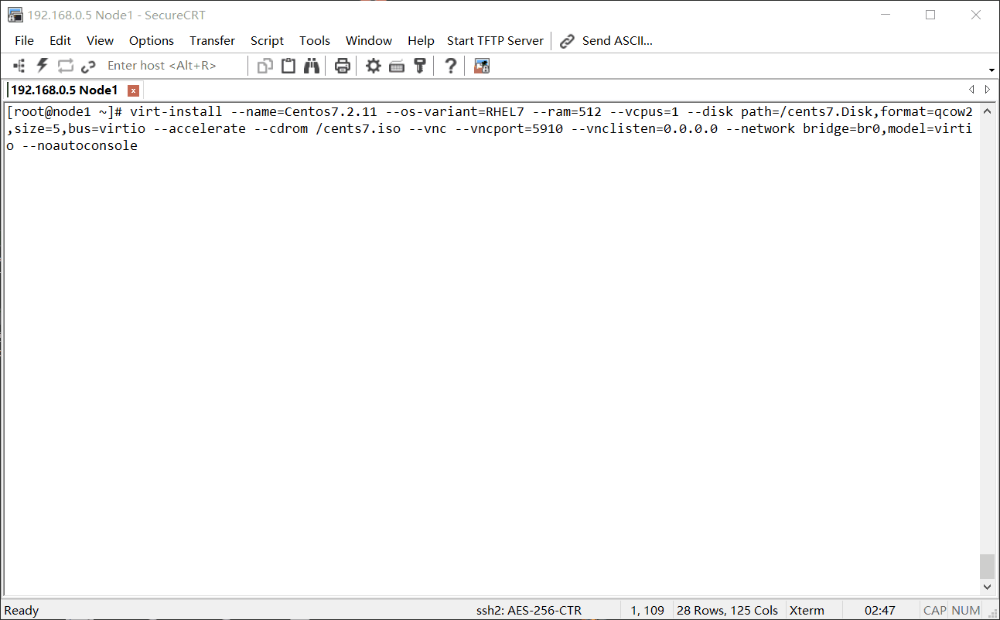

#### 安装Kvm,kvm_intel模块及Libvirtd
```bash
#检测硬件是否支持虚拟化，若含有vmx或svm字样则表示支持CPU虚拟化，Intel是：vmx，AMD是：svm （KVM依赖硬件虚拟化技术的支持）
#同时也需要检测是否有kvm_xxx模块，若装载不成功可能是未开启硬件虚拟化，需从bios中开启 "VT-d" 与 "Virtual Technology"
[root@wy ~]# egrep '(vmx|svm)' --color=always /proc/cpuinfo      
[root@wy ~]# modprobe kvm     
[root@wy ~]# modprobe kvm_intel || modprobe kvm_amd

#安装rpm包并启动"libvirtd"服务，注：KVM依赖于Qemu的某些功能，如I/O设备的模拟/管理等...
[root@wy ~]# yum -y install epel-release
[root@wy ~]# yum -y install kvm qemu-kvm-tools qemu-img libvirt libvirt-client libvirt-python libguestfs-tools \
virt-v2v virt-install virt-manager virt-viewer virt-top bridge-utils guestfish
[root@wy ~]# ln -sv /usr/libexec/qemu-kvm /usr/sbin/
"/usr/sbin/qemu-kvm" -> "/usr/libexec/qemu-kvm"

[root@wy ~]# systemctl start libvirtd   #云环境中其相当于Agent,virsh远程访问时以qemu:///host:port/systems的形式访问

#检查是否有kvm模块，若有则继续
[root@wy ~]# lsmod | grep kvm
kvm_intel       52570  30      
kvm             314739 1 kvm_intel

#建议使用此方式进行验证。字符设备："/dev/kvm" 是linux的Kvm模块调用接口，若需创建虚拟机等操作，仅需向其发起调用即可!...
[root@wy ~]# ll /dev/kvm 
crw-------. 1 root root 10, 232 1月  20 11:19 /dev/kvm
```
####  libvirtd 配置目录：/etc/libvirt/ 与 /etc/libvirt/qemu/
```bash
[root@node1 ~]# cat /etc/libvirt/libvirtd.conf
#listen_tcp = 1
#listen_addr = "192.168.0.1"
#tcp_port = "16509"
#此外还有关于TLS加密通讯，unix.socket的配置...

[root@node1 ~]# echo 1 > /proc/sys/net/ipv4/ip_forward
[root@node1 ~]# cat /etc/libvirt/qemu/networks/default.xml    #启动libvirtd服务后其根据此配置创建桥设备及DHCP
<!--
WARNING: THIS IS AN AUTO-GENERATED FILE. CHANGES TO IT ARE LIKELY TO BE
OVERWRITTEN AND LOST. Changes to this xml configuration should be made using:
  virsh net-edit default  <--- 设置KVM的默认网络
  virsh net-define default <--- 读取并定义新的网络配置
  virsh net-start default <--- 启用自定义网络
or other application using the libvirt API.
-->
<network>
  <name>default</name>
  <uuid>2238313d-75bd-4b02-af54-938a0dd09b63</uuid>
  <forward mode='nat'/>                                        <!-- 其默认的桥"virbr0"工作于NAT模式 -->
  <bridge name='virbr0' stp='on' delay='0'/>                   <!-- 其使用的网桥设备及细节设置 -->
  <mac address='52:54:00:34:6d:d8'/>
  <ip address='192.168.122.1' netmask='255.255.255.0'>         <!-- 桥设备的IP地址 -->
    <dhcp>
      <range start='192.168.122.2' end='192.168.122.254'/>     <!-- 分配的地址范围 -->
    </dhcp>
  </ip>
</network>
```

#### 配置桥接网络 br0 ，使虚拟机直接使用宿主机的物理网卡（物理网络）
```bash
# 即创建网桥设备并将物理网卡的地址转移到桥设备上，然后再将物理网卡加入到桥设备中

[root@wy ~]# cd /etc/sysconfig/network-scripts/ && cp ifcfg-eno16777736 ifcfg-br0
[root@wy ~]# vim ifcfg-eno16777736
DEVICE=eno16777736
TYPE=Ethernet     
ONBOOT=yes     
NM_CONTROLLED=no                # NetworkManager服务不支持桥接，所以原则上建议设为"no"
BRIDGE="br0"                    # 将本设备桥接到哪个设备 --> br0 (此配置下eth0与br0逻辑上称为1个网卡且MAC相同)
#BOOTPROTO=static               # 此段注释，相当于把br0当交换机，将eth0当接入设备

[root@wy ~]# vim ifcfg-br0
NAME=br0
DEVICE=br0                      # 网桥名字
TYPE=Bridge                     # 
ONBOOT=yes     
NM_CONTROLLED=yes     
BOOTPROTO=static     
IPADDR="192.168.2.149"     
NETMASK="255.255.255.0"     
GATEWAY="192.168.2.2"     

[root@wy ~]# systemctl restart network
[root@wy ~]# ip link set dev br0 promisc on     #开启网卡的混杂模式
```
#### 关于KVM的四种简单网络模型
```txt
1. 隔离模式：    虚机之间组建网络，该模式无法与宿主机通信，无法与其他网络通信，相当于虚机都连接到了独立的交换机上
2. 路由模式：    相当于虚机连接到一台路由器上，由路由器(物理网卡)，统一转发，但是不会改变源地址，因此无法实现NAT
3. NAT模式：     在路由模式中会出现虚拟机可以访问其他主机但其他主机的报文无法到达虚拟机
                而NAT模式则将源地址转换为路由器(物理网卡)地址，这样其他主机也知道报文来自哪个主机，docker中常被使用
4. 桥接模式：    在宿主机中创建一张虚拟网卡作为宿主机的网卡，而物理网卡则作为交换机
```
## 部署安装虚拟机
#### 建立磁盘文件
```bash
#如果使用的是raw格式就不需要了，kvm虚拟机默认使用raw格式的镜像格式，其性能最好，速度最快
#它的缺点就是不支持一些新的功能如快照镜像，zlib磁盘压缩，AES加密等。这里使用qcow2格式...
[root@wy ~]# mkdir /opt/vms
[root@wy ~]# qemu-img create -f qcow2 /opt/vms/centos63-webtest.img 40G
```
#### 建立虚拟机
下面展示多种方式建立虚拟机
```bash
# KVM对I/O设备同时支持全虚拟化和半虚拟化!，其半虚拟化组件叫做"virtio"，它是一种通用的半虚拟化驱动，是Linux内核中的模块
# I/O设备的虚拟模式有三种：1.模拟,2.半虚拟化,3.透传
# virtio-blk      块设备的半虚拟化，使用磁盘的版虚拟化时其性能接近物理机的85%
# virtio-net      网络设备的半虚拟化
# virtio-pci      PCI设备的半虚拟化（注！显卡设备不支持版虚拟化）
# virtio-console  控制台的半虚拟化
# virtio-ballon   内存的动态扩展/缩容

############# 使用iso安装 ############# 
[root@wy ~]# virt-install \     
--name=centos5 \     
--os-variant=RHEL5 \     
--ram=512 \     
--vcpus=1 \     
--disk path=/opt/vms/centos63-webtest.img,format=qcow2,size=7,bus=virtio \  #virtio是其接口类型，即半虚拟化技术
--accelerate \     
--cdrom /data/iso/CentOS5.iso \     
--vnc --vncport=5910 \     
--vnclisten=0.0.0.0 \     
--network bridge=br0,model=virtio \     #此处的网卡即使用了之前在宿主机创建的br0
--noautoconsole

############# 使用nat模式网络 ############# 
[root@wy ~]# virt-install \     
--name=centos5 \     
--os-variant=RHEL5 \     
--ram=512 \     
--vcpus=1 \     
--disk path=/opt/vms/centos63-webtest.img,format=qcow2,size=7,bus=virtio \     
--accelerate \     
--cdrom /data/iso/CentOS5.iso \     
--vnclisten=0.0.0.0 --vnc --vncport=5910 \     
--network network=default,model=virtio \     
--noautoconsole

############# 从http安装，使用ks, 双网卡, 启用console ############# 
[root@wy ~]# virt-install \     
--name=centos63-webtest \     
--os-variant=RHEL6 \     
--ram=4096 \     
--vcpus=4 \     
--virt-type kvm  \     
--disk path=/opt/vms/centos63-webtest.img,format=qcow2,size=7,bus=virtio \     
--accelerate  \     
--location http://111.205.130.4/centos63 \     
--extra-args "linux ip=59.151.73.22 netmask=255.255.255.224 gateway=59.151.73.1 \ 
ks=http://111.205.130.4/ks/xen63.ks console=ttyS0  serial" \
--vnc --vnclisten=0.0.0.0 --vncport=5910 \     
--network bridge=br0,model=virtio \     
--network bridge=br1,model=virtio \     
--force \     
--noautoconsole

########## 安装windows ######## (不能用virtio，因为默认windows没有virtio的硬盘和网卡驱动，即windows不支持半虚拟化)
[root@wy ~]# virt-install \     
--name=win7-test \     
--os-variant=win7 \     
--ram=4096 \     
--vcpus=4 \      
--disk path=/opt/vms/centos63-webtest.img,size=100 \     
--accelerate  \     
--cdrom=/opt/iso/win7.iso       
--vnclisten=0.0.0.0 --vnc --vncport=5910 \     
--network bridge=br0 \       
--force \
--noautoconsole

# 参数说明：     
# --name 指定虚拟机名称，全局唯一
# --ram 分配内存大小
# --vcpus 2,cpuset=1,2 分配CPU核心数，最大与物理CPU核数相同，以及将虚机CPU绑定在物理机的哪个核心，避免CPU资源漂移的开销
# --vcpus=VCPUS[,maxvcpus=MAX][,sockets=#][,cores=#][,threads=#] VCPU个数及相关配置
# --cpu 指定CPU模式及特性，如coreduo等；可使用 qemu-kvm -cpu ?来获取支持的CPU模式
# --disk 指定虚拟机镜像，其size子参数指定分配大小单位为G，其sparse关键字参数指明工作于稀疏格式
# --network 网络类型，常用的是bridge桥接。其可指定多次，其子参数model的值建议使用virtio，子参数mac指定MAC地址
# --metadata 用户自定义的元数据文本信息
# --accelerate 加速
# --pxe 基于PXE完成安装
# --cdrom 指定安装镜像
# --boot 指定启动顺序，如：--boot hd,cdrom
# --import 从已经存在的磁盘镜像中创建
# --location 安装源URL，支持FTP、HTTP及NFS等，如ftp://172.16.0.1/pub
# --vnc 启用VNC远程管理
# --vnclisten 指定VNC绑定IP，默认绑定127.0.0.1
# --vncport 指定VNC监控端口，默认端口5900，端口不能重复
# --os-type 操作系统类型，如linux、unix或windows等
# --extra-args 用于安装时传递给内核的额外选项，如指定ks文件位置，--extra-args "ks=http://172.16.0.1/class.cfg"
# --os-variant  [win7 vista winxp win2k8 rhel6 rhel5]
# --force 如果有yes或者no的交互式，自动yes，即禁止命令进入交互式模式
# --autostart 虚拟机是否在物理启动后自动启动（开机自启）
# --noautoconsole 禁止自动连接至虚拟机的控制台
# --nodisks 不使用本地磁盘，在LiveCD模式中常用
# --connect qemu:///system 指明需要连接到的VMM的URL信息，其中的"qemu:///system"即本机

# 当虚拟机创建后其配置信息保存在"/etc/libvirt/qemu/"中
# 当用户自定义虚拟机的xml配置文件时，对各类型的*.xml进行验证的例子：
[root@wy ~]# virt-xml-validate /etc/libvirt/qemu/networks/default.xml 
/etc/libvirt/qemu/networks/default.xml validates
```

#### 安装系统
```bash
#安装系统有三种方式，通过：VNC，virt-manager，console配合ks

#通过VNC来安装
#下载TightVNC连接上vnc安装，只需TightVNC Client即可。如果使用RealVNC就设置ColourLevel=rgb222才能连接
#端口号是安装时指定的，以后的安装流程和普通的是一样的

#通过virt-manager,
#如果你使用xshell那么可以不用安装x window就可以使用virt-manager, 需要安装 x11相关软件
[root@wy ~]# yum -y install libX11 xorg-x11-server-utils xorg-x11-proto-devel dbus-x11 \
xorg-x11-xauth xorg-x11-drv-ati-firmware  xorg-x11-xinit 
[root@wy ~]# virt-manager

#通过virt console
#如果安装时启用了 console可以使用 console来安装。Ctrl+] 可以退出console

#通过virt-viewer
[root@wy ~]# yum -y install virt-viewer xorg-x11-font* virt-viewer centos63-webtest 
```

## 管理KVM虚拟机
#### virsh command ...
```bash
1.virsh进入交互模式，在该交互模式下有命令补全。
   virsh # help list   #详细帮助     
2. virsh list --all #查看虚拟机状态     
3. virsh start instanceName #虚拟机开机     
4. virsh shutdown instanceName #虚拟机关机（需要Linux母体机电源管理 service acpid start）  
5. virsh destroy instanceName  #强制关机     
6. virsh create /etc/libvirt/qemu/wintest01.xml #通过以前的配置文件创建虚拟机     
7. virsh autostart instanceName #配置自启动     
8. virsh dumpxml wintest01 > /etc/libvirt/qemu/wintest02.xml #导出配置文件     
9. virsh undefine wintest01 #删除虚拟机配置文件，不会真的删除虚拟机     
10. mv /etc/libvirt/qemu/wintest02.xml /etc/libvirt/qemu/wintest01.xml ; \ 
    virsh define /etc/libvirt/qemu/wintest01.xml      #重新定义虚拟机
11. virsh edit wintest01  #编辑虚拟机配置文件     
12. virsh suspend wintest01  #挂起虚拟机     
13. virsh resume wintest01 #恢复挂起虚拟机     
```

#### 克隆
```bash
#一.使用virt-manager克隆，这个太简单就不演示了，需注意的是如果启用了VNC记得记得更改VNC的端口
#否则启动会失败的，见命令方式修改VNC修改

#二.使用命令克隆虚拟机
    Example：
    [root@wy ~]# virt-clone -o centos63_webtest -n centos63_webtest2 -f /opt/vms/centos_webtest2.img
    #参数说明:     
         -o –-original  #原来实例name     
         -n –-name      #新实例名称     
         -f –-file      #新实例磁盘存放位置
    #注：若启用了vnc则需修改配置文件的vnc端口否则启动失败，文件为：/etc/libvirt/qemu实例名.xml
        #或执行命令直接修改：
            [root@wy ~]# virsh edit <实例名>  ---->  <graphics type='vnc' port='5915'   ............
#三.启动克隆机
#有的Linux版本可能生成的网卡有问题，请修改 /etc/udev/rules.d/70-persistent-cd.rules 重启虚拟机)
[root@wy ~]# virsh start <实例名>
```
#### 快照
```bash
#kvm虚拟机默认使用raw格式的镜像格式，性能最好，速度最快
#它的缺点是不支持一些新功能，如支持镜像，zlib磁盘压缩，AES加密等。要使用镜像功能则磁盘格式必须为qcow2
#快照相关的主要命令：snapshot-create , snapshot-revert , snapshot-delete

#查看磁盘格式
[root@wy ~]# qemu-img info /opt/vms/centos63-119.22.img      
image: /opt/vms/centos63-119.22.img     
file format: qcow2     
virtual size: 40G (42949672960 bytes)     
disk size: 136K     
cluster_size: 65536 

#若不是qcow2格式则需要关机后转换磁盘格式，若是则跳过
[root@wy ~]# cp centos63-119.22.img centos63-119.22.raw     
[root@wy ~]# qemu-img convert -f raw -O qcow2 centos63-119.22.raw  centos63-119.22.img

#启动vm, 建立快照，以后可以恢复 (快照配置文件在/var/lib/libvirt/qemu/snapshot/实例名/..)
[root@wy ~]# virsh start centos63-119.22     
[root@wy ~]# virsh snapshot-create centos63-119.22 

#恢复快照，可以建立一些测试文件，准备恢复
[root@wy ~]# ls /var/lib/libvirt/qemu/snapshot/centos63-119.22
1410341560.xml    
[root@wy ~]# virsh snapshot-revert centos63-119.22 1410341560

删除快照
[root@wy ~]# qemu-img info   centos63-119.22     
1         1410341560             228M 2014-04-08 10:26:40   00:21:38.053 
[root@wy ~]# virsh snapshot-delete centos63-119.2 1410341560
```

#### 添加网卡
```bash
#线上服务器是双网卡，一个走内网一个走外网。但初始虚拟机时没有指定两个网卡，这样需要添加网卡了
#比如已经将br1桥接到em2了，如果不会见刚开始br0桥接em1

#方式一.通过virt-manager添加
#简单描述：选中虚拟机 -- Open -- Details – AddHardware 选择网卡模式，mac不要重复，确定即可

#方式二.通过命令来添加
#1.使用命令"virsh attach-interface"为虚拟机添加网卡
[root@wy ~]# virsh attach-interface centos63-119.23 --type bridge --source br1 --model virtio
#2.导出运行配置并覆盖原来的配置文件，因为attach-interface添加后次网卡只是在运行中的虚拟机内部生效了，但配置文件并未改变
[root@wy ~]# cd /etc/libvirt/qemu
[root@wy ~]# virsh dumpxml centos63-119.23 > centos63-119.23.xml
#3.修改GuestOS中的网卡配置文件，为另一个网卡配置IP
[root@wy ~]# cd /etc/sysconfig/network-scripts  
略...
```
#### 硬盘扩容
```bash
#原来的/opt目录随着使用，空间渐渐满了，这时候我们就需要给/opt的挂载分区扩容了
#有两种情况 1. 该分区是lvm格式 2. 不是lvm格式，且不是扩展分区

#一. 分区是lvm格式 这种很简单，添加一块磁盘，lvm扩容
    #virt-manager添加方式和添加网卡一样，不再赘述，下面是使用命令来添加
    #1. 建立磁盘，并附加到虚拟机中
    [root@wy ~]# qemu-img create -f raw 10G.img 10G     
    [root@wy ~]# virsh attach-disk centos-1.2 /opt/kvm/5G.img vdb  
    #2. 添加qcow2磁盘
    [root@wy ~]# qemu-img create -f qcow2 10G.img 10G     
    [root@wy ~]# virsh attach-disk centos-1.2 /opt/kvm/5G.img vdb --cache=none --subdriver=qcow2 
    #说明:       
    #centos-1.2         虚拟机名称     
    #/opt/kvm/5G.img    附加的磁盘     
    #vdb                添加为哪个磁盘, 也就是在guestos中的名字
    #3. 导出并覆盖原来的配置文件，和网卡一样，attach后只是在虚拟机中生效
    [root@wy ~]# virsh dumpxml centos-1.2 > centos63-119.23.xml
    #4. 使用lvm在线扩容，详见 http://www.cnblogs.com/cmsd/p/3964118.html
    
#二. 分区不是lvm格式，该分区不是扩展分区, 需要关机离线扩展
    1.  新建一个磁盘，大于原来的容量，比如原来是40G，你想对某个分区扩容20G那么
    [root@wy ~]# qemu-img create -f qcow2 60G.img 60G
    2. 备份原来的磁盘以防三长两短
    [root@wy ~]# cp centos63-119.27.img centos63-119.27.img.bak
    3. 查看原来的磁盘决定扩容哪一个分区
    [root@wy ~]# virt-filesystems --partitions --long -a centos63-119.27.img     
    [root@wy ~]# virt-df centos63-119.27.img 
    4. 扩容GuestOS的sda2
    [root@wy ~]# virt-resize --expand /dev/sda2 centos63-119.27.img 60G.img      
    #说明：  
    #/dev/sda2              扩容guestos的/dev/sda2     
    #centos63-119.27.img    原来的磁盘文件
    #60G                    第一步建立的更大的磁盘文件    
    5. 使用新磁盘启动
   [root@wy ~]# mv 60G.img centos63-119.27.img      
   [root@wy ~]# virsh start centos63-119.27
   #virt-resize其实就是将原来磁盘中的文件复制到新的文件中，将想要扩大的分区扩大了
```
#### 动态（实时）迁移
```bash
# 进行实时迁移时，KVM的GuestOS物理镜像必须在共享存储之上，且cpu型号和时钟相同，等等....
# 参考：
# https://www.chenyudong.com/archives/virsh-kvm-live-migration-with-libvirt.html

# 动态迁移需要让虚机工作于各节点使用同一个共享存储的环境下
# 在共享存储的基础上将虚机特定时间的内存页执行复制操作即可（复制期间变更的内存数据执行异步的复制传输）...
# 在保证虚机正常运行的同时将对应磁盘数据和内存数据移动至第二台虚机上

[root@wy ~]# systemctl stop firewalld
[root@wy ~]# setenforce 0
[root@wy ~]# mount ..... /mnt/doms/...

#导出虚机配置文件到另一节点的/etc，必要时还有 networks/default.xml
[root@wy ~]# virsh dumpxml Centos7 > ./Centos7.xml

#执行
[root@wy ~]# virsh migrate --live --verbose Centos7 qemu+ssh://172.16.x.x/system --unsafe
```
