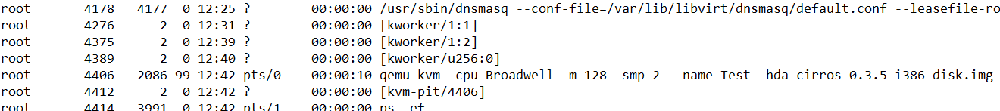

## 镜像工具 qemu-img

主要的镜像管理工具：`qemu-img`

## 创建镜像文件
镜像文件的格式，主要有`qcow2`和`raw`，如下用`qemu-img`命令创建镜像文件
```
qemu-img create -f TYPE FILENAME SIZE
		TYPE:  qcow2, raw
		FILENAME: 文件名
		SIZE: 文件大小，例如`1G`（稀疏格式）

或:
qemu-img create -f qcow2 -o size=20G,preallocation=metadata /img/winxp.qcow2	#稀疏格式（仅预分配磁盘元数据空间）

```
用`dd`命令也可以创建`raw`格式的镜像文件，用如下命令
```
dd if=/dev/zero of=FILENAME bs=1024k count=4096  # 4G Image
```

使用convert子参数完成镜像文件格式的转换
```
qemu-img convert -O TYPE SRC_IMG_NAME DEST_IMG_NAME

例：
qemu-img convert -p -f raw -O qcow2 test.raw new.qcow2
		 -p： 显示压缩进度
		 -f： 输入的格式
		 -O： 输出的格式
		 -c:  执行压缩（qcow2支持压缩功能）
```
查看磁盘映像信息
```bash
[root@node ~]# qemu-img info cirros-0.3.5-i386-disk.img 
image: cirros-0.3.5-i386-disk.img
file format: qcow2
virtual size: 39M (41126400 bytes)
disk size: 12M
cluster_size: 65536
Format specific information:
    compat: 0.10
```

###### qemu-img Supported formats ......
```txt
Supported formats: vvfat vpc vmdk vhdx vdi ssh sheepdog rbd raw host_cdrom host_floppy host_device file qed 
qcow2 qcow parallels nbd iscsi gluster dmg tftp ftps ftp https http cloop bochs blkverify blkdebug
```
## 加载镜像文件

#### 加载raw格式的镜像文件
+ 加载不分区的镜像文件
```
[root@node ~]# qemu-img create -f raw test.img 3G 	# 创建镜像
[root@node ~]# fdisk -lu test.img			# 查看分区情况
[root@node ~]# mkfs.ext4 test.img  			# 格式化
[root@node ~]# mount -o loop test.img /PATH
```

+ 加载分区的镜像文件
```
[root@node ~]# qemu-img create -f raw test.img 3G
[root@node ~]# fdisk -lu test.img
[root@node ~]# fdisk test.img  				# 对镜像分区
[root@node ~]# kpartx -avs test.img  			# 会在/dev/mapper目录下，生成与分区对应的loopXpY文件
[root@node ~]# mkfs.ext4 /dev/mapper/loop0p1
[root@node ~]# mount /dev/mapper/loop0p1 /PATH

[root@node ~]# umount /PATH
[root@node ~]# kpartx -d test.img
```
#### 加载qcow2格式的镜像文件
加载qcow2格式的镜像文件，需要内核支持NBD(Network Block Device)模块。按如下命令加载：
```
[root@node ~]# modprobe nbd				# 加载NBD模块

[root@node ~]# qemu-img create -f qcow2 test.qcow2 2G   # 创建镜像

[root@node ~]# qemu-nbd -c /dev/nbd0 test.qcow2
[root@node ~]# kpartx -avs /dev/nbd0
[root@node ~]# mount /dev/mapper/nbd0p1 /PATH

[root@node ~]# umount /PATH
[root@node ~]# kpartx -d /dev/nbd0
[root@node ~]# qemu-nbd -d /dev/nbd0
```
#### 使用qemu-kvm的方式启动磁盘映像
```bash
[root@node ~]# qemu-kvm -cpu Broadwell -m 128 -smp 2 --name "Test" -hda  cirros-0.3.5-i386-disk.img               
VNC server running on  ::1:5900				# 提示使用VNC连接其终端，此处监听在了本地回环接口...
```

#### 快照 (建议先关机)
```bash
[root@node ~]# cd /var/lib/libvirt/images/
[root@node ~]# qemu-img snapshot -c snapshot01 test.qcow2  # 创建（存储于/var/lib/libvirt/images/test.qcow2）
[root@node ~]# qemu-img snapshot -l test.qcow2             # 查看
[root@node ~]# qemu-img snapshot -a snapshot01 test.qcow2  # revert到快照点
[root@node ~]# qemu-img snapshot -d snapshot01 test.qcow2  # 删除

#创建后备镜像（多个虚机之间共用同一个基础镜像，其他做差异存储），创建虚机时直接使用下面创建的后备镜像："centos7.ovl"
[root@node ~]# cd /var/lib/libvirt/images/
[root@node ~]# qemu-img create -f qcow2 -b centos7-base.qcow2 centos7.ovl  # 其中"centos7.ovl"即后备镜像
[root@node ~]# qemu-img info centos7.ovl				   # 查看镜像信息，其中指明了基础镜像
```
#### qemu-kvm支持的CPU类型
```bash
[root@node ~]# qemu-kvm -cpu ?
x86           qemu64  QEMU Virtual CPU version 1.5.3                  
x86           phenom  AMD Phenom(tm) 9550 Quad-Core Processor         
x86         core2duo  Intel(R) Core(TM)2 Duo CPU     T7700  @ 2.40GHz 
x86            kvm64  Common KVM processor                            
x86           qemu32  QEMU Virtual CPU version 1.5.3                  
x86            kvm32  Common 32-bit KVM processor                     
x86          coreduo  Genuine Intel(R) CPU           T2600  @ 2.16GHz 
x86              486                                                  
x86          pentium                                                  
x86         pentium2                                                  
x86         pentium3                                                  
x86           athlon  QEMU Virtual CPU version 1.5.3                  
x86             n270  Intel(R) Atom(TM) CPU N270   @ 1.60GHz          
x86      cpu64-rhel6  QEMU Virtual CPU version (cpu64-rhel6)          
x86           Conroe  Intel Celeron_4x0 (Conroe/Merom Class Core 2)   
x86           Penryn  Intel Core 2 Duo P9xxx (Penryn Class Core 2)    
x86          Nehalem  Intel Core i7 9xx (Nehalem Class Core i7)       
x86     Nehalem-IBRS  Intel Core i7 9xx (Nehalem Core i7, IBRS update)x86          
x86    Westmere-IBRS  Westmere E56xx/L56xx/X56xx (IBRS update)        
x86      SandyBridge  Intel Xeon E312xx (Sandy Bridge)                
x86 SandyBridge-IBRS  Intel Xeon E312xx (Sandy Bridge, IBRS update)   
x86        IvyBridge  Intel Xeon E3-12xx v2 (Ivy Bridge)              
x86   IvyBridge-IBRS  Intel Xeon E3-12xx v2 (Ivy Bridge, IBRS)        
x86          Haswell  Intel Core Processor (Haswell)                  
x86     Haswell-IBRS  Intel Core Processor (Haswell, IBRS)            
x86        Broadwell  Intel Core Processor (Broadwell)                
x86   Broadwell-IBRS  Intel Core Processor (Broadwell, IBRS)          
x86   Skylake-Client  Intel Core Processor (Skylake)                  
x86 Skylake-Client-IBRS  Intel Core Processor (Skylake, IBRS)            
x86       Opteron_G1  AMD Opteron 240 (Gen 1 Class Opteron)           
x86       Opteron_G2  AMD Opteron 22xx (Gen 2 Class Opteron)          
x86       Opteron_G3  AMD Opteron 23xx (Gen 3 Class Opteron)          
x86       Opteron_G4  AMD Opteron 62xx class CPU    
x86       Opteron_G5  AMD Opteron 63xx class CPU                      
x86             host  KVM processor with all supported host features (only available in KVM mode)
```
