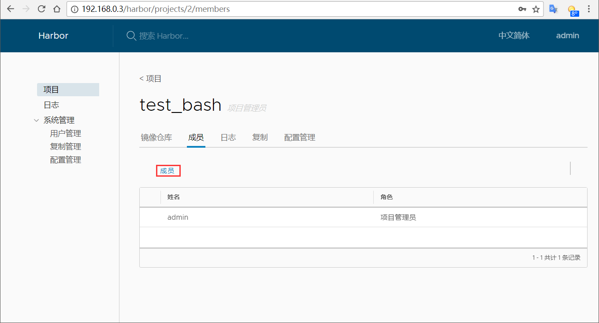

#### 环境
```txt
            [harbor]   <------>  [Node2]
            IP:192.168.0.3       IP:192.168.0.4

官方文档：https://github.com/goharbor/harbor/blob/master/docs/installation_guide.md

默认的仓库存储路径是: /data/
```
#### 部署流程
```bash
[root@harbor ~]# yum -y install epel-release
[root@harbor ~]# yum -y install python-pip
[root@harbor ~]# sudo curl -L https://github.com/docker/compose/releases/download\
/1.21.2/docker-compose-$(uname -s)-$(uname -m) -o /usr/local/bin/docker-compose
[root@harbor ~]# chmod a+x /usr/local/bin/docker-compose
[root@harbor ~]# docker-compose --version               #验证安装
docker-compose version 1.13.0, build 1719ceb
官网下载对新的harbor版本：https://github.com/vmware/harbor/releases
[root@harbor ~]# wget -c https://storage.googleapis.com/harbor-releases/harbor-offline-installer-v1.3.0-rc4.tgz
[root@harbor ~]# tar xvf harbor-offline-installer-v1.3.0-rc4.tgz
[root@harbor ~]# cd harbor
[root@harbor harbor]# cat harbor.cfg                    #编辑配置文件
hostname = 192.168.0.3      #hostname设置访问地址，可使用ip、域名，不可设为127.0.0.1或localhost
ui_url_protocol = http      #访问协议，默认http也可设置https，若设置https则nginx ssl要设置on
db_password = root123       #数据库root用户默认密码root123，实际使用时修改下
max_job_workers = 3 
customize_crt = on
ssl_cert = /data/cert/server.crt
ssl_cert_key = /data/cert/server.key
secretkey_path = /data
admiral_url = NA
email_identity =                                #邮件设置，发送重置密码邮件时使用
email_server = smtp.mydomain.com                #
email_server_port = 25                          #
email_username = sample_admin@mydomain.com      #
email_password = abc                            #
email_from = admin <sample_admin@mydomain.com>  #
email_ssl = false                               #
harbor_admin_password = Harbor12345             #启动Harbor后，管理员UI登录的密码，默认Harbor12345
auth_mode = db_auth         #认证方式支持多种如LADP、本机存储、数据库。默认db_auth，mysql数据库认证
#LDAP认证时配置项
#ldap_url = ldaps://ldap.mydomain.com
#ldap_searchdn = uid=searchuser,ou=people,dc=mydomain,dc=com
#ldap_search_pwd = password
#ldap_basedn = ou=people,dc=mydomain,dc=com
#ldap_filter = (objectClass=person)
#ldap_uid = uid 
#ldap_scope = 3 
#ldap_timeout = 5
self_registration = on          #是否开启自注册
token_expiration = 30           #Token有效时间，默认30分钟
project_creation_restriction = everyone #创建项目权限控制，默认everyone，也可设为adminonly（仅管理员）
verify_remote_cert = on
[root@harbor ~]# ./install.sh   #根据当期目录下的docker-compose.yml开始下载依赖的镜像，检测并按顺序依次启动各服务
...........(略)

✔ ----Harbor has been installed and started successfully.----

Now you should be able to visit the admin portal at http://192.168.0.3. 
For more details, please visit https://github.com/vmware/harbor .
```
#### Harbor Web UI


#### 创建用户


#### 创建项目

#### 为项目添加成员用户



#### 节点上传镜像
```txt
[root@node2 ~]# vim /etc/sysconfig/docker   #---> OPTIONS='...... --insecure-registry 192.168.0.3'
[root@node2 ~]# systemctl daemon-reload  
[root@node2 ~]# systemctl restart docker
[root@node2 ~]# docker login 192.168.0.3          
Username: test
Password: 
Login Succeeded
[root@node2 ~]# docker images
REPOSITORY          TAG                 IMAGE ID            CREATED                  SIZE
docker.io/bash      latest              a853bea42baa        Less than a second ago   12.22 MB
[root@node2 ~]# docker tag docker.io/bash 192.168.0.3/test_bash/centos_bash #打标签
[root@node2 ~]# docker push 192.168.0.3/test_bash/centos_bash           #上传标签的镜像到特定地址仓库的项目下                            
The push refers to a repository [192.168.0.3/test_bash/centos_bash]     #注！harbor上要先创建项目及其下对应的用户权限
1826300997c7: Pushed 
48357c4bc28c: Pushed 
6dfaec39e726: Pushed 
latest: digest: sha256:bd9d81423a86120d50da7fbea234922c1eafd818481c879cf46830a93ccb431b size: 946
```
#### Node2上传的镜像已经存在于仓库中

