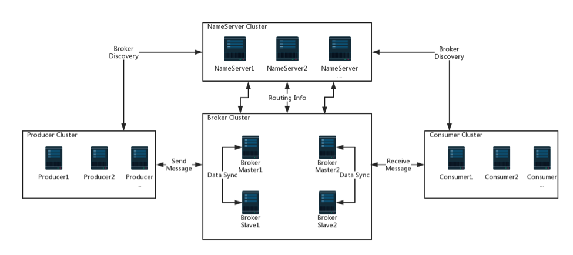

#### RocketMQ 术语
```txt
Topic
    表示消息的第一级类型，如在电商系统中消息可分为：交易消息、物流消息等，1条消息必须属于1个Topic

Tag
    表示消息的第二级类型，如交易消息中又可以分为交易创建消息，交易完成消息...
    一条消息可以没有Tag。RocketMQ提供2级消息分类，方便灵活的控制，如过滤...
    
Queue 
    在一个Topic下可设置多个queue（消息队列）。当发送消息时必需指定此消息的topic
    RocketMQ会轮询该topic下的所有队列，将消息发送出去。
    
NameServer
    提供轻量级服务发现和路由。 NS间数据是相同的，每个NS都记录完整的路由信息，提供等效的读写服务并支持快速存储扩展
    NS与NS间没有关系，Broker与每个NameServer进行定时注册，NS无状态，可横向扩展。每个Broker启动时都要到NS进行注册
    Producer在发送消息前会根据topic到任一NS获取路由(到Broker)信息，Consumer也会定时获取Topic路由信息...
    1. 接收Broker请求，并注册Broker的路由信息（包括Master和Slave）
    2. 接收Client请求，根据其请求的Topic获取其到Broker的路由信息
    
Broker
    通过提供轻量级Topic和Queue机制来处理消息存储，同时支持"push"、"pull"模式以及Master/Slave形式的容错机制
    它是消息中转者，可视为为消息队列服务器，提供了消息的接收、存储、拉取和转发服务
    Broker是RocketMQ的核心，它是不能挂的! 所以需要保证Broker的高可用，因此建议对每个Broker采用M/S结构。
    Broker启动时会启动定时任务，每10s向所有Namesrv发送心跳请求，同时也注册Topic信息到Namesrv
    对于kafka集群，其中1个节点为Master，且不用干预，Master是kafka自动选出的，但RocketMQ的M、S都需手动指定

Producer与Producer Group
    是消息的生产者，拥有相同Producer Group的Producer组成1个集群。
    消息队列的本质就是实现了publish/subscribe（发布/订阅）模式，它一般是指业务系统。
    Producer与NameServer集群中的其中1个节点（随机）建立长连接
    其定期从NS获取Topic的路由信息，并向提供Topic服务的Broker-Master建立长连接且定时向它发送自己的心跳

Consumer与Consumer Group 
    是消息的消费者，一般由后台系统异步消费消息，接收消息进行消费的实例
    Consumer与一个NameServer长连，若该NameServer断开则从NameServer列表中查找下一个进行连接...
    Consumer Group是一类Consumer的集合名称，这类Consumer通常消费一类消息，且消费逻辑一致。
    Producer只能将消息发到Broker master，但Consumer则不同，其同时和提供Topic服务的Master和Slave建立长连接
    其既可从Broker Master订阅消息，也可以从Broker Slave订阅消息

广播消费：
    一条消息被若干Consumer消费，即使它们属于相同Consumer Group，消息也会被Consumer Group中的每个Consumer消费1次!
    在广播消费中的Consumer Group概念可以认为在消息划分方面无意义。
    
集群消费： 
    一个Consumer Group中的Consumer实例平均分摊消费消息。
    例如某个Topic有9条消息，其中一个Consumer Group有3个实例(可能是3个进程或3台机器)，那么每个实例只消费其中的3条消息
```

#### 部署双主环境 conf/2m-noslave
```bash
# 双主模型环境：（双主环境中那个多个master节点组成集群，单个master节点宕机或重启对应用没影响）
#    Master1 192.168.133.128  nameServer1,brokerServer1
#    Master2 192.168.133.130  nameServer2,brokerServer1
    
#部署JDK
[root@localhost ~]# mkdir jdk
[root@localhost ~]# tar -zxf jdk.tar.gz -C /root/jdk && cd /root/jdk 
[root@localhost ~]# mv jdk1.8.0_101 java

#部署RocketMQ
[root@localhost ~]# tar -zxf alibaba-rocketmq-master3.tar.gz -C /root
[root@localhost ~]# mkdir -p /root/alibaba-rocketmq-master3/{store,logs}  #内部的定制版本注意要先删除旧数据

#环境变量: ROCKETMQ_HOME、JAVA_HOME（生产环境注意写入~/.bash_profile）
[root@localhost alibaba-rocketmq-master3]# export ROCKETMQ_HOME=/root/alibaba-rocketmq-master3
[root@localhost alibaba-rocketmq-master3]# export JAVA_HOME=/home/jdk/java

#配置应用目录下 bin/setenv.sh 内的环境变量
[root@localhost alibaba-rocketmq-master3]# vim /root/alibaba-rocketmq-master3/bin/setenv.sh
#!/bin/sh

export JAVA_HOME=/root/jdk/java
export ROCKETMQ_HOME=/root/alibaba-rocketmq-master3

#配置NameServer
[root@localhost ~]# vim /root/alibaba-rocketmq-master3/conf/mqnamesrv.properties  #注意! 在两个主节点都配置
#NS监听地址
listenPort=10401
#NS工作线程数
serverWorkerThreads=8
serverCallbackExecutorThreads=0
serverSelectorThreads=3
serverOnewaySemaphoreValue=256
serverAsyncSemaphoreValue=64
serverChannelMaxIdleTimeSeconds=120
#发送及回收的buffer大小
serverSocketSndBufSize=2048
serverSocketRcvBufSize=1024
serverPooledByteBufAllocatorEnable=false

# 注意!
# 当有多个节点时，相应的，在各节点的Broker的配置文件名字建议设为：broker-{b,c,d,N...}.properties
# 因为有两个Master主节点，所以主节点1启动依赖broker-a.properties，主节点2启动依赖broker-b.properties ...

#配置Broker
[root@localhost ~]# vim /root/alibaba-rocketmq-master3/2m-noslave/broker-a.properties   #注意! 在两个主节点都配置
#集群名字，同一集群内此配置要统一
brokerClusterName=rocketmq-cluster
#Broker的名字，注意! 此处不同的配置文件中填写的不一样
brokerName=broker-a
#Id=0为Master，大于0为Slave
brokerId=0
#集群中NameServer的所有地址，分号分割
namesrvAddr=192.168.133.128:10401;192.168.133.130:10401
#在发送消息时，自动创建服务器不存在的topic，默认创建的队列数
defaultTopicQueueNums=8
#是否允许Broker自动创建Topic，建议线下开启，线上关闭，手动创建
autoCreateTopicEnable=false
#是否允许Broker自动创建订阅组，建议线下开启，线上关闭，手动创建
autoCreateSubscriptionGroup=false
#Broker对外提供服务的端口
listenPort=10411
#删除文件时间点，默认为凌晨0点，此处为凌晨四点
deleteWhen=04
#文件保留时间，默认48小时
fileReservedTime=120
#CommitLog每个文件的大小默认1G
mapedFileSizeCommitLog=1073741824
#ConsumeQueue每个文件默认存30W条，根据业务情况调整
mapedFileSizeConsumeQueue=50000000
destroyMapedFileIntervalForcibly=120000
redeleteHangedFileInterval=120000
#检测物理文件磁盘空间
diskMaxUsedSpaceRatio=88
#存储路径
storePathRootDir=/root/alibaba-rocketmq-master3/store
#commitLog 存储路径
storePathCommitLog=/root/alibaba-rocketmq-master3/logs
#消费队列存储路径存储路径
#storePathConsumeQueue=/home/wangyu/mq/alibaba-rocketmq-master1/store/consumerqueue
#消息索引存储路径
#storePathIndex=/opt/rocketmq/data/index
#checkpoint 文件存储路径
#storeCheckpoint=/opt/rocketmq/data/checkpoint
#abort 文件存储路径
#abortFile=/opt/rocketmq/data/abort
#限制的消息大小
maxMessageSize=65536
flushCommitLogLeastPages=4
flushConsumeQueueLeastPages=2
flushCommitLogThoroughInterval=10000
flushConsumeQueueThoroughInterval=60000
checkTransactionMessageEnable=false
#发消息线程池数量
sendMessageThreadPoolNums=128
#拉消息线程池数量
pullMessageThreadPoolNums=128

# 刷盘方式
# - ASYNC_FLUSH     异步刷盘
# - SYNC_FLUSH      同步刷盘
flushDiskType=ASYNC_FLUSH

# Broker的角色
# - ASYNC_MASTER    异步复制Master
# - SYNC_MASTER     同步双写Master
# - SLAVE
brokerRole=ASYNC_MASTER
```
##### 关于服务的优化部分查看bin下的 /runbroker.sh、runserver.sh
#### 服务的启停
```bash
#启动RocketMQ，注意! 先分别在各节点启动"mqnamesrv"，然后再分别启动"mqbroker"
[Any-Node@localhost ~]# cd /root/alibaba-rocketmq-master3/bin/ && \
nohup sh mqnamesrv -c /root/alibaba-rocketmq-master3/conf/mqnamesrv.properties &> /dev/null &

[Any-Node@localhost ~]# cd /root/alibaba-rocketmq-master3/bin/ && \
nohup sh mqbroker -c /root/alibaba-rocketmq-master3/conf/2m-noslave/broker-a.properties  &> /dev/null &

#关闭RocketMQ，注意! 先分别在两个节点关闭 mqbroker，然后再分别关闭 mqnamesrv
[Any-Node@localhost ~]# cd /root/alibaba-rocketmq-master3/bin/ && sh mqshutdown broker
[Any-Node@localhost ~]# cd /root/alibaba-rocketmq-master3/bin/ && sh mqshutdown namesrv
```
#### mqadmin 命令参数说明
```txt
updateTopic：创建Topic，一般由应用自动创建，此处是手动方式
    -t  Topic 名称（只能使用字符 ^[a-zA-Z0-9_-]+$ ）
    -c  若-b为空则必填，cluster名称，表示topic建在该集群（集群可通过clusterList查询）
    -b  若-c为空则必填，broker地址，表示topic建在该broker
    -n  nameserve 服务地址列表，格式ip:port;ip:port;...
    -p  指定新topic 的权限限制 ( W|R|WR )
    -r  可读队列数（默认8）
    -w  可写队列数（默认8）
    -h  打印帮助

updateSubGroup：创建（修订）订阅组
   -b   若-b为空则必填，broker地址，表示订阅组建在该broker
   -c   若-c为空则必填，cluster名称，表示topic建在该集群（集群可通过clusterList查询）
   -d   是否容许广播方式消费
   -g   订阅组名 
   -i   从哪个broker 开始消费
   -m   是否容许从队列的最小位置开始消费，默认会设置为false
   -q   消费失败的消息放到一个重试队列，每个订阅组配置几个重试队列
   -r   重试消费最大次数，超过则投递到死信队列，不再投递，并报警
   -s   消费功能是否开启
   -w   发现消息堆积后，将Consumer的消费请求重定向到另外一台Slave机器
   -h   打印帮助
   -n   nameserve 服务地址列表，格式ip:port;ip:port;...
```
#### MQ创建实例
```txt
# 先删除两个节点 logs、store目录下的所有文件......

# 创建topic，在一个节点实例下执行即可
cd /root/alibaba-rocketmq-master3/bin/
sh mqadmin updateTopic -c rocketmq-cluster -n 192.168.133.128:10401 -t TOPIC_ORDER_SNAPSHOT -r 8 -w 8
sh mqadmin updateSubGroup -g TOPIC_ORDER_SNAPSHOT_Consumer_Group -s true -r 1 -b 192.168.133.128:10411  -n 192.168.133.128:10401

sh mqadmin updateTopic -c rocketmq-cluster -n 192.168.133.130:10401 -t TOPIC_ORDER_SNAPSHOT -r 8 -w 8
sh mqadmin updateSubGroup -g TOPIC_ORDER_SNAPSHOT_Consumer_Group -s true -r 1 -b 192.168.133.128:10411  -n 192.168.133.128:10401
sh mqadmin updateSubGroup -g TOPIC_ORDER_SNAPSHOT_Consumer_Group -s true -r 1 -b 192.168.133.130:10411  -n 192.168.133.130:10401

sh mqadmin updateTopic -c rocketmq-cluster -n 192.168.133.130:10401 -t TOPIC_TRANSACTION_LOG -r 8 -w 8

# 创建消费组，必须在2个节点分别执行
sh mqadmin updateSubGroup -g TOPIC_BUSI_LOG_Consumer_Group -s true -r 1 -b 192.168.133.130:10411  -n 192.168.133.128:10401
sh mqadmin updateSubGroup -g TOPIC_TRANSACTION_LOG_Consumer_Group -s true -r 1 -b 192.168.133.128:10411 -n 192.168.133.128:10401

sh mqadmin updateSubGroup -g TOPIC_BUSI_LOG_Consumer_Group -s true -r 1 -b 192.168.133.130:10411 -n 192.168.133.128:10401
sh mqadmin updateSubGroup -g TOPIC_TRANSACTION_LOG_Consumer_Group -s true -r 1 -b 192.168.133.130:10411 -n 192.168.133.128:10401

# 查看某个topic状态
sh mqadmin topicStatus -t TOPIC_TRANSACTION_LOG -n 192.168.133.128:10401

# 查看集群情况
[root@localhost bin]# sh mqadmin clusterList -n 192.168.133.128:10401
#Cluster Name     #Broker Name    #BID  #Addr                  #Version    #InTPS     #OutTPS
rocketmq-cluster  broker-a        0     192.168.133.128:10411  V3_2_6        0.00        0.00
rocketmq-cluster  broker-b        0     192.168.133.130:10411  V3_2_6        0.00        0.00

# 查看Topic列表信息
sh mqadmin topicList -n 192.168.133.128:10401

# 查看Topic路由信息
sh mqadmin topicRoute  -t TOPIC_TRANSACTION_LOG -n NameServerIP:Port

# 查看消费组状态（需要启动 mqconsumer）
sh mqadmin consumerProgress -g TOPIC_BUSI_LOG_Consumer_Group -n 192.168.133.128:10401
sh mqadmin consumerProgress -g TOPIC_BUSI_LOG_Consumer_Group -n 192.168.133.128:10401

# 获取Consumer消费进度
sh mqadmin getConsumerStatus -g 消费者属组 -t 主题 -i Consumer客户端ip -n NameServerIP:Port
```
#### Memo
```txt
kafka的topic里面有分区和副本的概念，使用之前都是根据数据量手动创建，对于rocketmq也一样，需要手动创建topic
rocketmq的topic中有队列(queue)的概念，也就是说一个节点上面可以有多个队列，这样能非常大的提高并发性
而kafka最多只能是一个分区一个进程消费，这样并发性限制非常大，并且单机分区数量不能过多，超过64个分区就出现明显的不稳定
但是rocketmq单机支持上万队列，所以并发性能非常好...
```
