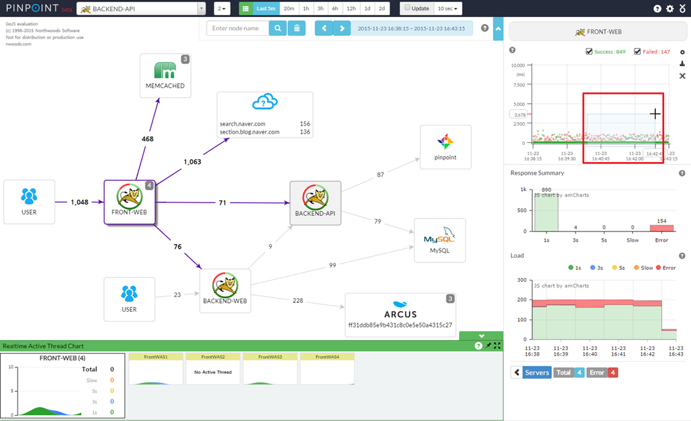
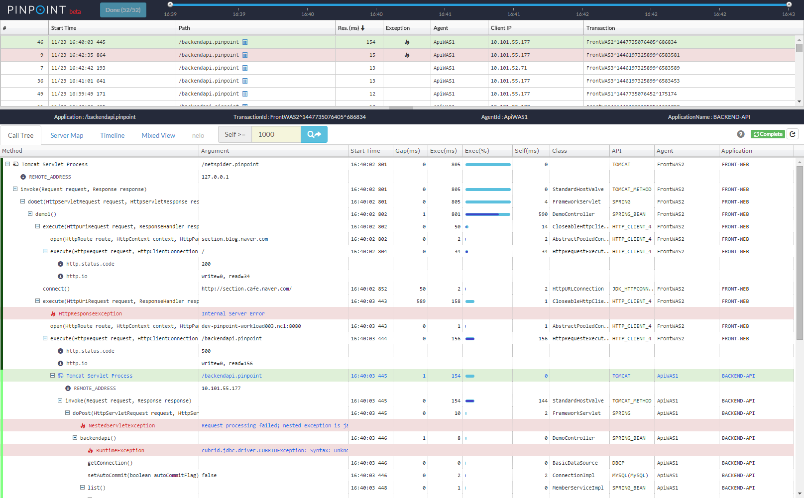
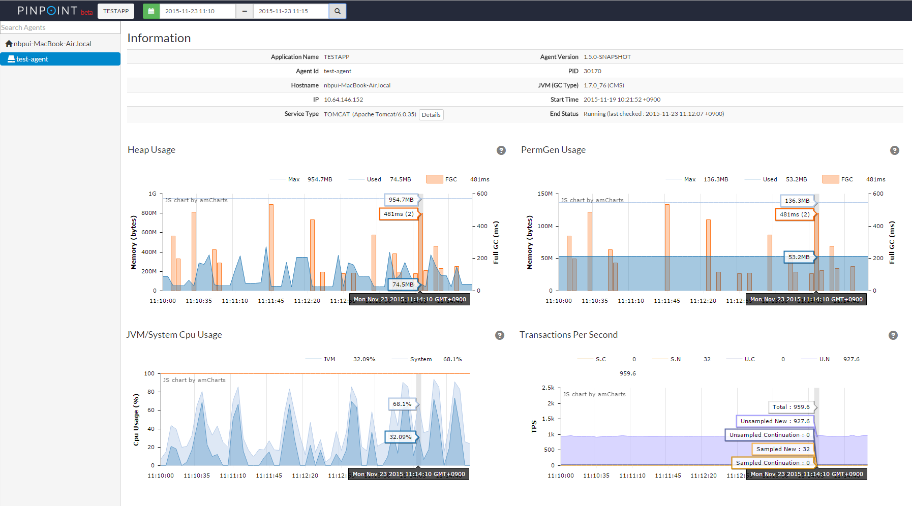
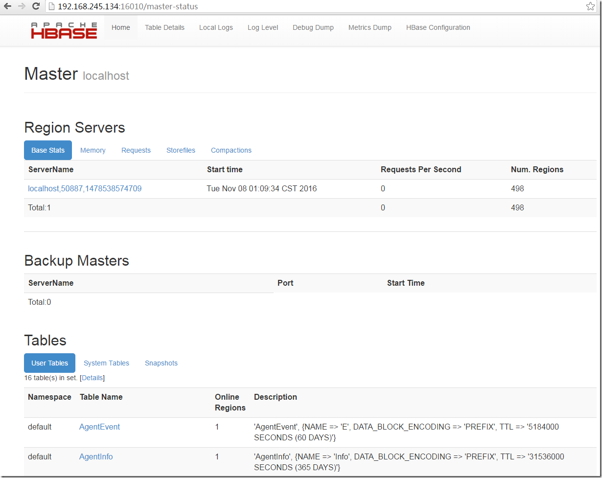
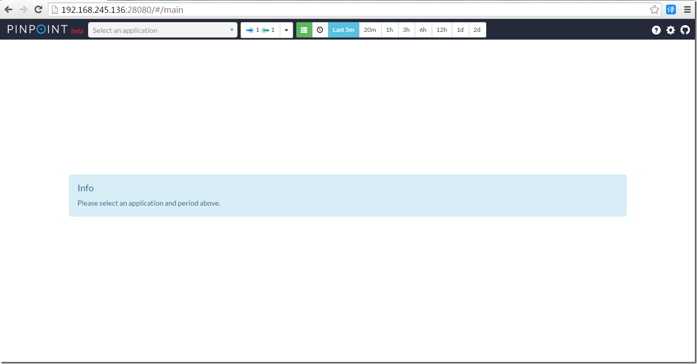
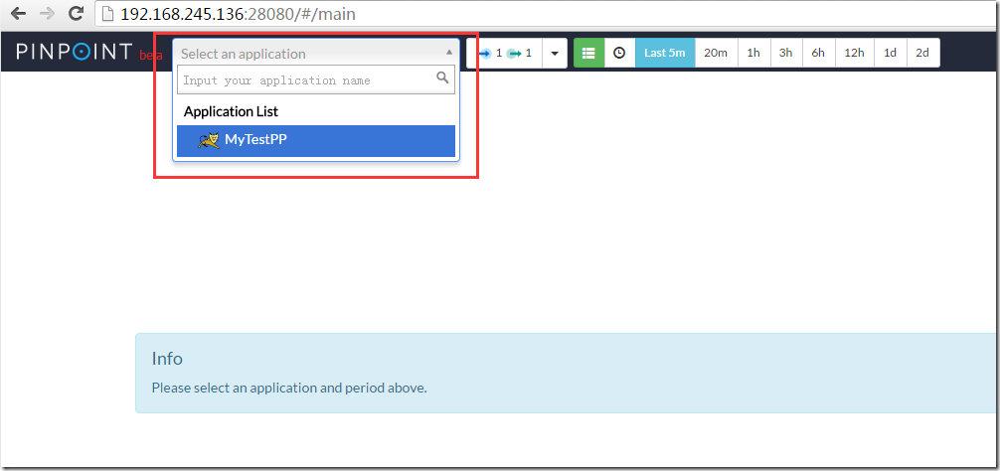
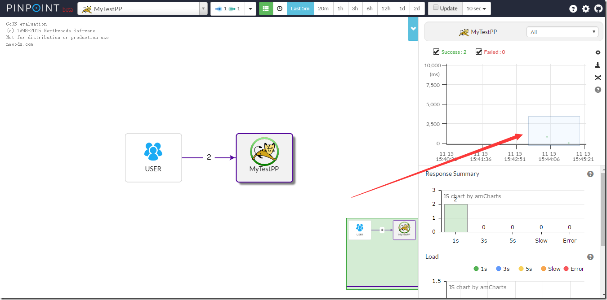
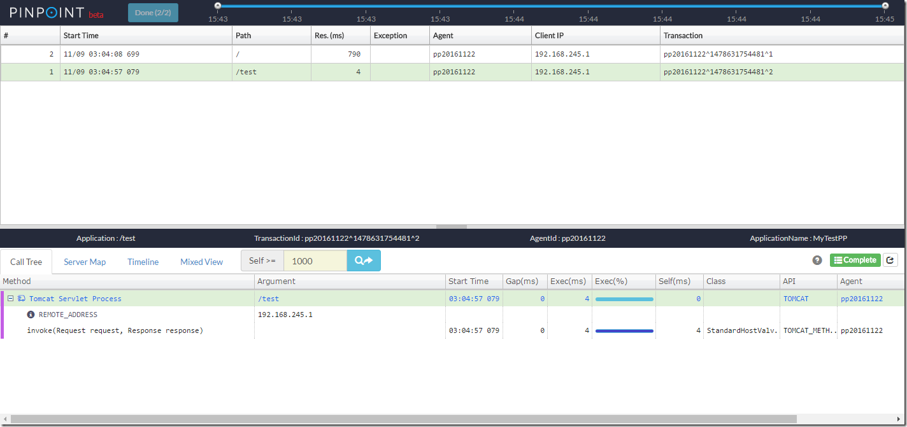

```bash
https://www.iqarr.com/2018/02/04/java/pinpoint/pinpoint-deploy/
https://www.jianshu.com/p/266f0c15f691

#pinpoint是和应用一起运行的另外的应用。使用字节码增强使得pinpoint看上去不需要代码修改，其使用Java编写
#pinpoint在类装载时通过介入应用代码为分布式事务和性能信息注入必要的跟踪代码
#pinpoint收集来的测试数据主要是存在Hbase数据库的。所以它可以收集大量的数据，可以进行更加详细的分析
#为了跟踪，添加拦截器到目标方法使得before()和after()方法被调用，并在before()和after()方法中实现了部分性能数据的记录
#它是一款无侵入式的开源APM监控工具，在被测试的Tomcat项目中打入探针就可以监控整套程序。

#通过增加下面三行到JVM启动脚本中就可为应用启用pinpoint，它对性能影响小 (只增加约3％资源利用率) 安装是无侵入式的:
-javaagent:${AGENT_PATH}/pinpoint-bootstrap-${VERSION}.jar
-Dpinpoint.agentId=<Agent UniqueId>
-Dpinpoint.applicationName=<The name indicating a same service (AgentId collection)>
```
#### 部署后最终效果如下



#### Supported Modules
* JDK 6+
* [Tomcat 6/7/8/9](https://github.com/naver/pinpoint/tree/master/plugins/tomcat), [Jetty 8/9](https://github.com/naver/pinpoint/tree/master/plugins/jetty), [JBoss EAP 6/7](https://github.com/naver/pinpoint/tree/master/plugins/jboss), [Resin 4](https://github.com/naver/pinpoint/tree/master/plugins/resin), [Websphere 6/7/8](https://github.com/naver/pinpoint/tree/master/plugins/websphere), [Vertx 3.3/3.4/3.5](https://github.com/naver/pinpoint/tree/master/plugins/vertx), [Weblogic 10/11g/12c](https://github.com/naver/pinpoint/tree/master/plugins/weblogic), [Undertow](https://github.com/naver/pinpoint/tree/master/plugins/undertow)
* Spring, Spring Boot (Embedded Tomcat, Jetty, Undertow), Spring asynchronous communication
* Apache HTTP Client 3.x/4.x, JDK HttpConnector, GoogleHttpClient, OkHttpClient, NingAsyncHttpClient, Akka-http, Apache CXF
* Thrift Client, Thrift Service, DUBBO PROVIDER, DUBBO CONSUMER, GRPC
* ActiveMQ, RabbitMQ, Kafka
* MySQL, Oracle, MSSQL(jtds), CUBRID, POSTGRESQL, MARIA
* Arcus, Memcached, Redis([Jedis](https://github.com/naver/pinpoint/blob/master/plugins/redis), [Lettuce](https://github.com/naver/pinpoint/tree/master/plugins/redis-lettuce)), CASSANDRA, MongoDB, Hbase
* iBATIS, MyBatis
* DBCP, DBCP2, HIKARICP, DRUID
* gson, Jackson, Json Lib, Fastjson
* log4j, Logback

#### Compatibility

`Java version required to run Pinpoint:`

Pinpoint Version | Agent | Collector | Web
---------------- | ----- | --------- | ---
1.0.x | 6-8 | 6-8 | 6-8
1.1.x | 6-8 | 7-8 | 7-8
1.5.x | 6-8 | 7-8 | 7-8
1.6.x | 6-8 | 7-8 | 7-8
1.7.x | 6-8 | 8 | 8
1.8.0 | 6-10 | 8 | 8 
1.8.1+ | 6-11 | 8 | 8 

`HBase compatibility table:`

Pinpoint Version | HBase 0.94.x | HBase 0.98.x | HBase 1.0.x | HBase 1.2.x | HBase 2.0.x
---------------- | ------------ | ------------ | ----------- | ----------- | -----------
1.0.x | yes | no | no | no | no
1.1.x | no | not tested | yes | not tested | no
1.5.x | no | not tested | yes | not tested | no
1.6.x | no | not tested | not tested | yes | no
1.7.x | no | not tested | not tested | yes | no
1.8.x | no | not tested | not tested | yes | no
#### 部署 Pinpoint
```bash
Pinpoint Github 下载地址：https://github.com/naver/pinpoint/releases

#需要的依赖:
jdk8                    #运行环境
hbase-1.0               #数据库，用来存储监控信息
tomcat8.0               #Web服务器
pinpoint-agent.tar.gz   #Agent端探针
pinpoint-collector.war  #pinpoint的控制器
pinpoint-web.war        #pinpoint展示页面

[root@node129 APM-soft]# ll
total 478724
-rw-r--r-- 1 root root   9277365 Apr 19 14:12 apache-tomcat-8.0.36.tar.gz
-rw-r--r-- 1 root root 103847513 Apr 19 14:42 hbase-1.0.3-bin.tar.gz
-rw-r--r-- 1 root root 181385781 Oct 10  2017 jdk8.tar.gz
-rw-r--r-- 1 root root  16552691 Apr 19 13:55 pinpoint-agent-1.8.3.tar.gz
-rw-r--r-- 1 root root  62696786 Apr 20 12:56 pinpoint-collector-1.8.3.war
-rw-r--r-- 1 root root  97417897 Apr 19 13:57 pinpoint-web-1.8.3.war
-rw-r--r-- 1 root root   1320206 Apr 19 14:32 test.war
-rw-r--r-- 1 root root  17699306 Apr 19 14:14 zookeeper-3.4.6.tar.gz
-rw-r--r-- 1 root root     16984 Apr 19 14:06 hbase-create.hbase

#设置JAVA_HOME环境变量:
[root@localhost ~]# ln -sv /jdk1.8.0_191 /jdk
[root@localhost ~]# cat >> /etc/profile.d/java.sh <<'eof'
export JAVA_HOME=/jdk
export PATH=$PATH:$JAVA_HOME/bin
eof

[root@localhost ~]# source /etc/profile
[root@localhost ~]# java -version
java version "1.8.0_191"
Java(TM) SE Runtime Environment (build 1.8.0_191-b12)
Java HotSpot(TM) 64-Bit Server VM (build 25.191-b12, mixed mode)

#安装Zookeeper: (略)

#安装HBase:
[root@localhost APM-soft]# tar -zxvf hbase-1.0.3-bin.tar.gz
[root@localhost APM-soft]# mkdir -p /data/service
[root@localhost APM-soft]# mv hbase-1.0.3/ /data/service/hbase
[root@localhost APM-soft]# cd /data/service/hbase/conf/
[root@localhost conf]# vim hbase-env.sh         #修改hbase-env.sh的JAVA_HOME环境变量
export JAVA_HOME=/usr/java/jdk17/               #在27行左右的位置修改
export _ssh_opts="-p 22"                        #指定启动时其连接目标主机所使用的SSH端口号
export HBASE_SSH_OPTS="-p 22"                   #在1.0版本中使用此配置设置ssh端口

[root@localhost conf]# vim hbase-site.xml       #修改Hbase的配置信息:
<configuration>
  <property>
    <name>hbase.rootdir</name>
    <value>file:///data/hbase</value>           #这里指定Hbase本地来存储数据，生产环境建议将数据存入HDFS
  </property>
	<property>
		<name>hbase.cluster.distributed</name>              #伪分布式需要配置此开源
		<value>true</value>
	</property>
  <property>
		<name>hbase.zookeeper.quorum</name>                 #zookeeper地址（zk不需事先搭建，由Hbase自动创建zookeeper）
		<value>localhost</value>  
	</property>
	<property>
		<name>hbase.zookeeper.property.clientPort</name>    #zookeeper端口（这里配置了伪分布式，将使用Hbase自身提供的zk）
		<value>2181</value>
	</property>
</configuration>
[root@localhost ~]# cd /data/service/hbase/bin  #启动hbase
[root@localhost bin]# ./start-hbase.sh          #查看Hbase是否启动成功，如果启动成功会看到 "HMaster" 进程
[root@localhost bin]# jps
12075 Jps
11784 HMaster

#初始化Hbase的pinpoint库，执行pinpoint提供的Hbase初始化语句，这时会初始化一会
[root@node129 bin]# ./hbase shell /root/APM-soft/hbase-create.hbase
#执行完了以后，进入Hbase
[root@localhost bin]# ./hbase shell             #进入后可以看到Hbase的版本，还有一些相关的信息
2016-11-15 01:55:44,861 WARN  [main] util.NativeCodeLoader: Unable to load native-hadoop library for your platform... using built
in-java classes where applicableHBase Shell; enter 'help<RETURN>' for list of supported commands.
Type "exit<RETURN>" to leave the HBase Shell
Version 1.0.3, rf1e1312f9790a7c40f6a4b5a1bab2ea1dd559890, Tue Jan 19 19:26:53 PST 2016
 
hbase(main):001:0>
hbase(main):001:0> status 'detailed'            #输入 "status 'detailed'" 可以查看刚才初始化的表是否存在
version 1.0.3
0 regionsInTransition
master coprocessors: []
1 live servers
    localhost:50887 1478538574709
        requestsPerSecond=0.0, numberOfOnlineRegions=498, usedHeapMB=24, maxHeapMB=237, numberOfStores=626, numberOfStorefiles=0, storefileUncom
pressedSizeMB=0, storefileSizeMB=0, memstoreSizeMB=0, storefileIndexSizeMB=0, readRequestsCount=7714, writeRequestsCount=996, rootIndexSizeKB=0, totalStaticIndexSizeKB=0, totalStaticBloomSizeKB=0, totalCompactingKVs=0, currentCompactedKVs=0, compactionProgressPct=NaN, coprocessors=[MultiRowMutationEndpoint]        "AgentEvent,,1478539104778.aa1b3b14d0b48d83cbf4705b75cb35b7."
            numberOfStores=1, numberOfStorefiles=0, storefileUncompressedSizeMB=0, storefileSizeMB=0, memstoreSizeMB=0, storefileIndexSizeMB=0,
readRequestsCount=0, writeRequestsCount=0, rootIndexSizeKB=0, totalStaticIndexSizeKB=0, totalStaticBloomSizeKB=0, totalCompactingKVs=0, currentCompactedKVs=0, compactionProgressPct=NaN, completeSequenceId=-1, dataLocality=0.0
...
#也可以登录web，来查看HBase的数据是否初始化成功
HbaseWeb : http://192.168.70.129:16010/master-status
```

```bash
#安装pinpoint-collector:

#解压Tomcat
[root@node129 ~]# cd APM-soft/
[root@node129 APM-soft]# tar -zxf apache-tomcat-8.0.36.tar.gz 
[root@node129 APM-soft]# mv apache-tomcat-8.0.36 /data/service/pp-col

#修改pp-col的Tomcat的配置，主要修改端口，避免与部署在同一台主机的pp-web的Tomcat的端口冲突
[root@node129 APM-soft]# cd /data/service/pp-col/conf/
[root@node129 conf]# sed -i 's/port="8005"/port="18005"/g' server.xml
[root@node129 conf]# sed -i 's/port="8080"/port="18080"/g' server.xml
[root@node129 conf]# sed -i 's/port="8443"/port="18443"/g' server.xml
[root@node129 conf]# sed -i 's/port="8009"/port="18009"/g' server.xml
[root@node129 conf]# sed -i 's/redirectPort="8443"/redirectPort="18443"/g' server.xml
[root@node129 conf]# sed -i "s/localhost/`ip r g 1 | awk 'NR==1{print $NF}'`/g" server.xml

#部署pinpoint-collector.war包
[root@node129 conf]# cd ~/APM-soft
[root@node129 APM-soft]# rm -rf /data/service/pp-col/webapps/*
[root@node129 APM-soft]# unzip pinpoint-collector-1.8.3.war -d /data/service/pp-col/webapps/
[root@node129 APM-soft]# cd /data/service/pp-col/bin/   #启动Tomcat
[root@node129 bin]# ./startup.sh                        #查看日志检查是否成功启动: tail -f ../logs/catalina.out

#安装pinpoint-web
[root@node129 bin]# cd ~/APM-soft
[root@node129 APM-soft]# tar -zxvf apache-tomcat-8.0.36.tar.gz
[root@node129 APM-soft]# mv apache-tomcat-8.0.36/ /data/service/pp-web

#修改pp-web的Tomcat的配置，主要修改端口，避免与pp-col的Tomcat的端口冲突
[root@node129 APM-soft]# cd /data/service/pp-web/conf/
[root@node129 conf]# sed -i 's/port="8005"/port="28005"/g' server.xml
[root@node129 conf]# sed -i 's/port="8080"/port="28080"/g' server.xml
[root@node129 conf]# sed -i 's/port="8443"/port="28443"/g' server.xml
[root@node129 conf]# sed -i 's/port="8009"/port="28009"/g' server.xml
[root@node129 conf]# sed -i 's/redirectPort="8443"/redirectPort="28443"/g' server.xml
[root@node129 conf]# sed -i "s/localhost/`ip r g 1 | awk 'NR==1{print $NF}'`/g" server.xml

#部署pinpoint-web.war包
[root@node129 conf]# cd ~/APM-soft
[root@node129 APM-soft]# rm -rf /data/service/pp-web/webapps/*
[root@node129 APM-soft]# unzip pinpoint-web-1.8.3.war -d /data/service/pp-web/webapps/ROOT
[root@node129 APM-soft]# ll /data/service/pp-web/webapps/ROOT/WEB-INF/classes/    #查看war包是否解压成功
total 88
-rw-rw-r--. 1 root root 2164 Apr  7  2016 applicationContext-cache.xml
-rw-rw-r--. 1 root root 3649 Apr  7  2016 applicationContext-dao-config.xml
-rw-rw-r--. 1 root root 1490 Apr  7  2016 applicationContext-datasource.xml
-rw-rw-r--. 1 root root 6680 Apr  7  2016 applicationContext-hbase.xml
-rw-rw-r--. 1 root root 1610 Apr  7  2016 applicationContext-websocket.xml
-rw-rw-r--. 1 root root 6576 Apr  7  2016 applicationContext-web.xml
drwxrwxr-x. 2 root root 4096 Apr  7  2016 batch
-rw-rw-r--. 1 root root  106 Apr  7  2016 batch.properties
drwxrwxr-x. 3 root root 4096 Apr  7  2016 com
-rw-rw-r--. 1 root root  682 Apr  7  2016 ehcache.xml
-rw-rw-r--. 1 root root 1001 Apr  7  2016 hbase.properties
-rw-rw-r--. 1 root root  153 Apr  7  2016 jdbc.properties
-rw-rw-r--. 1 root root 3338 Apr  7  2016 log4j.xml
drwxrwxr-x. 2 root root 4096 Apr  7  2016 mapper
-rw-rw-r--. 1 root root 1420 Apr  7  2016 mybatis-config.xml
drwxrwxr-x. 3 root root 4096 Apr  7  2016 org
-rw-rw-r--. 1 root root  630 Apr  7  2016 pinpoint-web.properties
-rw-rw-r--. 1 root root  141 Apr  7  2016 project.properties
-rw-rw-r--. 1 root root 3872 Apr  7  2016 servlet-context.xml
drwxrwxr-x. 2 root root 4096 Apr  7  2016 sql
#这里说明一下：
hbase.properties            #配置pp-web从哪个数据源获取采集数据，这里只指定Hbase的zookeeper地址
jdbc.properties             #pp-web连接自身Mysql数据库的连接认证配置
sql                         #pp-web本身有些数据需要存放在MySQL数据库中，这里需要初始化一下表结构
pinpoint-web.properties     #这里pp-web集群的配置文件，如果你需要pp-web集群的话
applicationContext-* .xml   #这些文件在后续的调优工作中会用到
log4j.xml                   #日志相关配置

#启动Tomcat:
[root@node129 APM-soft]# cd /data/service/pp-web/bin/ && ./startup.sh
#查看日志，检查Tocmat是否启动成功: tail -f ../logs/catalina.out

#这时候在浏览器输入 "http://192.168.70.129:28080" 就会出现主页面，如果访问不了的话需要关闭防火墙
[root@localhost conf]# systemctl stop firewalld
[root@localhost conf]# /etc/init.d/iptables stop
iptables: Setting chains to policy ACCEPT: filter          [  OK  ]
iptables: Flushing firewall rules:                         [  OK  ]
iptables: Unloading modules:                               [  OK  ]
```

```bash
#部署pp-agent采集监控数据 ( 在测试系统中部署pp-agent采集监控数据 ):
#部署采集器就很简单，只需要加3句话就好了，这里做一个测试的Tomcat来模拟部署

#首先先建立一个文件夹，放测试需要的包
[root@node129 APM-soft]# ll    #将测试需要的pp-agent拉到服务器上
total 478744
-rw-r--r-- 1 root root 181385781 Oct 10  2017 jdk8.tar.gz
-rw-r--r-- 1 root root   9277365 Apr 19 14:12 apache-tomcat-8.0.36.tar.gz
-rw-r--r-- 1 root root  16552691 Apr 19 13:55 pinpoint-agent-1.8.3.tar.gz
-rw-r--r-- 1 root root   1320206 Apr 19 14:32 test.war

#配置模拟的Tomcat测试环境
#为方便观察，配置个假的系统，解压Tomcat到指定目录
[root@node129 APM-soft]# cd /home/pp_test
[root@localhost APM-soft]# tar -zxvf apache-tomcat-8.0.36.tar.gz -C ~/home/pp_test
[root@localhost APM-soft]# cd /home/pp_test 
[root@node129 pp_test]# mv apache-tomcat-8.0.36 data
#配置localhost让外部可以访问
[root@node129 conf]# cd /home/pp_test/data/conf/
[root@localhost conf]# LOCALHOST_IP=$(ip r g 1 | awk 'NR==1{print $NF}')
[root@localhost conf]# sed -i "s/localhost/${LOCALHOST_IP}/g" server.xml
#解压测试用的war包
[root@node129 conf]# rm ../webapps/* -rf
[root@node129 conf]# unzip ~/APM-soft/test.war -d ../webapps/

#配置pp-agent采集器
[root@node129 conf]# cd /home/pp_test
[root@node129 pp_test]# tar -zxf ~/APM-soft/pinpoint-agent-1.8.3.tar.gz -C .
#编辑配置文件
[root@node129 pp_test]# vim pinpoint.config 
#主要修改IP，只需要指定到安装pp-col的IP就行了，安装pp-col启动后自动就开启了9994，9995，9996的端口了。
#如果有端口需求，要去pp-col的配置文件 "pp-col/webapps/ROOT/WEB-INF/classes/pinpoint-collector.properties" 修改端口
profiler.collector.ip=192.168.70.129
profiler.collector.tcp.port=9994
profiler.collector.stat.port=9995
profiler.collector.span.port=9996
#修改测试项目下的tomcat启动文件"catalina.sh"，修改这个只要是为了监控测试环境的Tomcat，增加探针
[root@node129 data]# cd /home/pp_test/data/bin/
[root@node129 bin]# vi catalina.sh
#在20行增加如下字段
#第一行: pp-agent的jar包位置
#第二行: agent的ID，这个ID是唯一的，我是用pp + 今天的日期命名的，只要与其他的项目的ID不重复就好了
#第三行: 采集项目的名字，这个名字可以随便取，只要各个项目不重复就好了
CATALINA_OPTS="$CATALINA_OPTS -javaagent:/home/pp_test/pinpoint-bootstrap-1.8.3.jar"
CATALINA_OPTS="$CATALINA_OPTS -Dpinpoint.agentId=agentid123"
CATALINA_OPTS="$CATALINA_OPTS -Dpinpoint.applicationName=bfkj"
#配置好就可以开始监控了，这里启动测试用的Tomcat的服务器:
[root@node129 data]# cd /home/pp_test/data/bin/
[root@node129 bin]# ./startup.sh            #查看启动日志确保Tomcat启动: tail -f ../logs/catalina.out

#这时候再访问pp-web，可以发现它的下拉框中多了一个app:
curl -s 192.168.70.129:8080 
curl -s 192.168.70.129:8080/test
```

```txt
注意： 鼠标点击右上角箭头位置，鼠标左键按住不动，拉框查看。
```

```bash
这时候就弹出了新页面，可以看到访问了一次主页，访问了一次test的servlet，而且详细信息都记录在下表中
```

#### weblogic 支持
```bash
#参考pinpoint官方说明： https://github.com/naver/pinpoint/tree/master/plugins/weblogic

1.部署前首先需要关闭weblogic服务后

2.首先进入域下的bin目录，对Weblogic的启动脚本"startWeblogic.sh"进行修改
#Example: 
[root@node129 apm]#  ll     #将附件中的tar包解压到指定目录，本例解压路径： /app/apm
total 120
drwxr-xr-x 2 root     root       253 Apr 22 11:16 boot
drwxrwxr-x 2 logstash logstash  4096 Apr 22 11:16 lib
drwxr-xr-x 2 root     root        37 Apr 22 11:18 log
-rw-rw-r-- 1 logstash logstash 44589 Mar 27 13:37 pinpoint-bootstrap-1.8.3.jar
-rw-rw-r-- 1 logstash logstash 35942 Apr 22 11:17 pinpoint.config     #这里需要修改参数指向探针数据传输的服务器地址
-rw-rw-r-- 1 logstash logstash 29077 Mar 27 13:35 pinpoint-real-env-lowoverhead-sample.config
drwxr-xr-x 2 root     root      4096 Apr 22 11:16 plugin
drwxrwxr-x 2 logstash logstash    28 Mar 27 13:32 script
drwxr-xr-x 2 root     root        38 Apr 22 11:16 tools
[root@node129 ~]# vim /app/apm/pinpoint.config
profile.collector.ip=20.59.20.156

[root@node129 ~]# vim /app/weblogic/Oracle/Middleware/Wlserver_10.3/samples/domains/medrec/bin/startWeblogic.sh
#对原有"SAVE_JAVA_OPTIONS"变量的默认设置进行APM探针参数的追加：
#参数说明:
#-javaagent:/app/apm/pinpoint-bootstrap-1.8.3.jar   #指定探针路径
#-Dpinpoint.agentId                                 #唯一标记agent运行所在的应用，使用有代表意义的且不重复的关键字
#-Dpinpoint.applicationName=bfkj                    #本节点所属项目，将许多的同样的应用实例分组为单一服务
#注意 pinpoint.agentId 必须全局唯一来标识应用实例，所有相同 pinpoint.applicationName 的应用被当成单个服务的多个实例
SAVE_JAVA_OPTIONS="${JAVA_OPTIONS} -javaagent:/app/apm/pinpoint-bootstrap-1.8.3.jar -Dpinpoint.agentId=agentid123 -Dpinpoint.applicationName=bfkj"

3.启动Weblogic...
4.查看Weblogic的输出日志，若无异常则部署成功
```
```txt
Add the agent parameter (-javaagent:$AGENT_PATH....) in start shell under the domains

For example:

In Windows, you should find the file: 'startWeblogic.cmd'. Then, add the agent parameter (-javaagent:$AGENT_PATH....) after 'set SAVE_JAVA_OPTIONS=%JAVA_OPTIONS%' as following:
set SAVE_JAVA_OPTIONS=%JAVA_OPTIONS% -javaagent:$AGENT_PATH....

In Linux(Unix), you should find the file: 'startWeblogic.sh'. Then, add the agent parameter (-javaagent:$AGENT_PATH....) after 'SAVE_JAVA_OPTIONS="${JAVA_OPTIONS}' as following:
SAVE_JAVA_OPTIONS="${JAVA_OPTIONS} -javaagent:$AGENT_PATH...."
```
#### 部署总结
```bash
#到这里整个部署过程就完了。值得注意的地方如下：
1.如果Hbase不是与pp-web、pp-col装在一台机器，那么需要安装zookeeper，只要安装并确保2181端口启动就好

2.如果zookeeper安装在独立机器，这里需修改pp-colletor与pp-web的配置文件：( 不然会导致2个模块启动失败 )
    pinpoint-collector.properties
    pinpoint-web.properties

3.其实pinpoint还是有缺陷，异步的操作监控不到! 
  比如写了个多线程来发送HttpClient4的请求，但是pinpoint监控不到。(新版本可能会修复)
  但是官方介绍说可以监控到Httpclient4的请求。现在都是分布式系统，异步拿数据很常见，如果监控不到异步的操作就很鸡肋了

4.在pp1.6部署，Hbase中的默认字段有增加，如果没有加上默认字段，取得的数据就会变得相当少了

5.Pinpoint还提供了警报触发后自动调用的两个接口，这个需要在部署Mysql并修改pp的配置

6.在测试环境使用1.6的jdk遇到报错，关键字: "provider weblogic.xml.jaxp.RegistryDocumentBuilderFactory not found" 
  解决办法：删除pinpoint目录下的lib/log4x.xml即可!
```
#### 删除ApplicationName或AgentId
```bash
#applicationname
http://x.x.x.x:port/admin/removeApplicationName.pinpoint?applicationName=应用名&password=admin

#agentid
http://x.x.x.x:port/admin/removeAgentId.pinpoint?applicationName=应用名&agentId=代理ID&password=admin

#注：
# 在配置文件中pinpoint-web.properties的admin.password字段定义其password值
```
#### 开启Hbase的Web UI
```bash
#ref: https://blog.csdn.net/liu16659/article/details/80713326

# vi hbase-site.xml
<property> 
  <name>hbase.master.info.port</name> 
  <value>60010</value> 
</property> 
```
#### Agent端测试到collecter端的联通性
```bash
# ref: https://naver.github.io/pinpoint/1.7.3/troubleshooting_network.html

# cd /apm-agent/scrtipts
# bash networktest.sh
# 输出：
UDP-STAT:// localhost
    => 127.0.0.1:9995 [SUCCESS]
    => 0:0:0:0:0:0:0:1:9995 [SUCCESS]

UDP-SPAN:// localhost
    => 127.0.0.1:9996 [SUCCESS]
    => 0:0:0:0:0:0:0:1:9996 [SUCCESS]

TCP:// localhost
    => 127.0.0.1:9994 [SUCCESS]
    => 0:0:0:0:0:0:0:1:9994 [SUCCESS]
```