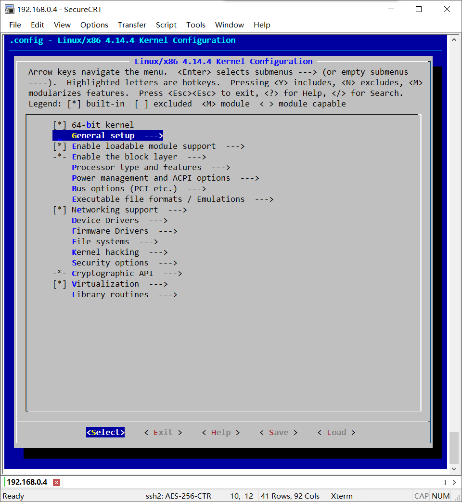
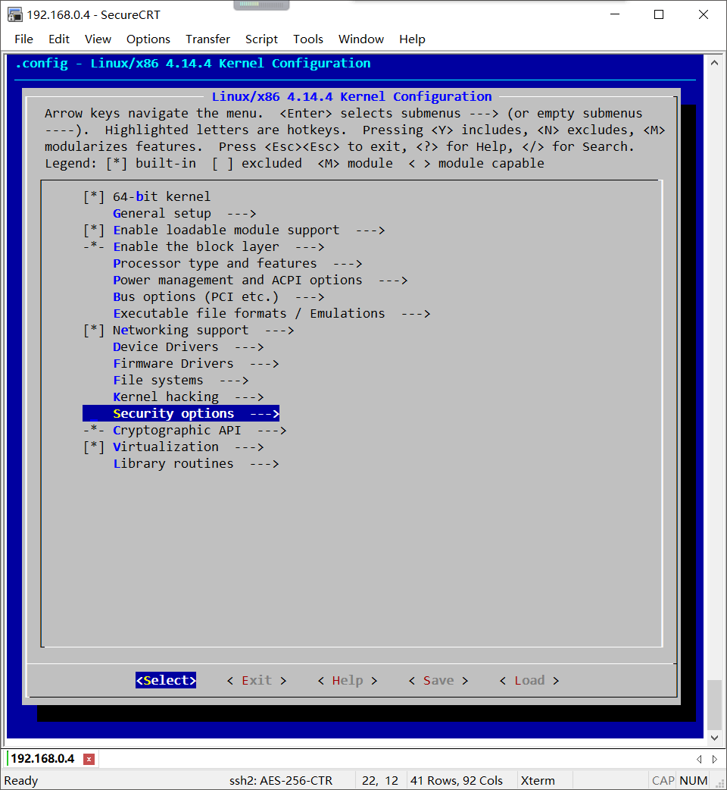
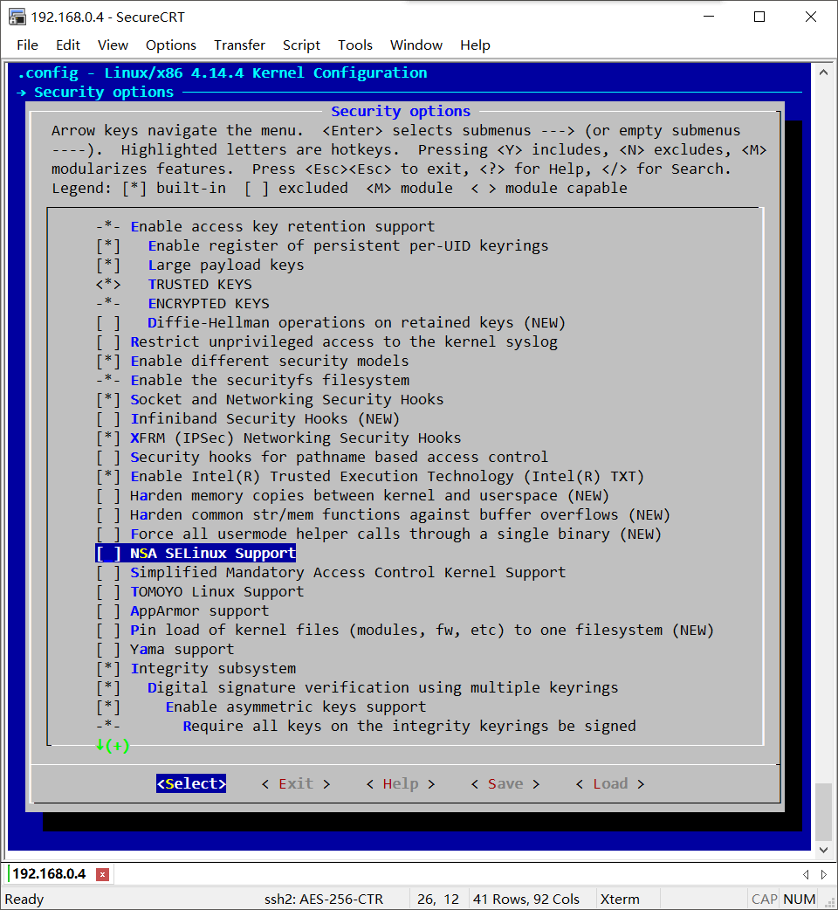
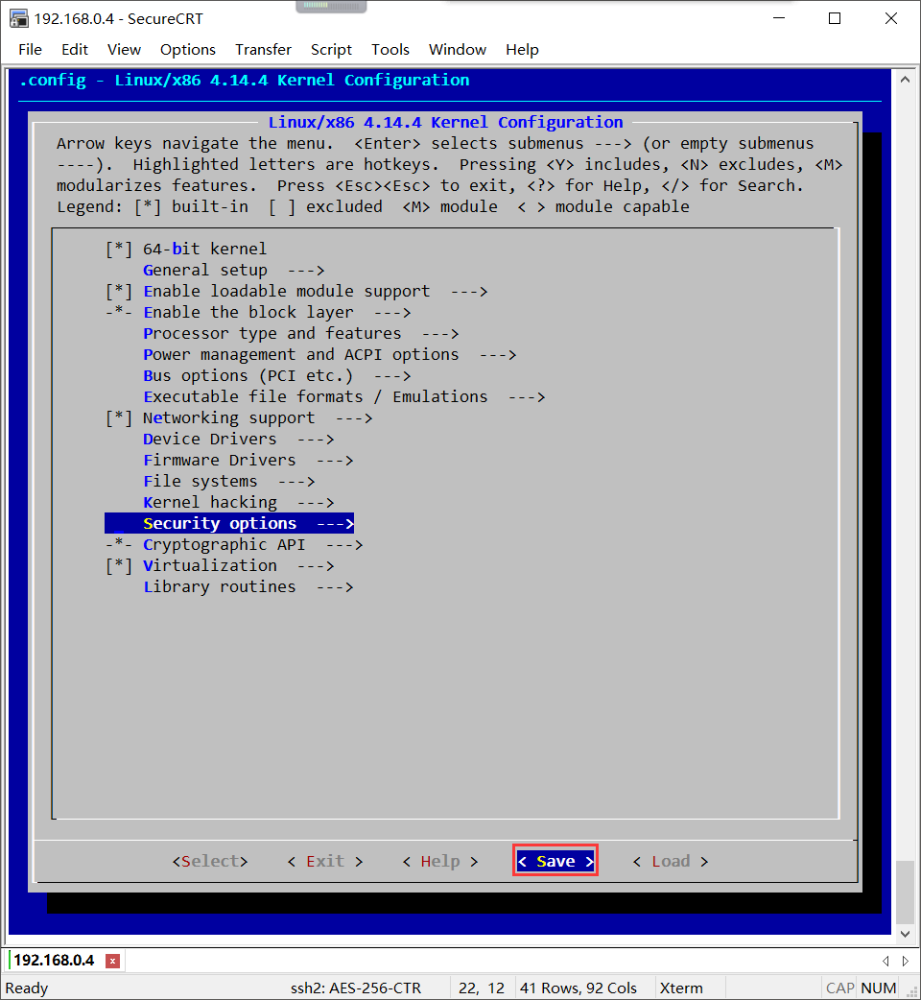
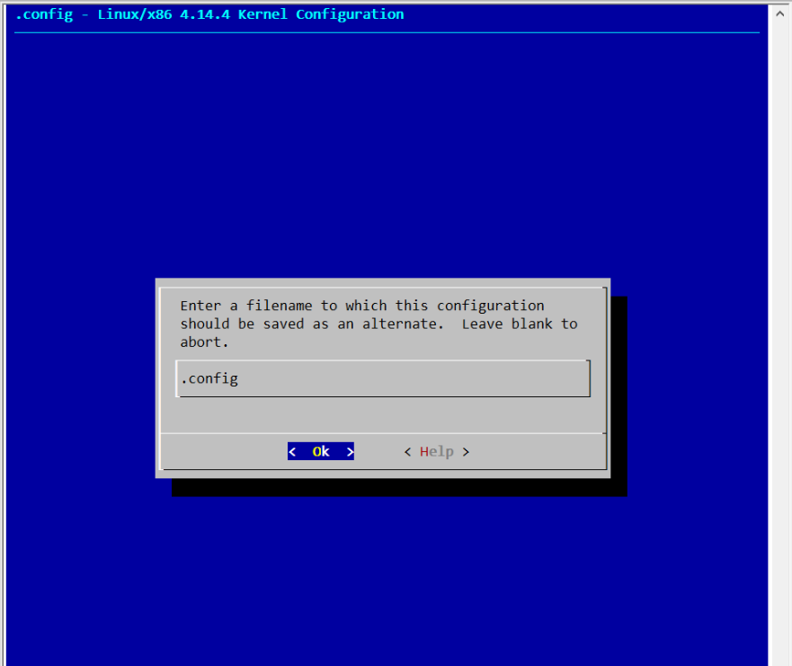

#### 准备开发环境
```bash
[root@localhost ~]# yum -y groupinstall "development tools"
[root@localhost ~]# yum -y install ncurses ncurses-devel gcc bc
```
#### 根据当前的旧内核配置文件配置新内核
```bash
#若不使用一下方法的话则需要查看硬件信息和内核信息手动修改新内核的配置文件
#若需要编译的新内核与这个旧的内核文件的版本不同的话则需要打开它的编辑配置接口重新配置一次（至少要打开再重新配置1次）
[root@localhost ~]# ll /boot/config-3.10.0-327.el7.x86_64 
-rw-r--r--. 1 root root 126426 11月 20 2015 /boot/config-3.10.0-327.el7.x86_64  
```
#### 解压新内核的源码包
```bash
[root@localhost ~]# tar xf linux-4.14.4.tar.xz -C /usr/src/
[root@localhost ~]# cd /usr/src/
[root@localhost src]# ll
总用量 4
drwxr-xr-x.  2 root root    6 8月  12 2015 debug
drwxr-xr-x.  3 root root   38 11月 21 02:53 kernels
drwxrwxr-x. 24 root root 4096 12月  5 18:26 linux-4.14.4
[root@localhost src]# ln -sv linux-4.14.4/ linux
"linux" -> "linux-4.14.4/"
[root@localhost src]# cd linux
[root@localhost linux]# ls -a
.             crypto                  include   MAINTAINERS  sound
..            Documentation           init      Makefile     tools
arch          drivers                 ipc       mm           usr
block         firmware                Kbuild    net          virt
certs         fs                      Kconfig   README
.cocciconfig  .get_maintainer.ignore  kernel    samples
COPYING       .gitattributes          lib       scripts
CREDITS       .gitignore              .mailmap  security

#将旧的配置拷贝至当前目录（目前还不适用于这个最新的版本）
[root@localhost linux]# cp /boot/config-3.10.0-327.el7.x86_64 .config  
```
#### 修改内核配置文件
```bash
#使用文本图形界面编辑配置文件（将加载上面拷贝的./config中的内容，此步骤是在其基础上做修改），修改当前目录的 ./config
[root@localhost linux]# make mennuconfig

# 注：
# make menuconfig   //基于ncurse库编制的图形工具界面（常用，一般是基于现有的旧配置文件进行编辑）
# make oleconfig    //直接使用现有的./config文件
# make config       //基于文本命令行工具，不推荐使用（基于命令行以遍历的方式编辑配置文件）
# make xconfig      //基于QT开发环境的图形工具界面
# make gconfig      //基于gtk+开发环境的图形工具界面（GNOME）
# make defconfig    //基于内核为目标平台提供的默认配置进行编辑（全新安装，不需要旧的./config）
# make allyesconfig     //全部编译进内核（生成的配置文件全部引入相关配置，常用于后期在对此./config进行部分选项剔除）
# make allnoconfig      //全部不编译进内核
# make localmodconfig   //直接使用现在已经装载的内核模块的配置文件
# make yesconfig        //
```
##### 一般不需要设置太多内容，具体说明去百度






#### Install ....
```bash
#编译内核（可能需要3个小时左右）等待编译的完成
[root@localhost linux]# make -j 4
  
  # make bzImage -j N ...

  # 只编译特定子目录中的相关代码：
  # cd /usr/src/kernels/3.10.0-693.5.2.el7.x86_64/
  # make dir/
  # 只编译一个特定的模块
  # make dir/file.ko
  
  # make <args>
  # make clean        清理大多数编译生成的文件（保留config文件）
  # make mrproper     清理所有编译生成的文件，包括config，及某些备份文件，还有内核配置文件
  # make distclean    mrproper删除的文件和编辑备份文件和一些补丁文件

#编译和安装内核模块
[root@localhost linux]# make modules_install

#安装内核
[root@localhost linux]# make install 

  # make install将"自动!"完成如下：
  # 1.安装完成后其将自动修改"/etc/grub.conf"文件
  # 2.安装bzImage为/boot/vmlinuz-<version-release>
  # 3.生成/boot/initramfs...
  # 4.修改grub的配置文件以便生成启动时的内核菜单项...

#生成新内核的ramdisk（CentOS7应该不需要了）
#[root@localhost ~]# mkinitrd /boot/initramfs-<Kernel-version-release>.img <Kernel-version-release>

[root@localhost ~]# reboot
```
