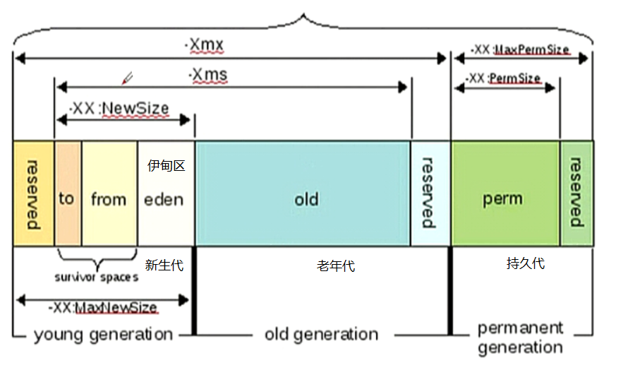

#### 测试环境：Tomcat8 以下变量定义添加在 catalina.sh 的96行之下
```
# 变量说明：
# $JAVA_OPTS：     仅对启动运行Tomcat实例的Java虚拟机有效
# $CATALINA_OPTS： 对本机上的所有Java虚拟机有效

# JVM初始分配的内存由-Xms指定,默认是物理内存的1/64
# JVM最大分配的内存由-Xmx指定,默认是物理内存的1/4
# 默认空余堆内存小于40%时,JVM就会增大堆直到-Xmx的最大限制，空余堆内存大于70%时, JVM会减少堆直到-Xms的最小限制
# 因此服务器一般设置-Xms,-Xmx相等以避免在每次GC 后调整堆的大小
#    在 JDK 1.8中移除整个永久代，取而代之的是一个叫元空间（Metaspace）的区域
#   （永久代使用的是JVM的堆内存空间，而元空间使用的是物理内存，直接受到本机的物理内存限制）。

JAVA_OPTS="
$JAVA_OPTS
-server 
-Xms256M        初始堆，默认1/64
-Xmx512M        最大堆，默认1/4
-Xss1M
-Djava.awt.headless=true 
-Dfile.encoding=UTF-8
-Duser.country=CN
-Duser.timezone=Asia/Shanghai
-XX:MinHeapFreeRatio=80 
-XX:MaxHeapFreeRatio=80 
-XX:ThreadStackSize=512
-XX:NewSize=256m                年轻代大小
-XX:NewRatio=4                  年轻代和年老代的比值.如:为3,表示年轻代与年老代比值为1:3,年轻代占整个年轻代年老代和的1/4
-XX:MaxPermSize=n               持久代大小
-XX:SurvivorRatio=8
-XX:+AggressiveOpts"

收集器设置:
串行收集器:          -XX:+UseSerialGC
并行收集器:          -XX:+UseParallelGC
并行年老代收集器:       -XX:+UseParalledlOldGC
并发收集器:          -XX:+UseConcMarkSweepGC

#或，使用环境变量的方式调整：export $CATALINA_OPTS="-Xmx256m ......"
```


#### Demo
```txt
set CATALINA_OPTS="
-server 
-Xms6000M 
-Xmx6000M 
-Xss512k 
-XX:NewSize=2250M 
-XX:MaxNewSize=2250M 
-XX:PermSize=128M
-XX:MaxPermSize=256M  
-XX:+AggressiveOpts 
-XX:+UseBiasedLocking 
-XX:+DisableExplicitGC 
-XX:+UseParNewGC 
-XX:+UseConcMarkSweepGC 
-XX:MaxTenuringThreshold=31 
-XX:+CMSParallelRemarkEnabled 
-XX:+UseCMSCompactAtFullCollection 
-XX:LargePageSizeInBytes=128m 
-XX:+UseFastAccessorMethods 
-XX:+UseCMSInitiatingOccupancyOnly
-Duser.timezone=Asia/Shanghai 
-Djava.awt.headless=true"
```
#### 测试环境
```txt
#!/bin/bash
# 注 "catalina.sh" 默认会引用当前路径下的 "setenv.sh" 脚本，通常在此脚本中设置 "JAVA_OPTS" 变量

project_1=$(cd $(dirname `basename setenv.sh`) && pwd | awk -F '_|/' '{print $6}' | grep -o "[a-z]\{1,\}")

export JAVA_OPTS="${JAVA_OPTS}""
-Xms256m -Xmx2048m -Dcmos.instance.id=${project_1} -Dfile.encoding=UTF-8 -Doracle.jdbc.V8Compatible=true 
-Dappframe.server.name=release_tomcat_ecp1 
-XX:+HeapDumpOnOutOfMemoryError 
-XX:HeapDumpPath=/home/zyzx/ecp/tomcat_ecp1/logs/oom.hprof 
-Dcmos-instance-id=release_ecp1 
-Dlog4j.configurationFile=/home/zyzx/10085_config/ecp/log4j2.xml"

echo "JAVA_OPTS=${JAVA_OPTS}"

JAVA_HOME=/home/zyzx/jdk7

export JAVA_HOME
```
