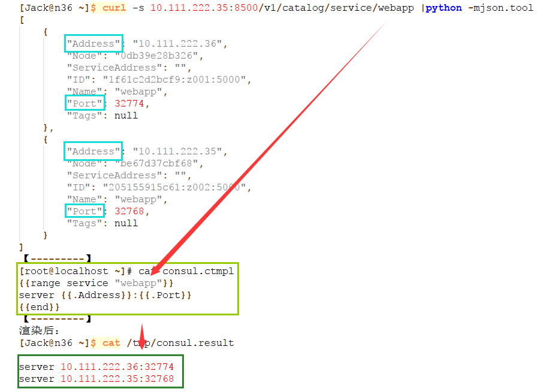
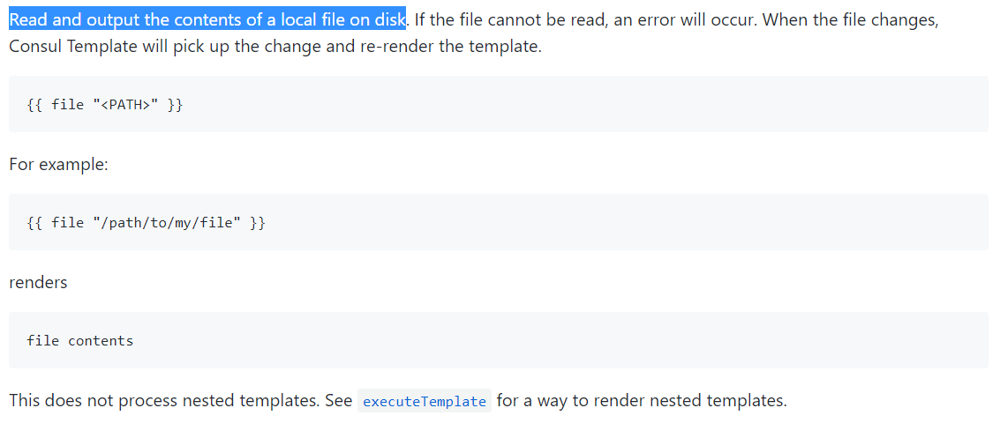
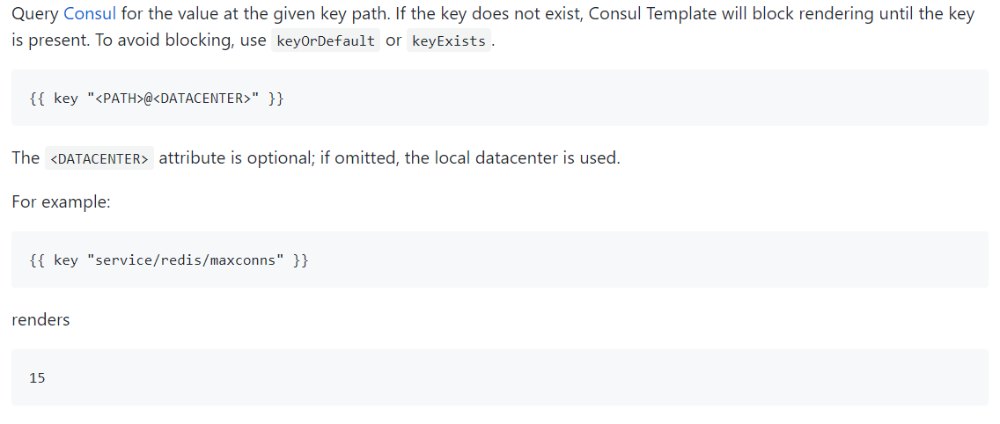
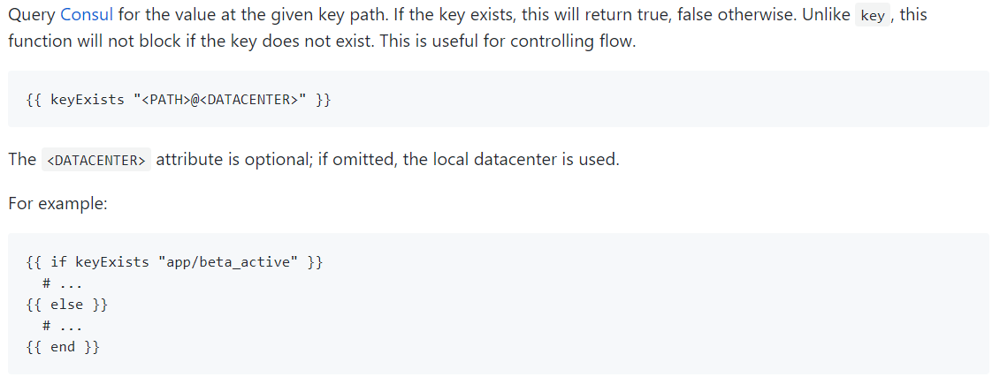
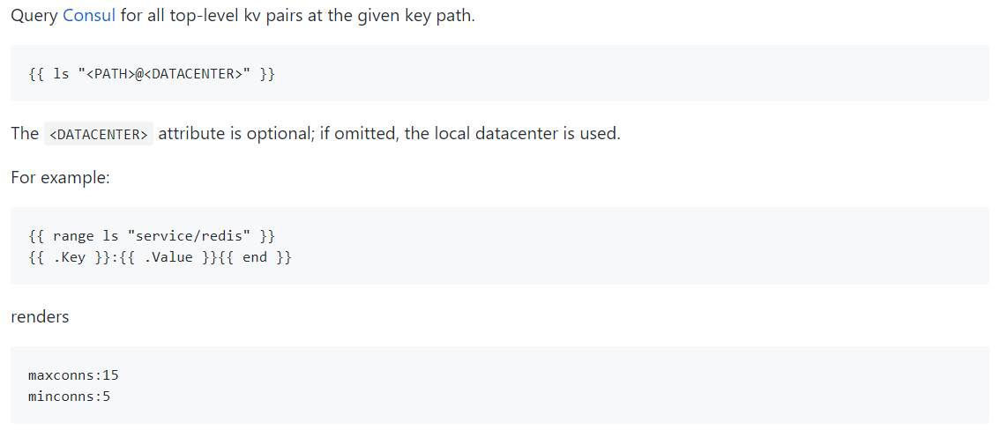

#### 备忘
```txt
Consul Template 提供一个方便的方式从Consul获取数据通过consul-template的后台程序保存到文件系统.
Consul Template 会通过Http请求从Consul中读取集群中的数据，数据发生变更时会触发更新指定配置文件的操作
其提供了便捷的方式从consul中获取存储的值，consul-template守护进程会查询consul实例来更新系统上指定的任何模板...
Consul-Template的配置文件简称："HCL(HashiCorp Configuration Language)" 它是和JSON兼容的...
当模板更新完成后还可以选择运行任意的命令....
Template 内制静止平衡功能，可以智能的发现consul实例中的更改信息。这个功能可以防止频繁的更新模板而引起系统的波动

dry mode：
    当不确定当前架构的状态或担心模板的变化会破坏子系统时，可使用consul template的-dry模式
    在dry模式下Consul Template会将结果呈现在STDOUT，所以操作员可以检查输出是否正常，以决定更换模板是否安全...
```
#### 参数
```txt
-auth=<user[:pass]>      设置基本的认证用户名和密码
-consul-addr             Consul实例的地址
-max-stale=<duration>    查询过期的最大频率，默认1s
-dedup                   启用重复数据删除，当许多consul template实例渲染一个模板的时候可降低consul的负载
-ssl                     使用https连接Consul
-ssl-verify              通过SSL连接的时候检查证书
-ssl-cert                SSL客户端证书发送给服务器
-ssl-key                 客户端认证时使用的SSL/TLS私钥
-ssl-ca-cert             验证服务器的CA证书列表
-token=<token>           设置Consul API的token
-syslog                  把标准输出和标准错误重定向到syslog，syslog的默认级别是local0。
-syslog-facility=<f>     设置syslog级别，默认是local0，必须和-syslog配合使用
-template=<template>     增加一个需要监控的模板，格式：'templatePath:outputPath(:command)'，多个模板则可以设置多次
-wait=<duration>         当呈现一个新的模板到系统和触发一个命令时等待的最大最小时间。若最大值被忽略，默认是最小值4倍
-retry=<duration>        当在和consul api交互的返回值是error的时候，等待的时间，默认5s
-config=<path>           配置文件或者配置目录的路径
-pid-file=<path>         PID文件路径
-log-level=<level>       设置日志级别："debug","info", "warn" (default), and "err"
-dry                     Dump生成的模板到标准输出，不会生成到磁盘
-once                    运行consul-template一次后退出，不以守护进程运行
-reap                    子进程自动收割

#注：除了consul和template 其他参数都是可选的
```
#### Example
```bash
#查询本地的Consul实例，一旦模板发生变化渲染模板并重启Nginx，若Consul不可用则30秒重试一次:
[root@node3 ~]# onsul-template -consul-addr 127.0.0.1:8500  \
-template "/tmp/template.ctmpl:/var/www/nginx.conf:service nginx restart"  -retry 30s  -once

#查询Consul实例，渲染多个模板并作为服务直到停止:
[root@node3 ~]# consul-template -consul-addr my.consul.internal:6124 \
-template "/tmp/nginx.ctmpl:/var/nginx/nginx.conf:service nginx restart" \
-template "/tmp/redis.ctmpl:/var/redis/redis.conf:service redis restart" \
-template "/tmp/haproxy.ctmpl:/var/haproxy/haproxy.conf"

#查询一个需要权限验证的Consul实例，将渲染后的模板输出到控制台而不写入磁盘
#在这个例子中-template的第二个和第三个参数是必须的但是被忽略了，这个文件将不会被写入磁盘,命令也不会被执行
[root@node3 ~]# consul-template  -consul-addr my.consul.internal:6124 -dry \
-template "/tmp/template.ctmpl:/tmp/result:service nginx restart"

#使用SSL证书进行Consul的查询:
[root@node3 ~]# consul-template -consul-addr 127.0.0.1:8543 -ssl -ssl-cert /path/to/client/cert.pem \ 
-ssl-ca-cert /path/to/ca/cert.pem  -template "/tmp/template.ctmpl:/tmp/result" -dry -once

#查询Consul并启动一个子进程.模板的变化会发送指令给子进程
#详细的说明请查看 https://github.com/hashicorp/consul-template#exec-mode
[root@node3 ~]# consul-template  -template "/tmp/in.ctmpl:/tmp/result"  -exec "/sbin/my-server"

#如果有多个模板要执行的话，配多个template参数即可
[root@node3 ~]# consul-template \
-consul-addr 127.0.0.1:8500 \
-template "/tmp/nginx.ctmpl:/var/nginx/nginx.conf:service nginx restart" \
-template "/tmp/redis.ctmpl:/var/redis/redis.conf:service redis restart" \
-template "/tmp/haproxy.ctmpl:/var/haproxy/haproxy.conf"

------------------------------------------------------------------------------------------------
#通过配置文件的方式创建Template
[root@node3 ~]# cat /data/cfg/consul/tmpl.json
consul = "127.0.0.1:8500"
template {
  source = "/etc/haproxy/haproxy.ctmpl"
  destination = "/etc/haproxy/haproxy.cfg"
  command = "service haproxy restart"
}
[root@node3 ~]# consul-template -config /data/cfg/consul/tmpl.json     #此处直接调用配置文件中的设置
```
#### Demo
```bash
[root@node3 ~]# curl -s node1:8500/v1/catalog/service/web2?passing |python -m json.tool
[
    {
        "Address": "192.168.0.6",
        "CreateIndex": 2074,
        "ID": "8e0284b0-9c86-be65-972a-30a2d9d11b1b",
        "ModifyIndex": 2074,
        "Node": "node2",
        "NodeMeta": {},
        "ServiceAddress": "",
        "ServiceEnableTagOverride": false,
        "ServiceID": "web2",
        "ServiceName": "web2",
        "ServicePort": 82,
        "ServiceTags": [
            "rails1"
        ],
        "TaggedAddresses": {
            "lan": "192.168.0.6",
            "wan": "192.168.0.6"
        }
    }
]

[root@node3 ~]# vim consul.ctmpl                #编辑Template文件
{{range service "web2"}}
地址信息:{{.Address}}:{{.Port}}
服务名称：{{.Name}}
标签:{{.Tags}}
{{end}}

[root@node3 ~]# consul-template -consul-addr node1:8500 -template "./consul.ctmpl" -dry #输出
地址信息:192.168.0.6:82
服务名称：web2
标签:[rails1]
```
#### Consul-Template 的配置文件
```txt
#Consul-Template的配置文件，简称HCL(HashiCorp Configuration Language)，它是和JSON兼容的，下面看个例子：
consul = "127.0.0.1:8500"
token = "abcd1234"
retry = "10s"
max_stale = "10m"
log_level = "warn"
pid_file = "/path/to/pid"
wait = "5s:10s"

vault {
  address = "https://vault.service.consul:8200"
  token = "abcd1234"
  renew = true
  ssl {
    // ...
  }
}

auth {
  enabled  = true
  username = "test"
  password = "test"
}

ssl {
  enabled = true
  verify = false
  cert = "/path/to/client/cert"
  key = "/path/to/client/key"
  ca_cert = "/path/to/ca"
}

syslog {
  enabled = true
  facility = "LOCAL5"
}

deduplicate {

  enabled = true
  prefix = "consul-template/dedup/"
}

template {
  source = "/path/on/disk/to/template.ctmpl"
  destination = "/path/on/disk/where/template/will/render.txt"
  command = "restart service foo"
  command_timeout = "60s"
  perms = 0600
  backup = true
  left_delimiter  = "{{"
  right_delimiter = "}}"
  wait = "2s:6s"
}

#以上并不是所有的fields都需要，比如Vault你可能就不需要，所以你就不需要指定Vault配置。以上就是配置文件。
```
#### 附加





