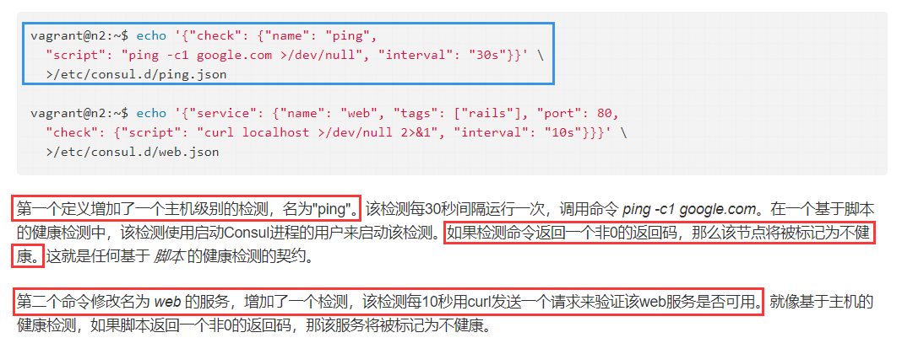

#### 备忘
```txt
Consul是支持多数据中心分布式高可用的服务发现和配置共享的服务软件，由 HashiCorp 公司用 Go 语言开发
基于 Mozilla Public License 2.0 的协议进行开源. 支持健康检查并允许 HTTP 和 DNS 协议调用 API 存储键值对
完成安装后所有节点必须运行agent! agent可分为：server、client...
Server和Client的角色和Cluster上运行的应用服务无关, 是基于Consul层面的一种角色划分
每个数据中心至少须有1台consul-server ( 成为集群的Leader )
集群中其他agent运行为client。它是轻量级进程，主要负责注册服务、健康检查、转发对server的查询...
多个数据中心间基于gossip protocol协议来通讯， 使用Raft算法实现一致性
Server用于维护Consul Cluster的状态信息，实现数据一致性，响应RPC请求
官方建议至少运行3个或以上的Consul Server。多个server之中需要选举一个leader, 选举过程基于Raft协议实现
多个Server节点上的Consul数据信息保持强一致性。在局域网内与本地客户端通讯，通过广域网与其他数据中心通讯
Client只维护自身的状态, 并将HTTP和DNS接口请求转发给服务端
```
#### 环境
```txt
        node1   --->    服务端
        node2   --->    客户端
        node3   --->    客户端
```
#### Consul 服务端部署
```bash
[root@node1 ~]# unzip consul_0.8.1_linux_amd64.zip           #解压
Archive:  consul_0.8.1_linux_amd64.zip
  inflating: consul                     
[root@node1 ~]# install -m 755 consul /usr/local/bin/consul  #各Node拷贝到指定目录并赋予权限
[root@node2 ~]# install -m 755 consul /usr/local/bin/consul  #
[root@node3 ~]# install -m 755 consul /usr/local/bin/consul  #

[root@node1 ~]# mkdir -p /etc/consul.d/ 
[root@node1 ~]# consul agent -server -rejoin -bootstrap -data-dir /var/consul -node=node1 -ui \
-config-dir=/etc/consul.d/ -bind=192.168.0.5 -client 0.0.0.0

==> WARNING: Bootstrap mode enabled! Do not enable unless necessary
==> Starting Consul agent...
==> Consul agent running!
           Version: 'v0.8.1'
           Node ID: '8166fcee-5187-609d-ef62-159cf6951df9'
         Node name: 'node1'
        Datacenter: 'dc1'
            Server: true (bootstrap: true)
       Client Addr: 0.0.0.0 (HTTP: 8500, HTTPS: -1, DNS: 8600)
      Cluster Addr: 192.168.0.5 (LAN: 8301, WAN: 8302)
    Gossip encrypt: false, RPC-TLS: false, TLS-Incoming: false
             Atlas: <disabled>

==> Log data will now stream in as it occurs:

    2017/12/31 15:09:41 [INFO] raft: Initial configuration (index=1): [{Suffrage:Voter ID:192.168.0.5:8300 Address:192.168.0.5:8300}]
    2017/12/31 15:09:41 [INFO] raft: Node at 192.168.0.5:8300 [Follower] entering Follower state (Leader: "")
    2017/12/31 15:09:41 [INFO] serf: EventMemberJoin: node1 192.168.0.5
    2017/12/31 15:09:41 [INFO] consul: Adding LAN server node1 (Addr: tcp/192.168.0.5:8300) (DC: dc1)
    2017/12/31 15:09:41 [INFO] serf: EventMemberJoin: node1.dc1 192.168.0.5
    2017/12/31 15:09:41 [INFO] consul: Handled member-join event for server "node1.dc1" in area "wan"
    2017/12/31 15:09:48 [ERR] agent: failed to sync remote state: No cluster leader
    2017/12/31 15:09:51 [WARN] raft: Heartbeat timeout from "" reached, starting election
    2017/12/31 15:09:51 [INFO] raft: Node at 192.168.0.5:8300 [Candidate] entering Candidate state in term 2
    2017/12/31 15:09:51 [INFO] raft: Election won. Tally: 1
    2017/12/31 15:09:51 [INFO] raft: Node at 192.168.0.5:8300 [Leader] entering Leader state
    2017/12/31 15:09:51 [INFO] consul: cluster leadership acquired
    2017/12/31 15:09:51 [INFO] consul: New leader elected: node1
    2017/12/31 15:09:51 [INFO] consul: member 'node1' joined, marking health alive
==> Newer Consul version available: 1.0.2 (currently running: 0.8.1)
    2017/12/31 15:09:53 [INFO] agent: Synced service 'consul'

#参数：
#-server	使agent运行在server模式
#-rejoin	忽略先前的离开、再次启动时仍尝试加入集群
#-bootstrap-expect 在1个"datacenter"中期望的server数量，启用则等待达到指定数量时才引导整个集群（不能和bootstrap共用）
#-bootstrap	设置S端是否为"bootstrap"模式。若数据中心仅1个server则需启用。
#-data-dir	为agent存放元数据，任何节点都要有。该目录应在持久存储中（不丢失），若server模式则用于记录整个集群state
#-node          本节点在集群中的名称，在集群中它必须唯一，默认是该节点主机名（建议指定）
#-ui-dir        提供存放web ui资源的路径。该目录必须可读！
#-config-dir    需加载的配置目录，其中".json"格式的文件都会被加载，表示node自身所注册的服务文件的存储路径
#-config-file   需加载的配置文件，文件是"json"格式的信息，该参数可多次配置，后面文件加载的参数会覆盖前面文件中的参数...
#-bind          该地址用于集群内部通讯、C/S均需设置，集群内所有节点到此地址都必须可达，默认：0.0.0.0
#-client	将绑定到client接口的地址（即公开地址），其提供HTTP、DNS、RPC服务。默认"127.0.0.1"。RPC地址会被其他consul命令使用
#-log-level	日志级别。默认"info"。有如下级别："trace","debug", "info", "warn",  "err"。可用：consul monitor来连接节点查看日志
#-syslog        将日志记录进syslog，仅支持Linux和OSX平台
#-pid-file      记录pid号
#-datacenter    数据中心名字，旧版本选项为：-dc
#-ui		启动内建的Web页面

# consul也支持使用json方式保存启动配置信息：
# {  
# 	"datacenter": "east-aws",  	
# 	"data_dir": "/opt/consul",  
# 	"log_level": "INFO",  	
# 	"node_name": "foobar",  
# 	"server": true,  
# 	"watches": [  
# 		{  
# 			"type": "checks",  
# 			"handler": "/usr/bin/health-check-handler.sh" 
# 		}  
# 	],  
# 	"telemetry": {  
# 		"statsite_address": "127.0.0.1:2180"  
# 	}  
# }
```
#### Consul 客户端部署
```bash
[root@node2 ~]# consul agent -ui -data-dir /var/consul -node=node2 -datacenter=dc1 -config-dir=/etc/consul.d/ \
-bind=192.168.0.6  -join 192.168.0.5 
==> Starting Consul agent...
==> Joining cluster...
    Join completed. Synced with 1 initial agents
==> Consul agent running!
           Version: 'v0.8.1'
           Node ID: '8e0284b0-9c86-be65-972a-30a2d9d11b1b'
         Node name: 'node2'
        Datacenter: 'dc1'
            Server: false (bootstrap: false)
       Client Addr: 127.0.0.1 (HTTP: 8500, HTTPS: -1, DNS: 8600)
      Cluster Addr: 192.168.0.6 (LAN: 8301, WAN: 8302)
    Gossip encrypt: false, RPC-TLS: false, TLS-Incoming: false
             Atlas: <disabled>

==> Log data will now stream in as it occurs:

    2017/12/31 15:23:44 [INFO] serf: EventMemberJoin: node2 192.168.0.6
    2017/12/31 15:23:44 [INFO] agent: (LAN) joining: [192.168.0.5]
    2017/12/31 15:23:44 [INFO] serf: EventMemberJoin: node1 192.168.0.5
    2017/12/31 15:23:44 [INFO] agent: (LAN) joined: 1 Err: <nil>
    2017/12/31 15:23:44 [WARN] manager: No servers available
    2017/12/31 15:23:44 [ERR] agent: failed to sync remote state: No known Consul servers
    2017/12/31 15:23:44 [INFO] consul: adding server node1 (Addr: tcp/192.168.0.5:8300) (DC: dc1)
    2017/12/31 15:23:46 [INFO] agent: Synced node info
==> Newer Consul version available: 1.0.2 (currently running: 0.8.1)

#备忘说明：
#参数："-ui" 启动内建界面，可通过："http://1ocalhost:8500/ui/" 的形式访问
#参数："-join" 使agent加入已有集群。当agent以client模式运行时不加参数："-server"即可！
#后期加入集群："consul join <任一集群节点Ip>" 
#注：若报：Error joining the cluster: dial tcp 10.0.0.53:8301: getsockopt: no route to host 可能是防火墙的原因，检查端口8301是否开放
#为加入集群，一个agent仅需了解一个已存在的集群成员，加入集群后agent将会自动传递完整的成员信息......
#重启/移除节点：consul <reload/leave>	 服务定义可通过配置文件并发送SIGHUP信号给agent进行更新
#参数："-client"指定了客户端绑定地址，用于HTTP、DNS、RPC服务
#consul <join/members> 都是通过RPC与Consul交互的，例：-rpc-addr=192.168.11.143:8400
```
#### 查看集群节点成员
```bash
[root@node1 ~]# consul members	     #或：curl -s http://192.168.0.5:8500/v1/agent/members | python -m json.tool
Node   Address           Status  Type    Build  Protocol  DC
node1  192.168.0.5:8301  alive   server  0.8.1  2         dc1
node2  192.168.0.6:8301  alive   client  0.8.1  2         dc1
node3  192.168.0.7:8301  alive   client  0.8.1  2         dc1

#注：通过member查看的是最终一致性，强一致性需要去server端查看：
#这里访问本地时将会自动转发至server端！：
[root@node3 ~]# curl localhost:8500/v1/catalog/nodes
[
    {
        "Address": "192.168.0.5",
        "CreateIndex": 5,
        "ID": "8166fcee-5187-609d-ef62-159cf6951df9",
        "Meta": {},
        "ModifyIndex": 6,
        "Node": "node1",
        "TaggedAddresses": {
            "lan": "192.168.0.5",
            "wan": "192.168.0.5"
        }
    },
    {
        "Address": "192.168.0.6",
        "CreateIndex": 2073,
        "ID": "8e0284b0-9c86-be65-972a-30a2d9d11b1b",
        "Meta": {},
        "ModifyIndex": 2073,
        "Node": "node2",
        "TaggedAddresses": {
            "lan": "192.168.0.6",
            "wan": "192.168.0.6"
        }
    },
    {
        "Address": "192.168.0.7",
        "CreateIndex": 80,
        "ID": "c8798f09-a694-882a-8be3-8c1f44bf868a",
        "Meta": {},
        "ModifyIndex": 81,
        "Node": "node3",
        "TaggedAddresses": {
            "lan": "192.168.0.7",
            "wan": "192.168.0.7"
        }
    }
]
```
#### 注册服务以及查询
```bash
#搭建好conusl集群后用户和程序便能到consul中去查询&注册服务。可通过2种方式：
#   1： 服务定义文件
#   2： HTTP API
#本例假设有名叫web2的服务运行在80端口，另为其设一个标签："tags" 以便使用其作为额外的查询信息......
#如需注册多个服务可在配置目录下创建多个服务定义文件。若使用RESTFul API的方式则无需执行consul reload
[root@node2 ~]# echo '{"service": {"name": "web2", "tags": ["rails"], "port": 80}}' > /etc/consul.d/web.json
[root@node2 ~]# consul reload					#重载Client端的Consul配置信息...

#当出现下列输出中的 agent: Synced service XXX 时，说明服务注册成功!...
==> Log data will now stream in as it occurs:
    ........(略)
    2017/12/31 15:43:18 [INFO] serf: Re-joined to previously known node: node3: 192.168.0.7:8301
    2017/12/31 15:43:18 [INFO] consul: adding server node1 (Addr: tcp/192.168.0.5:8300) (DC: dc1)
    2017/12/31 15:43:18 [INFO] agent: (LAN) joined: 1 Err: <nil>
    2017/12/31 15:43:18 [INFO] agent: Synced service 'web2'     #载入了服务定义并成功注册...
==> Newer Consul version available: 1.0.2 (currently running: 0.8.1)

#查询注册的服务所在的IP及端口等信息
[root@node1 ~]# curl -s http://node1:8500/v1/catalog/service/web2 | python -m json.tool
[
    {
        "Address": "192.168.0.6",
        "CreateIndex": 930,
        "ID": "8e0284b0-9c86-be65-972a-30a2d9d11b1b",
        "ModifyIndex": 930,
        "Node": "node2",
        "NodeMeta": {},
        "ServiceAddress": "",
        "ServiceEnableTagOverride": false,
        "ServiceID": "web2",
        "ServiceName": "web2",
        "ServicePort": 82,
        "ServiceTags": [
            "rails1"
        ],
        "TaggedAddresses": {
            "lan": "192.168.0.6",
            "wan": "192.168.0.6"
        }
    }
]
#仅查询状态健康的web2服务：curl http://localhost:8500/v1/health/service/web2?passing

#通过内置的DNS查询服务信息（基于标记的服务查询的格式是 TAG.NAME.service.consul）
#默认的所有DNS名字会都在consul命名空间下，这个子域告诉Consul,我们在查询服务,NAME则是服务的名称
[root@node1 ~]# dig +short @127.0.0.1 -p 8600 web2.service.consul  SRV
1 1 82 node2.node.dc1.consul.	#启动的82为服务端口，其中的node2.node.dc1.consul为服务名，可借助查询到的此域名访问

[root@node1 ~]# dig +short @127.0.0.1 -p 8600 web2.service.consul A
192.168.0.6			#服务所在的IP地址

注：NS API中节点名称结构为 NAME.node.consul或者NAME.node.DATACENTER.consul
#如果数据中心名字省略,Consul只会查询本地数据中心.
#请求Consul返回有rails标签的web服务：dig @127.0.0.1 -p 8600 rails.web.service.consul SRV
```
#### 健康检查
```bash
#与服务定义相同，检查定义可通过2种方式：1：检查定义、2：HTTP API
#在基于脚本的健康检查中的约定：脚本运行于与Consul进程相同的UID并且其以非0值返回则此节点被标为不健康!
#Check脚本可自由地做任何事情确定check状态。唯一限制是退出代码必须遵循下面的约定：0 -> 正常、 1 -> 告警、其他 -> 失败
#每种check都须包含name，但id、notes可选。若未提供id则其被设为name。
#在一个节点中的每个check的ID必须唯一！因此若check的name值冲突那么ID就应设置......
#字段notes用于增强checks的可读性。Script check中"notes"字段可由脚本生成，脚本其他的输出保存在notes中以供查看
#字段notes同样适用HTTP接口更新TTL check的外部程序一样可设置notes字段......
#注意，当尝试用DNS查询不健康的服务时Consul将不会返回结果，因为服务不健康!.....
	
#Example1：
	{  
	   "check": {  
	      "id": "mem-util",  
	      "name": "Memoryutilization",  
	      "docker_container_id": "f972c95ebf0e",  
	      "shell": "/bin/bash",  "script": "/usr/local/bin/check_mem.py", "interval": "10s"  
	   }  
	}

#Example2:
	{  
		"service":{  
			"id": "jetty",  
			"name": "jetty", "address": "192.168.1.200", "port": 8080, "tags": ["dev"],  
			"checks": [  
				{  
					"http": "http://192.168.1.200:8080/health", "interval": "5s"  
				}  
			]  
	}  }  

[root@node2 ~]# echo '{"check": {"name": "ping", "script": "ping -c1 163.com >/dev/null", "interval": "30s"}}' \
>/etc/consul.d/ping.json

#查询特定健康状态的服务：
[root@node1 ~]# curl -s http://localhost:8500/v1/health/state/passing?dc=dc1 | python -m json.tool
[
    {
        "CheckID": "ping",
        "CreateIndex": 892,
        "ModifyIndex": 915,
        "Name": "ping",
        "Node": "node1",
        "Notes": "",
        "Output": "",
        "ServiceID": "",
        "ServiceName": "",
        "Status": "passing"
    },
    ......(略)
    
# state可以是：			eg：/v1/health/state/<XXXX>?dc=XX
# 	 "any"
# 	 "unknown"
# 	 "passing"
# 	 "warning"
# 	 "critical"
```



#### 停止agent时 "Ctrl-C" 的特殊作用
```txt
可用 Ctrl-C 优雅的关闭Agent. 中断Agent后可看到他离开了集群并关闭，在"尤雅"退出时Consul提醒其他集群成员此节点离开
而强行杀掉进程则集群其他成员应会检测到此节点失效...
当成员离开时其服务和检测也会从目录中移除，但当成员失效时他的健康状况被简单的标记为危险但不会从目录中移除...
成员失效时Consul会自动尝试对失效节点重连等待并允许其从某些网络条件下恢复起来，而离开的节点则不再继续联系
若agent作为服务器端，那么优雅的离开是很重要的! 这可以避免引起潜在的可用性故障影响达成一致性协议...
```
#### Consul 内置的DNS与生产环境的原DNS服务间的转发处理
```txt
1、原内网服务器，做DNS转发：将consul后缀域的都转发到consul server上
2、DNS全部跳转到consul DNS服务器上，非consul后缀的使用consul server自身的recurors属性跳转到原DNS服务器上
3、dnsmap转： server=/consul/10.6.X.X#8600 解析consul后缀的
```
