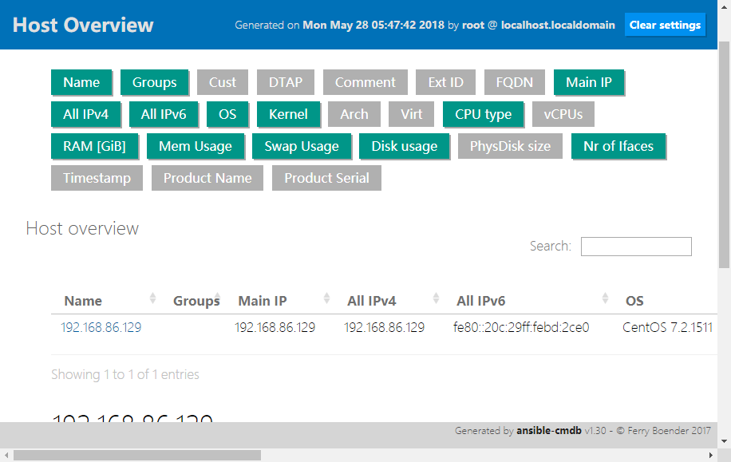

#### Install
```bash
#安装
[root@localhost ~]# pip install sqlmap -i http://pypi.douban.com/simple/ --trusted-host pypi.douban.com
[root@localhost ~]# cd /root/ansible-cmdb-1.30
[root@localhost ~]# python setup.py install

#-----------------------------------------------------------------------------------

#打离线包
[root@localhost ~]# pip freeze --all > package.txt
[root@localhost ~]# pip install -i http://pypi.douban.com/simple/ \
--trusted-host pypi.douban.com --download /tmp/pip-packages -r package.txt 
#离线安装
[root@localhost ~]# pip install --no-index --find-index=${HOME}/pip-packages -r package.txt

#注!
#ansible-cmdb支持的模板路径：/root/ansible-cmdb-1.30/build/lib/ansiblecmdb/data/tpl
```
#### Demo
```bash
[root@localhost ~]# ansible -i x all -m setup --tree /tmp/ansible-cmdb  #使用setup模块收集主机信息后导出到指定目录
[root@localhost ~]# ansible-cmdb /tmp/ansible-cmdb > index.html    #使用ansible-cmdb模块将生成的JSON串转为静态页面

#生成CSV表格
[root@localhost ~]# ansible-cmdb -t csv
"Name","OS","IP","Arch","Mem","MemFree","MemUsed","CPUs","Virt","Disk avail"
"192.168.86.129","CentOS 7.2.1511","192.168.86.129","x86_64/x86_64","2g","0g","2g","1","VMware/guest","15.0g, 0.0g"

#以资产列表得形式统计出主机信息：( 部分列不支持，暂时还没找到解决办法，如果需要可以修改模板 )
[root@localhost ~]# ansible-cmdb -t txt_table --columns name,os,ip,mac,arch,mem\
,memfree,memused,cpus,virt,diskavail /tmp/666

Name            OS               IP              Mac                Arch           Mem  MemFree  MemUsed  CPUs  Virt          
--------------  ---------------  --------------  -----------------  -------------  ---  -------  -------  ----  ------------  
192.168.86.129  CentOS 7.2.1511  192.168.86.129  00:0c:29:bd:2c:e0  x86_64/x86_64  2g   0g       2g       1     VMware/guest   

#输出为sql格式的文件：
[root@localhost ~]# ansible-cmdb -t sql out > cmdb.sql      #将数据导入数据库：  mysql -uroot -p ansdb < cmdb.sql 
```
#### 支持的元信息
```txt
| name 
| fqdn 
| main_ip 
| os_name 
| os_version
| system 
| kernel 
| arch_hardware 
| arch_userspace
| virt_type 
| virt_role 
| cpu_type 
| vcpus 
| ram 
| disk_total 
| disk_free
```
#### WEB-UI

